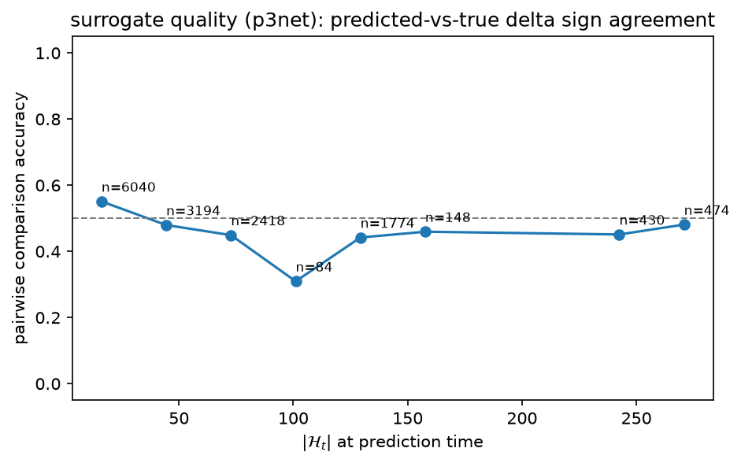
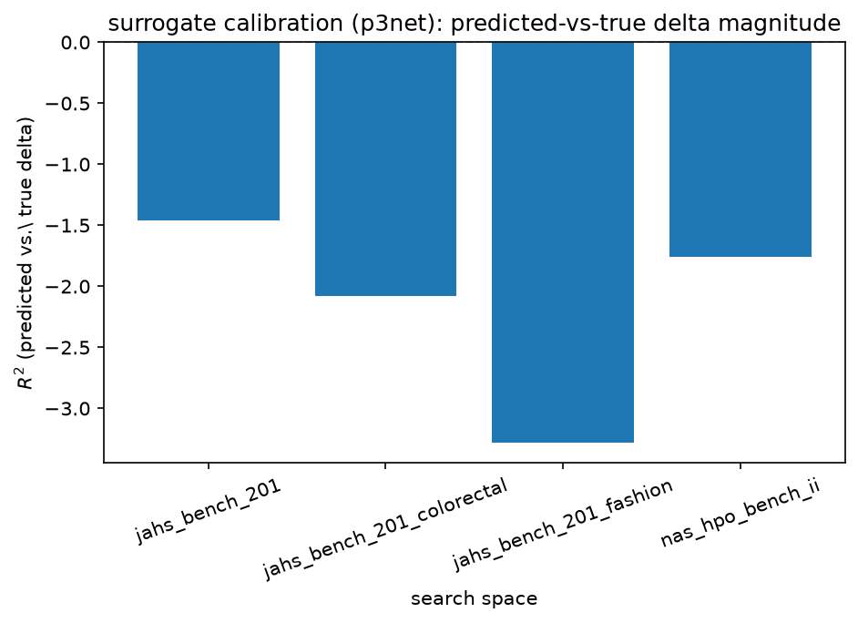
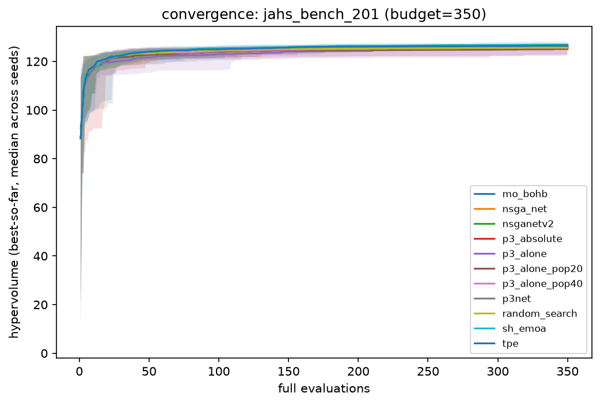
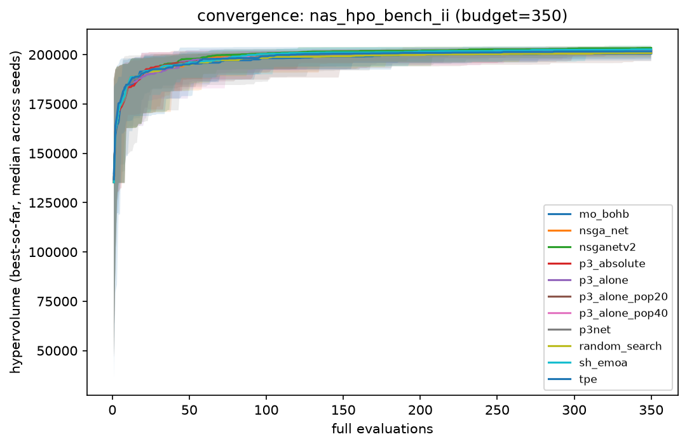
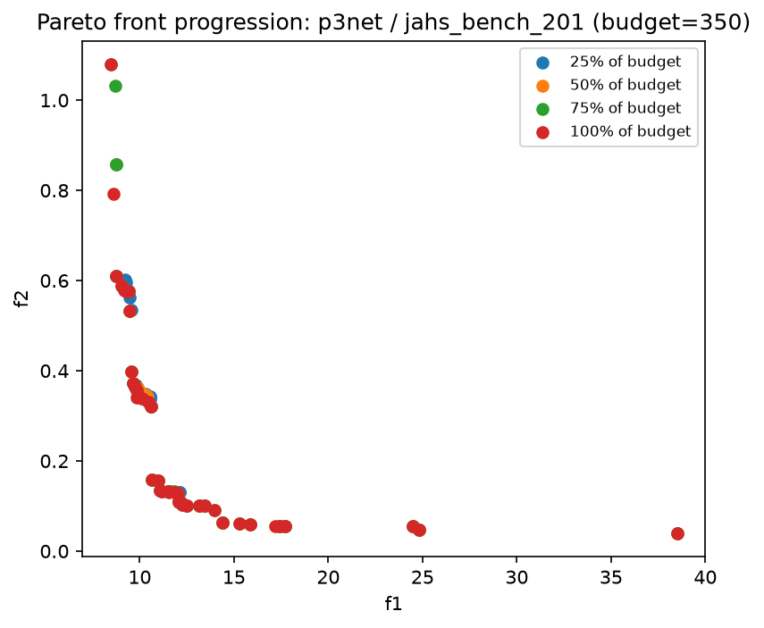
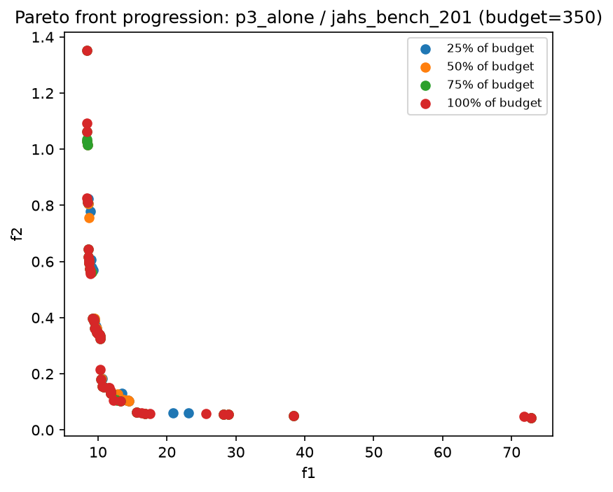
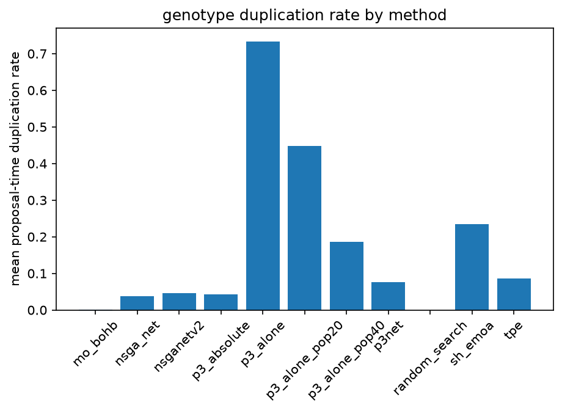

<!-- Pełne polskie tłumaczenie chapters/v003/ (praca P3Net, GECCO), wygenerowane 2026-08-19 na potrzeby własne autorów. -->

# Abstrakt

Wspólne przeszukiwanie architektury sieci neuronowej i hiperparametrów musi godzić dokładność predykcji ze stałym, ograniczonym budżetem kosztownych pełnych ewaluacji, a dominujący w tej dziedzinie silnik — krzyżowanie w stylu NSGA-II sparowane z surogatem będącym bezwzględnym (absolutnym) regresorem, jak w NSGANetV2 — zmienia współrzędne genotypu niezależnie od tego, czy rzeczywiście ze sobą oddziałują. Proponujemy P3Net, który zamiast tego łączy Parameter-less Population Pyramid (P3), operator krzyżowania kierowany drzewem powiązań (linkage tree), bez osobnego kroku mutacji, z względnym, świadomym powiązań surogatem $\hat\delta_F$, który przewiduje *zmianę* dokładności wynikającą z proponowanej modyfikacji, ograniczoną do jednego podzbioru powiązań (linkage subset), który uległ zmianie, zamiast regresji bezwzględnej dokładności na podstawie pełnego kodowania. Oceniamy P3Net względem NSGANetV2, dopasowanych ablacji silnika/surogatu izolujących każdą dźwignię projektową z osobna, oraz czterech dalszych metod bazowych (SH-EMOA, MO-BOHB, TPE, przeszukiwanie losowe) na JAHS-Bench-201 (CIFAR-10, Colorectal-Histology, Fashion-MNIST) oraz NAS-HPO-Bench-II, w czterech budżetach ewaluacji i przy $R=30$ ziarnach (seedach) na komórkę, z użyciem hiperwolumenu względem najlepszego znanego frontu.

Wynikiem jest w dużej mierze negatywne, lecz diagnostycznie rzetelne odkrycie: P3Net nie odróżnia się statystycznie od jednostajnego przeszukiwania losowego w żadnej z szesnastu testowanych komórek (przestrzeń przeszukiwania, budżet). Znaczną część tego zjawiska wiążemy ze strukturalną patologią reguły geometrycznego wzrostu poziomów w \texttt{Pyramid}, którą pokazujemy jako wymuszającą rosnący udział budżetu ewaluacji w jednostajnie losowym bootstrapie populacji wraz ze wzrostem budżetu (do $93$–$94\%$ przy największym testowanym budżecie); redesign polegający na rozgrzewającym starcie (warm-start) i kryterium wkładu w hiperwolumen mierzalnie, lecz tylko częściowo, to koryguje. Po niezależnym zidentyfikowaniu i zamknięciu konfuzji populacyjno-silnikowej w dopasowanej ablacji P3-plus-bezwzględny-regresor, ta ablacja również nie wykazuje mierzalnej przewagi surogatu względnego nad prostszym surogatem bezwzględnym, a celowana poprawka dowiedzionego, wyłącznie addytywnego ograniczenia reprezentacyjnego $\hat\delta_F$ — choć niezależnie zweryfikowana jako dodająca rzeczywistą pojemność modelu — również nie przynosi korzyści na skalę tego benchmarku. Raportujemy to jako uczciwe wyniki zerowe (null results), zamiast je pomijać lub przeformułowywać, wraz z jedną komórką benchmarku, w której P3Net wygrywa istotnie statystycznie, i argumentujemy na podstawie literatury P3/GOMEA, że testowany mechanizm ma większą szansę opłacić się na większych, strukturalnie bogatszych przestrzeniach przeszukiwania niż cztery tu ocenione.

**Słowa kluczowe:** przeszukiwanie architektury sieci neuronowych, predyktor surogatowy, P3, optymalizacja ewolucyjna, optymalizacja wielokryterialna

# Wprowadzenie

Przeszukiwanie architektury sieci neuronowej (neural architecture search) eksploruje duże, dyskretne przestrzenie kandydackich projektów sieci, a ocena pojedynczego kandydata względem prawdziwego celu — czy to przez trening od zera, przez współdzielenie wag (weight sharing), czy przez odpytanie benchmarku zbudowanego w tym celu — jest dominującym kosztem przeszukiwania \citep{white2023insights,liu2023survey}. Traktowanie przeszukiwania architektury i strojenia hiperparametrów, takich jak wybór współczynnika uczenia (learning rate) czy zaniku wag (weight decay), jako dwóch osobnych etapów — najpierw architektura przy stałym lub domyślnym ustawieniu hiperparametrów, potem strojenie hiperparametrów dla zwycięskiej architektury — jest powszechną praktyką \citep{lu2019nsganet,lu2020nsganetv2}. Zela i in. pokazują, że jest to niewiarygodne z dwóch powodów: architektura i hiperparametry oddziałują ze sobą, więc najlepsza architektura przy jednym ustawieniu hiperparametrów nie musi być najlepsza przy innym; a powszechny skrót polegający na rankingowaniu architektur po zaledwie kilku epokach treningu słabo koreluje z ich rankingiem przy pełnym budżecie treningowym \citep{zela2018towards}. Rozdzielenie tych dwóch etapów podwaja to ryzyko. Przeszukiwanie obu jednocześnie, zamiast sekwencyjnie, pozwala uniknąć tej kumulacji, kosztem dalszego powiększenia przestrzeni przeszukiwania ponad już i tak kosztowną.

NSGA-Net ustanowił przeszukiwanie ewolucyjne bezpośrednio nad architekturami sieci, trenując każdego kandydata do końca \citep{lu2019nsganet}. NSGANetV2 \citep{lu2020nsganetv2} pokazał, że sparowanie tego samego silnika ewolucyjnego z wyuczonym predyktorem dokładności pozwala tanio przesiewać większość kandydatów, rezerwując pełną ewaluację dla niewielkiego, obiecującego podzbioru — co wprost odpowiada na problem kosztu podniesiony przed chwilą. Wielokryterialne przeszukiwanie ewolucyjne pozostaje najbardziej popularnym podejściem do wielokryterialnego NAS w tej dziedzinie, a wspomaganie surogatowe tego rodzaju jest jedną z kilku technik efektywnościowych nadbudowanych na tym silniku (Sekcja "Prace pokrewne").

Ta sama linia NSGA-Net \citep{lu2019nsganet} dokumentuje też konkretną słabość, wartą wspomnienia właśnie tutaj, bo wskazuje dokładnie na ten rodzaj ukrytej struktury, który silnik przeszukiwania świadomy zależności — temat tej pracy — ma za zadanie wykorzystać: wraz ze wzrostem liczby węzłów, 60–80% wygenerowanych genotypów dekoduje się do duplikatów architektur. Jest to sygnał, że zmienne w kodowaniu oddziałują ze sobą w sposób, który operator ślepy na tę strukturę może wykorzystać co najwyżej przypadkowo, jeśli w ogóle. Sama w sobie ta słabość nie jest jednak zabójcza: koszt zduplikowanych architektur można zneutralizować środkami inżynierskimi zewnętrznymi wobec samego algorytmu przeszukiwania, więc pytanie brzmi, czy na potrzeby tej pracy liczy się to za problem rozwiązany. Wykrywanie i pomijanie już widzianych genotypów jest standardową praktyką od 2019 roku, stosowaną zarówno przy budowie benchmarków (kanonizacja izomorficznych komórek, jak w NAS-Bench-101 \citep{ying2019nasbench101}), jak i "w locie" podczas przeszukiwania (sam NSGA-Net \citep{lu2019nsganet}, oraz P3Net przez własną pamięć podręczną deduplikacji, Sekcja "Proponowany Optymalizator"). Ta praktyka nie jest jednak uniwersalna, i ta luka ma bezpośrednie znaczenie dla tej pracy: NAS-Bench-201 \citep{dong2020nasbench201} leży u podstaw jednego z dwóch głównych benchmarków tej pracy, JAHS-Bench-201 \citep{bansal2022jahsbench} (Sekcja "Wyniki"), a jego własna, odrębna przestrzeń komórek nie jest kanonizowana względem izomorfizmu — jego autorzy sami stwierdzają, że zbudowali go "bez uwzględniania izomorfizmu", a spośród 15 625 surowych kodowań tylko 6 466 (${\sim}41\%$) jest topologicznie unikalnych, co daje ${\sim}59\%$ współczynnik duplikacji \citep{dong2020nasbench201}, który przenosi się niezłagodzony bezpośrednio na JAHS-Bench-201 \citep{bansal2022jahsbench}. To, co pozostaje otwarte, to zatem nie istnienie duplikatów — powyższe łagodzenie już to pokrywa — lecz węższe pytanie, które faktycznie stawia ta praca: czy operator przeszukiwania świadomy zależności generuje ich mniej już w momencie proponowania, a nie tylko taniej wykrywa je po fakcie.

Osobna linia badań celuje dokładnie w tę strukturę zależności między zmiennymi genotypu: ewolucyjne algorytmy uczące powiązania (linkage learning), takie jak GOMEA \citep{thierens2011optimal} i Parameter-less Population Pyramid (P3) \citep{goldman2014parameterless}, rozwijane w dużej mierze niezależnie od tej linii NAS opartej na NSGA-II. Uczą się one, które zmienne genotypu ze sobą oddziałują, i chronią te grupy podczas krzyżowania, zamiast traktować genotyp jako niestrukturalne kodowanie, co w zasadzie pozwala unikać rodzaju redundantnego, generującego duplikaty przeszukiwania, które dokumentują własne liczby NSGA-Net. Duplikaty i zależności zmiennych są jednak dwoma odrębnymi zjawiskami, które niekoniecznie się pokrywają. Duplikaty powstają na etapie dekodowania: różne genotypy mogą opisywać dokładnie tę samą architekturę, niezależnie od tego, jak zmienne wpływają na wartość funkcji celu. Zależności zmiennych to coś innego: które zmienne genotypu wspólnie determinują cel. Taki operator uczy się dokładnie tych zależności, nie duplikatów. Czy w związku z tym generuje też mniej duplikatów, zależy od tego, czy oba zjawiska pokrywają się w praktyce: czy te same grupy zmiennych odpowiedzialne za redundancję dekodowania są też grupami istotnymi dla wartości funkcji celu. Dokładnie to sprawdza diagnostyka współczynnika duplikacji w Sekcji "Wyniki".

P3Net łączy dwa elementy, odpowiadające po kolei na te dwa, w dużej mierze niezależne problemy: silnik przeszukiwania świadomy zależności, odpowiadający na dopiero co podniesione pytanie o duplikaty/zależności, oraz względny, świadomy powiązań surogat, odpowiadający na problem kosztu ewaluacji, od którego zaczyna się ta praca. Silnikiem jest P3 \citep{goldman2014parameterless}, który zastępuje NSGA-II, tak że krzyżowanie podąża za drzewem powiązań (linkage tree) wyuczonym z populacji, zamiast działać na pojedynczych zmiennych. Surogat istnieje z tego samego powodu, co własny predyktor NSGANetV2 \citep{lu2020nsganetv2}: przesiewa tanio większość kandydatów, tak że kosztowna pełna ewaluacja jest zarezerwowana dla niewielkiego, obiecującego podzbioru. Zamiast jednak regresować bezwzględną dokładność kandydata na podstawie jego pełnego kodowania, przewiduje zmianę dokładności względem rodzica, ograniczoną do jednego zmodyfikowanego podzbioru powiązań, w duchu eLyMPuS, wariantu LyMPuS, który przewiduje względną zmianę dopasowania (fitness) wzdłuż struktury powiązań odkrywanej stopniowo, a nie zakładanej jako znanej z góry \citep{przewozniczek2026lympus} (Sekcja "Prace pokrewne" rozwija ten wątek). Zarówno silnik przeszukiwania, jak i surogat zostają rozszerzone do ustawienia wspólnego, w którym genotyp obejmuje hiperparametry treningowe, takie jak współczynnik uczenia i zanik wag, obok wyborów architektonicznych.

Pytanie centralne: czy przy stałym, ograniczonym budżecie pełnych ewaluacji, świadome zależności przeszukiwanie P3, sparowane ze świadomym powiązań, względnym surogatem, produkuje kandydatów o lepszym kompromisie dokładność/koszt obliczeniowy niż selekcja oparta na dystansie zagęszczenia (crowding distance) NSGA-II sparowana z surogatem będącym bezwzględnym regresorem, jak robi to NSGANetV2 \citep{lu2020nsganetv2}? Ta praca testuje to pytanie w ustawieniu wspólnego przeszukiwania architektury i hiperparametrów. Dopasowane ablacje rozdzielają obie dźwignie, silnik przeszukiwania i surogat, na tyle, na ile pozwala na to projekt badania: względny, świadomy powiązań surogat jest zdefiniowany wyłącznie w obecności drzewa powiązań, więc nie może sam być sparowany z NSGA-II — ograniczenie projektu ablacji, które Sekcja "Wyniki" omawia szerzej. P3Net — ewolucyjny algorytm uczący powiązania sparowany ze względnym, świadomym powiązań surogatem do wspólnego przeszukiwania architektury i hiperparametrów — jest metodą zaproponowaną do zbadania tego pytania. Jest oceniany na dwóch benchmarkach, JAHS-Bench-201 i NAS-HPO-Bench-II, przy równych budżetach pełnej ewaluacji, względem NSGANetV2, powyższych dopasowanych ablacji oraz SH-EMOA i MO-BOHB, metod bazowych ustanowionych dokładnie dla tego wspólnego ustawienia na tych samych dwóch benchmarkach \citep{guerreroviu2021bagofbaselines}. Najbliższa praca wcześniejsza, Bartnik \citep{bartnik2026evolutionary}, łączy już algorytm uczący powiązania wspomagany surogatem z przeszukiwaniem sieci, ale na przestrzeni obejmującej wyłącznie architekturę; Sekcja "Prace pokrewne" szczegółowo omawia, jak P3Net różni się od tego punktu odniesienia jednocześnie na trzech osiach — swoim świadomym powiązań, względnym surogatem, swoim bezpośrednim porównaniem z NSGA-II/NSGANetV2, oraz swoim zakresem wspólnego przeszukiwania architektury i hiperparametrów.

Mówiąc wprost, i zgodnie z tym, jak faktycznie napisane są Sekcje "Wyniki" i "Wnioski": odpowiedź, jaką znajduje ta praca, jest w istotnym stopniu negatywna na testowanej rodzinie benchmarków. P3Net nie odróżnia się statystycznie od jednostajnego przeszukiwania losowego w żadnej z szesnastu zmierzonych komórek (przestrzeń przeszukiwania, budżet); strukturalna patologia w silniku zarządzania populacją (Wyniki, "Diagnostyka: udział bootstrapu piramidy populacji") jest zidentyfikowana jako główny czynnik, zdiagnozowana i częściowo, lecz nie w pełni, skorygowana; a samo ograniczenie reprezentacyjne względnego surogatu, po izolacji od tej konfuzji na poziomie silnika, również nie wykazuje mierzalnej przewagi nad prostszym bezwzględnym regresorem (Wyniki, "Diagnostyka: pojemność reprezentacyjna surogatu"; Wnioski). Wkładem tej pracy nie jest zatem wykazane zwycięstwo efektywnościowe, lecz rzetelna, uczciwie zaraportowana diagnoza tego, dlaczego ta kombinacja radzi sobie gorzej na skali tego benchmarku, rzeczywiste, zweryfikowane próby poprawek dla każdej zdiagnozowanej przyczyny, oraz uzasadnione, osadzone w literaturze wyjaśnienie (Prace pokrewne; Wnioski) warunków — większych, strukturalnie bardziej złożonych przestrzeni przeszukiwania — w jakich ten sam mechanizm powinien radzić sobie lepiej, a których ta rodzina benchmarków nie zapewnia.

# Prace pokrewne

Własnym punktem wyjścia tej pracy jest ewolucyjne przeszukiwanie architektur, zapoczątkowane przez NSGA-Net \citep{lu2019nsganet} i już wprowadzone powyżej ze względu na jego udokumentowany współczynnik duplikacji genotypów (Sekcja "Wprowadzenie"). Mechanicznie NSGA-Net wykorzystuje NSGA-II jako swój silnik przeszukiwania, z selekcją opartą na sortowaniu niezdominowanym i dystansie zagęszczenia (crowding distance); każdy kandydat jest trenowany w pełni, a jedynym mechanizmem przyspieszającym zbieżność jest wykorzystanie historii przeszukiwania poprzez sieć bayesowską.

Rok później NSGANetV2 wprowadził predyktor dokładności doszlifowywany online w trakcie przeszukiwania i zastąpił pełny trening od zera dostrajaniem (fine tuning) wag odziedziczonych z supersieci (supernet), redukując liczbę w pełni ewaluowanych architektur do 350 (Tabela 2 oryginalnego badania) \citep{lu2020nsganetv2}. Ta zamiana zamienia koszt treningu na udokumentowane ryzyko niezgodności rankingu między dokładnością mierzoną przy współdzieleniu wag a dokładnością uzyskaną z niezależnego treningu \citep{yu2020evaluatingnas}.

Ten schemat kontynuuje wzorzec, który White i in. identyfikują jako najczęstsze podejście do wielokryterialnego NAS: ewoluowanie architektur za pomocą wielokryterialnego algorytmu ewolucyjnego, dla którego sam NSGANetV2 jest podawany jako przykład \citep{white2023insights}. Liu i in. wymieniają sparowanie tego silnika z wyuczonym surogatem jako jedną z kilku uznanych technik redukcji kosztu ewaluacji, obok współdzielenia wag i proxy zero-cost; żaden z tych przeglądów nie wskazuje tej kombinacji jako jednego, dominującego paradygmatu tej dziedziny \citep{liu2023survey}.

Dalszy rozwój w tym kierunku zmierzał ku predyktorom opartym na rankingu, a nie regresji, takim jak RankNet w MoSegNAS \citep{lu2022mosegnas}, który rozszerza linię NSGANetV2 na segmentację semantyczną. Warto zauważyć, że to rozszerzenie nie jest ponownym użyciem "plug-and-play" predyktora samego NSGANetV2: autorzy motywują RankNet konkretnie tym, że generyczne lub zbyt uproszczone surogaty słabo transferują się do nowego zadania, i łączą go z przeprojektowaną przestrzenią przeszukiwania typu enkoder-dekoder oraz drugim, specyficznym dla opóźnienia (latency) surogatem, zamiast przenosić niezmienione predyktor i przestrzeń przeszukiwania z ery klasyfikacji. Osobny nurt krytycznie ocenia proxy zero-cost, których udokumentowaną słabością jest niewiarygodne rozróżnianie między architekturami z czołówki rankingu.

Równolegle rozwinęła się osobna rodzina algorytmów ewolucyjnych, która jawnie modeluje strukturalne zależności między zmiennymi genotypu, mianowicie GOMEA i Parameter-less Population Pyramid (P3) \citep{thierens2011optimal,goldman2014parameterless}. Algorytmy te budują drzewo powiązań na podstawie statystycznych zależności obserwowanych w populacji i wykorzystują je do sterowania krzyżowaniem, chroniąc wykryte grupy zależnych zmiennych przed zaburzeniem. P3 dodatkowo przeciwdziała przedwczesnej zbieżności typowej dla modeli generacyjnych: w przeciwieństwie do NSGA-II, nie odrzuca wcześniej znalezionych dobrych rozwiązań, wprowadzając jednocześnie nową różnorodność. Strukturalnie P3 zastępuje pojedynczą populację o stałym rozmiarze uporządkowaną piramidą populacji o rosnącym rozmiarze (rysunek przedstawiający piramidę populacji P3), dodając nowy poziom dopiero wtedy, gdy istniejące poziomy przestają dawać poprawione rozwiązania. Ta własność nadaje algorytmowi jego nazwę, "bezparametrowy" (parameter-less): rozmiar populacji nie jest wybierany z góry. Budowa i awansowanie pojedynczego nowego rozwiązania w górę piramidy wymaga kanonicznie prawdziwej ewaluacji fitness przy każdej zaakceptowanej lokalnej poprawie, nie tylko na końcu procesu; ten szczegół ma bezpośrednie znaczenie dla rozliczania budżetu przy niewielkich budżetach ewaluacji P3Net (Sekcja "Wyniki" wraca do tego przy omówieniu ablacji P3 bez surogatu).

*(Rysunek: piramida populacji P3 — pionowy stos poziomów o rosnącym rozmiarze; nowy poziom jest dodawany dopiero wtedy, gdy poziomy poniżej niego przestają produkować lepsze rozwiązania, więc wysokość piramidy nie jest ustalona z góry.)*

Warto zaznaczyć, że opisane powyżej statystycznie wyuczone powiązania na poziomie populacji nie powinny być mylone z optymalizacją gray-box (gray box optimization) w węższym sensie ustanowionym przez Whitleya i in. \citep{whitley2016graybox}. To pojęcie jest używane w obrębie linii badań GOMEA, w tym jej rozszerzenia rzeczywistoliczbowego RV-GOMEA \citep{andreadis2024maxclique} oraz wspólnej biblioteki GOMEA \citep{bouter2023library}: tam optymalizator otrzymuje jawny dostęp do podfunkcji składających się na funkcję celu i wykorzystuje ten dostęp do wykonywania tanich, częściowych ponownych ewaluacji fitness po zlokalizowanej zmianie zmiennej. Niniejsza praca działa natomiast w reżimie czarnej skrzynki (black box): dokładność walidacyjna NAS nie może być rozłożona na lokalnie przeliczalne podfunkcje, więc P3 służy tu wyłącznie jako silnik przeszukiwania świadomy struktury zależności genotypu.

Podobnie jak w przypadku NSGA-Net i NSGANetV2, koszt pełnej ewaluacji pozostaje centralnym wąskim gardłem także dla ewolucyjnych algorytmów uczących powiązania: każdy krok optymalnego mieszania (optimal mixing) proponuje częściową zmianę zmiennej, której wpływ na funkcję celu musi być, w tym reżimie czarnej skrzynki, zweryfikowany przez pełną ewaluację fitness. Sparowanie tego silnika przeszukiwania z tanim, wyuczonym surogatem, który przesiewa kandydatów przed zaangażowaniem się w pełną ewaluację, jest zatem naturalnym rozszerzeniem.

Łączenie algorytmów uczących powiązania z wyuczonym surogatem było już badane, choć nie w domenie NAS. CS-GOMEA integruje GOMEA z konwolucyjną siecią neuronową pełniącą rolę surogatu, ocenianym na syntetycznych problemach kombinatorycznych (Onemax, funkcje Trap, krajobrazy NK, HIFF); autorzy jawnie identyfikują niewykorzystanie przez surogat informacji z drzewa powiązań w jego własnej konstrukcji jako otwarty kierunek badawczy \citep{dushatskiy2019csgomea}. Dushatskiy i in. \citep{dushatskiy2021novelsurrogateassistedevolutionaryalgorithm} integrują surogat bezpośrednio z wariantem P3, jako pierwszy udokumentowany taki przypadek, testując podejście na kosztownym, rzeczywistym problemie uczenia zespołowego opartego na podziale (partition-based ensemble learning); warto zauważyć, że model SVR przewyższył predyktor neuronowy w ich eksperymentach. Najnowsza praca w tej linii, LyMPuS \citep{przewozniczek2026lympus}, wprowadza surogat zintegrowany bezpośrednio z mechanizmem odkrywania powiązań i weryfikuje go eksperymentalnie w połączeniu z P3, ponownie na klasycznych benchmarkach kombinatorycznych, takich jak krajobrazy NK, szkła spinowe Isinga (Ising Spin Glasses) i Max3Sat. Jedyna wcześniejsza praca, która łączy tego rodzaju uczenie powiązania wspomagane surogatem z samym NAS, praca Bartnik \citep{bartnik2026evolutionary}, jest omówiona osobno w dalszej części, po wprowadzeniu dwóch benchmarków, na których opiera się zarówno ona, jak i niniejsza praca.

Ta domena walidacji, klasyczne benchmarki kombinatoryczne zamiast NAS, jest też tym miejscem, w którym wykazano, że przewaga linii P3/GOMEA nad przeszukiwaniem generycznym skaluje się konkretnie z rozmiarem problemu i złożonością strukturalną, a nie jedynie utrzymuje się przy jednej ustalonej skali. Goldman i Punch raportują niższy rząd złożoności obliczeniowej w liczbie ewaluacji dla P3 niż dla pięciu porównywanych algorytmów w krajobrazach NK, szkłach spinowych Isinga i MAX-SAT, na przestrzeni rozmiarów problemu obejmującej mniej więcej dwa rzędy wielkości \citep{goldman2015fast}. Qiao i Gallagher formalizują ten sam wzorzec dla GOMEA na skonkatenowanych funkcjach Trap, wyprowadzając ograniczenie czasu działania $O(m^3 2^k)$ dla $m$ podfunkcji o długości $k$ przy wiernym modelu powiązań, którego przewaga nad ślepym na strukturę $(1+1)$ EA o złożoności $O(\ln(m)(mk)^k)$ poszerza się asymptotycznie zarówno z $m$, jak i z $k$ \citep{qiao2024gomearuntime}. Własne porównanie CS-GOMEA pokazuje ten sam wzorzec empirycznie, a nie asymptotycznie: bazowe metody optymalizacji bayesowskiej, z którymi porównuje się CS-GOMEA, SMAC i Hyperopt, degradują powyżej 16 zmiennych, podczas gdy CS-GOMEA nadal znajduje optimum przy 400 \citep{dushatskiy2019csgomea}. Przestrzeń przeszukiwania komórek oceniana w niniejszej pracy (Sekcja "Wprowadzenie") jest znacznie mniejsza niż którakolwiek z tych, i, jak omówiono poniżej, porównawczo mniej ustrukturyzowana; czy przewaga, którą ta linia badań wykazuje na swoich tradycyjnych, większych i bardziej zwodniczych problemach walidacyjnych, jest na tej skali obecna, nieobecna, czy osłabiona, jest zatem otwartym pytaniem, którego to porównanie samo nie rozstrzyga (Sekcja "Wyniki" wraca do tego przy omówieniu, co, jeśli cokolwiek, w niniejszych wynikach jest z tym spójne).

Surogat P3Net opiera się konkretnie na eLyMPuS, "empirycznym" wariancie LyMPuS wprowadzonym w tej samej pracy. eLyMPuS zastępuje założenie LyMPuS o znanej, prawdziwej strukturze zależności strukturą zależności odkrywaną stopniowo, i ewentualnie niekompletnie, dokładnie tym reżimem czarnej skrzynki, w którym działa P3Net. Mechanistycznie jednak $\hat{\delta}_F$ regresuje ciągłą różnicę fitness, a nie dyskretne porównanie lepszy/gorszy/niejednoznaczny z eLyMPuS, co plasuje jego mechanizm obliczeniowy bliżej opartego na regresji względnego surogatu CS-GOMEA \citep{dushatskiy2019csgomea}. Dług wobec eLyMPuS jest więc filozoficzny, a nie mechanistyczny: oba są względnymi, świadomymi powiązań estymatorami nad niekompletnie odkrytą strukturą, a P3Net w związku z tym rezygnuje z warunkowej na monotoniczności gwarancji odzysku (recovery guarantee) eLyMPuS. Sekcja "Proponowany Optymalizator" szczegółowo omawia tę adaptację.

Wśród zastosowań algorytmów uczących powiązania bezpośrednio do NAS, które w ogóle rezygnują z wyuczonego surogatu, jedyną zidentyfikowaną pracą jest Tran i in., łącząca GOMEA z Synaptic Flow, treningowo darmową metryką obliczaną analitycznie, która nie wymaga uczenia się z wcześniejszych wyników ewaluacji \citep{tran2023gomeanas}. Stanowi to fundamentalnie inny mechanizm redukcji kosztu niż wyuczony surogat i, jak omówiono poniżej, różni się od wspomaganego surogatem uczenia powiązań zastosowanego do NAS przez Bartnik \citep{bartnik2026evolutionary}.

Niezależnie od podejść opartych na uczeniu powiązania, węższy nurt badań zajął się wspólną optymalizacją architektury sieci i hiperparametrów treningowych, zamiast traktować strojenie hiperparametrów jako osobny krok następujący po przeszukiwaniu architektury \citep{zela2018towards}. Od tego czasu wprowadzono ustandaryzowane benchmarki dla tego ustawienia, mianowicie JAHS-Bench-201 \citep{bansal2022jahsbench}, benchmark surogatowy nad wspólną przestrzenią przeszukiwania łączącą zmienne kategoryczne i ciągłe, oraz NAS-HPO-Bench-II \citep{hirose2021nashpobenchii}, stałą tabelę przeglądową (lookup table) siatki kombinacji architektury i hiperparametrów. Takie benchmarki istnieją z tego samego powodu, co NAS-Bench-101: wstępne obliczenie lub przybliżenie funkcji celu raz na zawsze pozwala porównywać wiele przebiegów przeszukiwania na identycznej, powtarzalnej prawdzie referencyjnej (ground truth), zamiast powtarzać żywy trening dla każdego kandydata i każdej porównywanej metody. Ten kompromis, między dokładną, enumerowalną prawdą referencyjną a wyuczonym, ciągłym przybliżeniem, jest dalej omawiany poniżej \citep{ying2019nasbench101}.

Systematyczne porównanie solverów w tym ustawieniu ocenia standardowe metody bazowe, takie jak SH-EMOA (wielokryterialny algorytm ewolucyjny zbudowany na selekcji opartej na zdominowanym hiperwolumenie z SMS-EMOA \citep{beume2007smsemoa}), Multi-Objective Bayesian Optimization Hyperband (MO-BOHB, łączący własny, kierowany optymalizacją bayesowską Hyperband z BOHB \citep{falkner2018bohb} z losowo-wagową skalaryzacją Czebyszewa celów) oraz przeszukiwanie losowe; czwarta metoda bazowa użyta w niniejszym porównaniu, Tree-structured Parzen Estimator (TPE) \citep{bergstra2011tpe}, nie jest sama badana przez tę linię badań, lecz jest tu przyjęta na tych samych zasadach. Żadna z metod porównywanych w tej linii badań nie jest ewolucyjnym algorytmem uczącym powiązania. P3Net przyjmuje SH-EMOA i MO-BOHB jako dodatkowe metody bazowe bezpośrednio z tego porównania (Sekcja "Wyniki"): w przeciwieństwie do NSGANetV2, który jest importowany z NAS wyłącznie dla architektury i tu rozszerzony na ustawienie wspólne, SH-EMOA i MO-BOHB zostały ustanowione konkretnie dla samego wspólnego ustawienia architektury i hiperparametrów \citep{guerreroviu2021bagofbaselines}, nie dla benchmarku dzielonego z własną ewaluacją P3Net — ewaluacja tego porównania używa natomiast niestandardowej przestrzeni przeszukiwania (Oxford-Flowers, Fashion-MNIST przy $16\times16$), która poprzedza zarówno JAHS-Bench-201, jak i NAS-HPO-Bench-II o kilka miesięcy, więc to samo ustawienie, a nie konkretny dzielony benchmark, przenosi się tutaj.

W całej tej literaturze wspólnego NAS+HPO połowa przestrzeni przeszukiwania dotycząca hiperparametrów konsekwentnie odnosi się do procedury treningowej, a nie do pojemności strukturalnej sieci. JAHS-Bench-201 \citep{bansal2022jahsbench} przeszukuje współczynnik uczenia, zanik wag, funkcję aktywacji i augmentację danych jako hiperparametry; liczba komórek i szerokość kanałów są zamiast tego traktowane jako osobna oś wierności (fidelity), obok epok treningowych i rozdzielczości wejścia, odrębna zarówno od wymiaru architektury, jak i hiperparametrów. NAS-HPO-Bench-II \citep{hirose2021nashpobenchii} zmienia jako hiperparametry jedynie współczynnik uczenia i rozmiar batcha, na bazie ustalonej przestrzeni przeszukiwania topologii komórek; czas trwania treningu jest obsługiwany przez osobny surogat, a nie jako przeszukiwaną zmienną.

Zela i in. podobnie wspólnie optymalizują kategoryczne metaparametry wielogałęziowej architektury ResNet: liczbę bloków rezydualnych i gałęzi na blok oraz współczynnik poszerzenia (widening factor) na blok. Są one przeszukiwane razem z siedmioma ciągłymi hiperparametrami treningowymi: początkowym współczynnikiem uczenia, rozmiarem batcha, pędem (momentum), zanikiem wag L2, długością CutOut, MixUp $\alpha$ oraz współczynnikiem śmierci ShakeDrop. Epoki treningowe pełnią tu jedynie funkcję wymiaru zasobu Hyperbandu, a nie zmiennej decyzyjnej.

P3Net podąża za tą samą konwencją (Sekcja "Wprowadzenie"). Bartnik \citep{bartnik2026evolutionary} całkowicie omija tę kwestię projektową, ponieważ jej genotyp nie ma w ogóle wymiaru hiperparametrów: procedura treningowa jest ustalona przez tabelę przeglądową NAS-Bench-201, a jej własna dyskusja przyznaje, że wynikające z tego wnioski opisują tę zamkniętą przestrzeń przeszukiwania, a nie NAS w ogólności — ograniczenie, które bezpośrednio motywuje ewaluację na prawdziwie wspólnych benchmarkach, takich jak powyższe.

Przeanalizowana powyżej literatura wspólnego NAS+HPO różni się też źródłem swojej prawdy referencyjnej. Zela i in. optymalizują wspólne ustawienie poprzez BOHB na rzeczywistych przebiegach treningowych. NAS-HPO-Bench-II \citep{hirose2021nashpobenchii} odpowiada na każde zapytanie przez ustaloną tabelę przeglądową zmierzonych wartości, podczas gdy JAHS-Bench-201 \citep{bansal2022jahsbench} odpowiada przez wyuczony surogat; żaden z nich nie trenuje niczego w momencie ewaluacji. Benchmarki pierwszego rodzaju dostarczają stałej, wyczerpująco enumerowalnej tabeli przeglądowej, nad którą można zatem obliczyć dokładny front Pareto wyroczni (oracle); nazywamy je *Kategorią 1*. Benchmarki drugiego rodzaju odpowiadają na każde zapytanie przez wyuczony, ciągły surogat nad przestrzenią przeszukiwania i nie dopuszczają enumerowalnego frontu wyroczni; nazywamy je *Kategorią 2*. W tej terminologii NAS-HPO-Bench-II to Kategoria 1, a JAHS-Bench-201 to Kategoria 2.

Sklasyfikowanie NAS-HPO-Bench-II jako Kategorii 1 zakłada, że P3Net odpytuje wyłącznie jego wyczerpująco stabelaryzowany zakres: do 12 epok treningowych, z trzema zarejestrowanymi ziarnami na wpis. Sam benchmark udostępnia też osobny, wyuczony surogat (sieć GIN połączona z MLP), który ekstrapoluje wyniki do 200 epok. Gdyby ta ekstrapolacja stanowiła poziom pełnej ewaluacji $r_K$, podważałoby to zarówno tę klasyfikację, jak i status dokładnego frontu wyroczni. Tak nie jest: poziom pełnej ewaluacji $r_K$ P3Net dla tego benchmarku jest ustalony wyłącznie na stabelaryzowanym zakresie, a 200-epokowa ekstrapolacja surogatowa nigdy nie jest odpytywana przez pętlę przeszukiwania. Klasyfikacja jako Kategoria 1 oraz status dokładnego frontu wyroczni więc oba się utrzymują.

Główne benchmarki P3Net to te same dwa, wybrane z powodów już ustanowionych w tej linii badań i szerzej w literaturze NAS Kategorii 1: deterministyczny cel, obliczalny front wyroczni i ograniczony budżet ewaluacji.

Własnego surogatu JAHS-Bench-201 nie należy mylić z wyuczonym surogatem, który P3Net, CS-GOMEA \citep{dushatskiy2019csgomea}, Dushatskiy i in. \citep{dushatskiy2021novelsurrogateassistedevolutionaryalgorithm} oraz LyMPuS \citep{przewozniczek2026lympus} budują w trakcie samego przeszukiwania. Surogat JAHS-Bench-201 zastępuje funkcję celu raz, offline, przed rozpoczęciem jakiegokolwiek przeszukiwania. Surogat używany przez te metody uczące powiązania działa inaczej: jest dopasowywany stopniowo w trakcie przeszukiwania, na podstawie już ewaluowanych kandydatów, wyłącznie po to, by zdecydować, którzy dalsi kandydaci są warci pełnego zapytania. Są to dwie niezależne decyzje projektowe na dwóch różnych poziomach; wkład P3Net dotyczy jedynie drugiego z nich, surogatu działającego w czasie przeszukiwania, nadbudowanego nad dowolnym substratem odpowiadającym na pełną ewaluację.

Wśród prac łączących taki predyktor działający w czasie przeszukiwania z algorytmem uczącym powiązania, najbliższą niniejszej pracy jest Bartnik. Adaptuje ona SA-P3-GOMEA, algorytm uczący powiązania wspomagany surogatem, do wielokryterialnego NAS na NAS-Bench-201, optymalizując dokładność walidacyjną względem zmierzonego zużycia energii GPU. Używany tam surogat to bezwzględny regresor nad płaskim genotypem (deterministyczne lub probabilistyczne warianty SVR, MLP, lasu losowego lub gradient boostingu). Porównywane metody bazowe to MO-LS i pozbawiony surogatu MO-P3-GOMEA, a nie NSGA-II czy NSGANetV2. Przestrzeń przeszukiwania to zamknięty benchmark NAS-Bench-201 ograniczony wyłącznie do architektury, bez żadnych hiperparametrów treningowych w genotypie.

Odchodząc od konkretnych wyborów Bartnik, szersza literatura przeglądowa potwierdza marginalną pozycję tej rodziny algorytmów: trzy niezależne systematyczne przeglądy literatury ewolucyjnego NAS \citep{liu2023survey, white2023insights, ozcelik2026survey} nie wymieniają GOMEA, P3 ani szerzej uczenia powiązań jako odrębnej kategorii metod, co wskazuje, że ta rodzina algorytmów pozostaje poza głównym nurtem tej dziedziny. Połączenie ewolucyjnego algorytmu uczącego powiązania z wyuczonym surogatem zostało już empirycznie zwalidowane, i, jak opisano powyżej, praca Bartnik jest pierwszą, która rozszerza je na NAS. Cztery aspekty pozostają jednak wspólnie nieadresowane: świadomy powiązań, względny surogat zamiast bezwzględnego regresora nad płaskim genotypem; NSGA-II/NSGANetV2 jako bezpośrednio porównywana metoda bazowa; wspólne przeszukiwanie architektury i hiperparametrów, do którego, wedle naszej wiedzy, żaden ewolucyjny algorytm uczący powiązania nie był wcześniej stosowany; oraz wpływ świadomości powiązań na współczynnik duplikacji genotypów w przestrzeni przeszukiwania typu grafowej komórki. Nawet Bartnik, jedyna wcześniejsza praca w tej linii działająca na takiej przestrzeni (NAS-Bench-201, a zatem podatnej na ten sam izomorfizm co JAHS-Bench-201, omówiony w Sekcji "Wprowadzenie"), nie raportuje tego współczynnika jako osobnej diagnostyki.

Dalsze ograniczenie wspólne dla obu benchmarków użytych w niniejszej pracy, odrębne od zakresu jednego zbioru danych omówionego w Sekcji "Wyniki", polega na tym, że JAHS-Bench-201 i NAS-HPO-Bench-II instancjonują tę samą przestrzeń przeszukiwania komórek w stylu NAS-Bench-201 \citep{dong2020nasbench201} oraz to samo zadanie klasyfikacji obrazów na małą skalę. Nie jest to własność specyficzna dla niniejszego porównania, lecz udokumentowana cecha szerszej literatury benchmarkowania NAS. Yang i in. pokazują, że to projekt przestrzeni przeszukiwania, bardziej niż sam algorytm przeszukiwania, odpowiada w dużej mierze za raportowaną dokładność metody, oraz że rankingi metod zmierzone na jednym zbiorze danych nie utrzymują się wiarygodnie na innym \citep{yang2020nasfrustratinglyhard}. Mehta i in. dochodzą do tego samego wniosku na większą skalę, uruchamiając 25 kombinacji przestrzeń-przeszukiwania/zbiór-danych i stwierdzając, że wnioski, a nawet hiperparametry algorytmu przeszukiwania, dostrojone na jednym benchmarku NAS często nie przenoszą się na inny \citep{mehta2022nasbenchsuite}. Lopes i in. badają bezpośrednio przestrzeń komórek NAS-Bench-201 i stwierdzają, że jej pula operacji jest redundantna, a rozkład wydajności przechylony w stronę architektur już dobrych, tak że większość losowo próbkowanych architektur już osiąga wydajność bliską najlepszej osiągalnej \citep{lopes2023nasbenchdesign}; w tym świetle przestrzeń przeszukiwania dzielona przez oba oceniane tu benchmarki plasuje się bliżej łatwego, niskowariancyjnego końca zakresu, jaki obejmują benchmarki NAS — własność, wobec której należy odczytywać każdy uzyskany na niej wynik. Tu i in. oraz Duan i in. dokumentują tę samą lukę generalizacyjną konkretnie wzdłuż osi domeny zadania: metody NAS zwalidowane na klasyfikacji obrazów transferują się niekonsekwentnie, w niektórych przypadkach katastrofalnie, do innych zadań, takich jak rozwiązywanie równań różniczkowych cząstkowych, zwijanie białek czy gęste przewidywanie na poziomie pikseli, a zestawy benchmarków zbudowane specjalnie do testowania tego zjawiska, odpowiednio NAS-Bench-360 i TransNAS-Bench-101, obie raportują dokładnie tę niestabilność \citep{tu2022nasbench360,duan2021transnasbench101}. Nic z tego nie jest specyficzne dla ewolucyjnych algorytmów uczących powiązania; jest to własność literatury benchmarkowania NAS jako całości, a niniejsze porównanie dziedziczy ją wraz ze wszystkim innym, co zbudowano na tej rodzinie przestrzeni przeszukiwania (Wnioski).

# Sformułowanie Problemu

**Definicja formalna.** Niech $[n] \triangleq \{1, \dots, n\}$. Przestrzeń przeszukiwania jest zdefiniowana jako iloczyn kartezjański
\[
    \Lambda = \Lambda_1 \times \Lambda_2 \times \cdots \times \Lambda_n,
\]
gdzie każde $\Lambda_i$ jest skończonym zbiorem operacji (np. \textsc{conv}$3{\times}3$, \textsc{skip}, \textsc{none}). Genotyp $x = (x_1, \dots, x_n) \in \Lambda$ przypisuje jedną operację do każdej krawędzi grafu komórki. W ustawieniu wspólnego przeszukiwania architektury i hiperparametrów, docelowym dla sekcji "Wyniki", $\Lambda$ jest rozszerzone o ciągłe współrzędne dla hiperparametrów treningowych (np. współczynnik uczenia, zanik wag), dając $\Lambda = \Lambda_1 \times \cdots \times \Lambda_n \times \Theta$, gdzie $\Theta \subset \mathbb{R}^m$ zbiera te ciągłe współrzędne. Otwarte pozostają dwa sposoby, w jaki blokowe krzyżowanie P3 oparte na drzewie powiązań, zdefiniowane nad dyskretnymi grupami, ma obsłużyć $\Theta$, a oba są zgodne z poniższym sformułowaniem: (i) dyskretyzacja każdej współrzędnej $\Theta$ do skończonego zbioru, wchłaniająca ją do powyższego dyskretnego iloczynu bez zmiany operatora krzyżowania, lub (ii) rozszerzenie drzewa powiązań i optymalnego mieszania o mieszanie wartości rzeczywistych na $\Theta$ w duchu RV-GOMEA \citep{andreadis2024maxclique}, obok dyskretnego mieszania na $\Lambda_1 \times \cdots \times \Lambda_n$. Który z dwóch wariantów jest użyty, jest ustalone raz, w sekcji "Proponowany Optymalizator"; każdy z wyborów pozostawia $D$, $g$, $f_1$ i $f_2$ zdefiniowane poniżej bez zmian.

**Dekodowanie i poprawność.** Funkcja dekodowania $D \colon \Lambda \to \mathcal{N}$ mapuje genotyp na sieć neuronową. Nie każdy genotyp daje poprawną architekturę (np. gdy nie istnieje ścieżka między wejściem a wyjściem komórki). Ograniczenie poprawności jest wyrażone jako
\[
    g(x) \leq 0,
\]
gdzie $g \colon \Lambda \to \mathbb{R}$ jest funkcją strukturalną, boolowską w przypadkach użytych w tej pracy (np. $g(x) \in \{-1, +1\}$ kodujące, czy istnieje ścieżka wejście-wyjście), zapisaną w formie rzeczywistoliczbowej, by pomieścić stopniowaną miarę niewykonalności, gdyby jakiś benchmark taką zdefiniował; $x$ jest \emph{poprawny} wtedy i tylko wtedy, gdy $g(x) \leq 0$. Zbiór poprawnych genotypów oznaczany jest jako $\Lambda^* = \{x \in \Lambda : g(x) \leq 0\}$.

**Funkcje celu.** Każdy genotyp $x \in \Lambda^*$ jest oceniany przez dwie funkcje:
\[
    f_1(x) = \text{błąd walidacyjny sieci } D(x) \quad \text{(minimalizowany)},
\]
\[
    f_2(x) = \phi\bigl(D(x)\bigr) \quad \text{(proxy kosztu obliczeniowego, minimalizowany)},
\]
gdzie $\phi$ oznacza wybraną miarę kosztu obliczeniowego (liczba parametrów lub FLOP-y), obliczaną analitycznie dla ustalonej rozdzielczości wejścia, utrzymywanej na poziomie ustawienia rozdzielczości ustalonego przez najwyższy poziom wierności $r_K$ (Ewaluacja wielowierna, poniżej), tak by $f_2$ nie zmieniało się wraz z poziomem wierności, na którym akurat odpytywane jest $f_1$, nawet na benchmarkach takich jak JAHS-Bench-201, gdzie rozdzielczość sama jest jedną z osi wierności.

**Sformułowanie wielokryterialne.** Poszukujemy zbioru rozwiązań niezdominowanych (frontu Pareto):
\[
    \mathcal{P}^* = \bigl\{ x \in \Lambda^* : \nexists\, x' \in \Lambda^*,\;
    f_1(x') \leq f_1(x) \;\wedge\; f_2(x') \leq f_2(x) \;\wedge\;
    \mathbf{f}(x') \neq \mathbf{f}(x) \bigr\},
\]
gdzie $\mathbf{f}(x) = (f_1(x), f_2(x))$.

**Ewaluacja wielowierna.** Ewaluacja $f_1(x)$ przy pełnej wierności jest kosztowna. Wprowadzamy drabinę wierności $r_1 < r_2 < \cdots < r_K$, uporządkowaną według rosnącej liczby epok treningowych; gdy benchmark udostępnia dalsze osie zasobów wpływające na koszt ewaluacji lub na proxy obliczeniowe (np. rozdzielczość wejścia), każdy poziom $r_k$ dodatkowo ustala odpowiadające ustawienie na tych osiach, więc $r_k$ oznacza pełną konfigurację zasobów, a nie samą liczbę epok. Na benchmarkach z jedną osią zasobów redukuje się to do $r_k$ oznaczającego wyłącznie liczbę epok treningowych. Cel na poziomie $r_k$ to $f_1^{(k)}(x)$; wartość na najwyższym poziomie $f_1^{(K)}(x)$ jest docelową miarą jakości. Do uczenia i selekcji modeli metody wykorzystujące drabinę wierności używają $f_1^{(k)}(x)$ na najniższym poziomie, który koreluje wystarczająco z $f_1^{(K)}(x)$, zapobiegając obciążeniu wprowadzanemu przez mieszanie poziomów wierności; sam P3Net nie wykorzystuje tej drabiny, działając wyłącznie na $r_K$ (sekcja "Proponowany Optymalizator"). Żadna z metod porównywanych w sekcji "Wyniki" (Metody bazowe) również jej nie wykorzystuje; jest ona zdefiniowana tutaj jako ogólny mechanizm na poziomie substratu, przydatny, gdyby do porównania dodano w przyszłości metodę bazową wielowierną (np. opartą na Hyperband), a nie jako aktywny komponent obecnego eksperymentu.

**Szum ewaluacji.** Tam, gdzie substrat odpowiadający na $f_1$ niesie rzeczywistą stochastyczność, na przykład żywy trening lub własne zarejestrowane powtórzenia benchmarku, $f_1^{(k)}(x)$ jest traktowane jako zmienna losowa: każda konfiguracja jest ewaluowana przy $s$ różnych ziarnach, lub przy próbkach wyciąganych z zarejestrowanych powtórzeń substratu, a do selekcji i raportowania używana jest mediana spośród nich. Substraty deterministyczne, takie jak surogat dający punktowe oszacowanie, nie wymagają takiego uśredniania. Oba główne benchmarki P3Net (sekcja "Wyniki") odpowiadają na zapytania deterministycznie: surogat dający punktowe oszacowanie dla JAHS-Bench-201, ustalona tabela przeglądowa dla NAS-HPO-Bench-II w obrębie jej wyczerpująco stabelaryzowanego zakresu (zastrzeżenie co do tego, którego poziomu wierności to dotyczy, omówione w sekcji "Prace pokrewne"). Tak więc przez całą tę pracę $s=1$, a ten krok uśredniania nie jest wykonywany; jest zachowany jako ogólny mechanizm na poziomie substratu na potrzeby przyszłej pracy nad substratami stochastycznymi, takimi jak żywy trening. $s$ nie należy mylić z $R$, liczbą niezależnych przebiegów przeszukiwania na metodę (sekcja "Wyniki"): $R$ pozostaje znaczące niezależnie od determinizmu substratu, ponieważ losowość między przebiegami pochodzi z inicjalizacji i stochastycznych operatorów przeszukiwania, a nie z powtórzonych zapytań do tej samej konfiguracji.

**Model surogatowy.** Pełna ewaluacja $f_1(x)$ odpytuje prawdziwy cel dla $D(x)$; konkretny substrat dla tego zapytania, czy to żywy trening, tabela przeglądowa benchmarku, czy własny surogat benchmarku, jest instancjonowany w sekcji "Wyniki". Po zebraniu $t$ pełnych ewaluacji mamy zbiór obserwacji
\[
    \mathcal{H}_t = \bigl\{ (x^{(i)},\, \mathbf{f}(x^{(i)})) \bigr\}_{i=1}^{t}.
\]
Zamiast regresować $f_1$ bezpośrednio z zakodowanego genotypu, jak w NSGANetV2 \citep{lu2020nsganetv2}, surogat użyty przez P3Net jest \emph{względny} i \emph{świadomy powiązań}: dla rodzica $x \in \Lambda^*$ i kandydata $x'$ różniącego się od $x$ wyłącznie na współrzędnych podzbioru powiązań $F \subseteq [n]$ zidentyfikowanego przez bieżący model zależności (tj. $x'_i = x_i$ dla wszystkich $i \notin F$), surogat przewiduje efekt tej lokalnej zmiany względem rodzica,
\[
    \hat{\delta}_F \colon \Lambda^* \times \Lambda^* \to \mathbb{R},
    \quad
    \hat{\delta}_F(x, x') \approx f_1(x) - f_1(x'),
\]
trenowany na parowych różnicach fitness wyprowadzonych z $\mathcal{H}_t$. Główny koszt przeszukiwania jest mierzony w wywołaniach $f_1$ (pełnych ewaluacjach), nie w wywołaniach $\hat{\delta}_F$. To właśnie odróżnia P3Net od NSGANetV2 \citep{lu2020nsganetv2} już na poziomie sformułowania problemu: P3Net ocenia kandydatów względem ich rodzica, wykorzystując strukturę odkrytą przez P3, podczas gdy NSGANetV2 ocenia każdego kandydata w kategoriach bezwzględnych, wyłącznie na podstawie jego kodowania. Konstrukcja i aktualizacja $\hat{\delta}_F$, oraz jego użycie w pętli przeszukiwania P3Net, są opisane w sekcji "Proponowany Optymalizator".

# Proponowany Optymalizator

Rysunek towarzyszący tej sekcji przedstawia pojedynczą iterację pętli przeszukiwania P3Net jako diagram przepływu od lewej do prawej: rodzic $x$ (z $\mathcal{H}_t$) prowadzi do zaproponowania $x'$ na podzbiorze $F$ przez dawcę, następnie do oceny przez $\hat{\delta}_F(x,x')$, potem do tymczasowej akceptacji, jeśli $\hat\delta_F \geq 0$, następnie do wyboru $C^*$ po zakończeniu przemiatania (sweep) lub osiągnięciu $\kappa$, następnie do pełnej ewaluacji $f_1(x)$, i na końcu do aktualizacji $\mathcal{H}_t$. Pola pełne (ciągłe obramowanie) reprezentują osobniki z rzeczywistą, w pełni ewaluowaną wartością $f_1$ (elementy $\mathcal{H}_t$); pola przerywane reprezentują osobniki tymczasowe, zaakceptowane wyłącznie przez surogat $\hat\delta_F$, nigdy jeszcze niepotwierdzone przez pełną ewaluację. Pętla górna powtarza się dla każdego podzbioru powiązań odwiedzanego podczas przemiatania, aż do limitu głębokości łańcucha $\kappa$ (opisanego niżej); pętla dolna rozpoczyna kolejną iterację przeszukiwania.

**Reprezentacja i drzewo powiązań.** Drzewo powiązań jest budowane na podstawie bieżącej populacji, odzwierciedlając statystyczne zależności między zmiennymi genotypu: wybory operacji na poszczególnych krawędziach z sekcji dotyczącej sformułowania problemu, rozszerzone poniżej o zdyskretyzowane współrzędne $\Theta$, gdy w zakresie znajduje się ustawienie wspólne. Zgodnie ze standardową procedurą P3, drzewo jest budowane przez aglomeracyjne, hierarchiczne grupowanie w stylu UPGMA — czyli powtarzalne łączenie dwóch najbardziej podobnych pozostałych grup zmiennych — nad miarą zależności opartą na znormalizowanej informacji wzajemnej między zmiennymi genotypu, dając zagnieżdżoną rodzinę podzbiorów zmiennych używaną przez operator optymalnego mieszania (optimal mixing); ta konstrukcja jest stosowana do genotypu NAS bez zmian względem jego pierwotnej, kombinatorycznej formy optymalizacyjnej. P3Net przyjmuje opcję (i) z sekcji dotyczącej sformułowania problemu: każda ciągła współrzędna $\Theta$ jest dyskretyzowana na skończony zbiór przedziałów (bins), ustalony raz przed rozpoczęciem przeszukiwania (np. siatka logarytmiczna dla współczynnika uczenia), tak że wspólny genotyp $\Lambda_1 \times \cdots \times \Lambda_n \times \Theta$ jest w całości kategoryczny, a drzewo powiązań, jego miara zależności oparta na informacji wzajemnej oraz przemiatanie optymalnego mieszania opisane niżej stosują się do niego dokładnie tak samo, jak do kodowania obejmującego wyłącznie architekturę, bez osobnego mechanizmu mieszania dla wartości rzeczywistych. Jest to kompromis: rezygnacja z rozdzielczości ciągłego przeszukiwania hiperparametrów na rzecz utrzymania centralnego porównania z NSGA-II/NSGANetV2 przypisywalnego wyłącznie silnikowi przeszukiwania i surogatowi, a nie zmieszanego z dodatkowym, osobno nowatorskim rozszerzeniem P3 o mieszanie ciągłe; rozszerzenie do opcji (ii) (mieszanie wartości rzeczywistych w duchu RV-GOMEA \citep{andreadis2024maxclique}) jest pozostawione jako praca przyszła.

Ilustracyjne drzewo powiązań nad pięcioma zmiennymi genotypu przedstawia liście jako pojedyncze współrzędne wspólnego genotypu $\Lambda_1 \times \cdots \times \Lambda_n \times \Theta$; każdy węzeł wewnętrzny to kandydacki podzbiór powiązań $F$, który może zostać odwiedzony podczas przemiatania optymalnego mieszania (krok 1 pętli przeszukiwania, poniżej). Wyróżniony jest konkretny podzbiór, $F=\{1,2,3\}$.

**Krzyżowanie.** Krzyżowanie działa na poziomie grup zmiennych zidentyfikowanych przez to drzewo, a nie pojedynczych bitów, chroniąc wykryte grupy powiązanych decyzji projektowych przed zaburzeniem.

**Brak operatora mutacji.** P3Net, podobnie jak szersza linia P3/GOMEA, z której czerpie \citep{goldman2014parameterless,thierens2011optimal}, nie posiada osobnego kroku mutacji: cała zmienność jest generowana przez przemiatanie optymalnego mieszania kierowane krzyżowaniem, opisane poniżej, więc różnorodność populacji pochodzi w całości z rekombinacji względem drzewa powiązań, a nie z dodatkowego operatora losowego zaburzenia.

**Surogat.** Konstrukcja surogatu w P3Net wykorzystuje tę samą strukturę zależności, która kieruje operatorem wariacji: względny, świadomy powiązań estymator $\hat{\delta}_F$ zdefiniowany w sekcji dotyczącej sformułowania problemu, trenowany na parowych różnicach fitness wyprowadzonych z $\mathcal{H}_t$, jest tym, co przemiatanie optymalnego mieszania P3 odpytuje przy każdej proponowanej modyfikacji. Mechanistycznie ten estymator oparty na regresji jest bliższy względnemu surogatowi CS-GOMEA \citep{dushatskiy2019csgomea} niż dyskretnemu porównaniu eLyMPuS; dług wobec eLyMPuS, wariantu LyMPuS \citep{przewozniczek2026lympus}, jest filozoficzny, a nie mechanistyczny. Oba przewidują względną zmianę fitness uwarunkowaną niekompletnie odkrytą strukturą powiązań, a nie taką, która jest zakładana jako znana z góry (rozwija to sekcja "Prace pokrewne"), adaptowaną tutaj do kodowania architektury sieci.

**Konstrukcja teleskopowa.** Oszacowanie bezwzględnego błędu kandydata uzyskuje się kompozycyjnie, poprzez teleskopowanie tej względnej korekty wstecz wzdłuż przemiatania, aż do najbliższego przodka o znanej, w pełni ewaluowanej wartości $f_1$: zapisując $x_0, x_1, \dots, x_m = x'$ jako łańcuch tymczasowo zaakceptowanych modyfikacji od tego przodka $x_0$ (przy znanym $f_1(x_0)$), gdzie każdy krok wnosi $\hat{\delta}_{F_i}(x_{i-1}, x_i)$ dla podzbioru powiązań $F_i$ zmodyfikowanego w kroku $i$,
\[
    \hat{f}_1(x_m) = f_1(x_0) - \sum_{i=1}^{m} \hat{\delta}_{F_i}(x_{i-1}, x_i),
\]
co redukuje się do $\hat{f}_1(x') = f_1(x) - \hat{\delta}_F(x, x')$ w przypadku jednokrokowym $m=1$. Głębokość łańcucha $m$ jest ograniczona przez $\kappa$, wprowadzone poniżej, właśnie po to, by ograniczyć, jak daleko może propagować się skumulowany błąd surogatu, zanim pełna ewaluacja go zresetuje.

**Pętla przeszukiwania.** Drzewo powiązań, surogat i konstrukcja teleskopowa opisane powyżej to trzy elementy, które pętla przeszukiwania łączy w jeden działający cykl. Rysunek towarzyszący tej sekcji podsumowuje jedną iterację; pętla przebiega następująco:

1. P3 generuje zbiór kandydatów $C \subset \Lambda^*$ poprzez krzyżowanie kierowane drzewem powiązań; dla każdego rodzica wybranego do wariacji, każdy podzbiór powiązań w bieżącym modelu zależności jest odwiedzany w losowej kolejności, zgodnie ze standardowym przemiataniem optymalnego mieszania, a dla każdego podzbioru $F$ z populacji losowany jest dawca, który proponuje modyfikację ograniczoną do $F$ (pochodzenie rodzica, dawcy i przodka — poniżej);
2. każda proponowana modyfikacja $x'$ jest oceniana przez surogat względem jej bezpośredniego poprzednika w przemiataniu, $\hat{f}_1(x')$, uzyskiwanej za pomocą $\hat{\delta}_F$;
3. modyfikacja jest tymczasowo akceptowana, jeśli $\hat{\delta}_F$ przewiduje nieujemną poprawę (domyślnie próg akceptacji równy zero; sekcja "Wyniki" ocenia wrażliwość na ten próg łącznie z $\kappa$), a przemiatanie kontynuuje się od wynikowego osobnika; w przeciwnym razie modyfikacja jest odrzucana, osobnik pozostaje niezmieniony, a przemiatanie przechodzi do kolejnego podzbioru powiązań w kolejności ustalonej w kroku 1;
4. gdy przemiatanie każdego rodzica zakończy się w pełni, lub zostanie skrócone przez limit głębokości łańcucha $\kappa$ opisany poniżej, wśród wszystkich wyników przemiatania wybierany jest obiecujący podzbiór $C^* \subseteq C$ jako kandydaci niezdominowani w przestrzeni celów $(\hat{f}_1, f_2)$ ($C^*$ jest zbiorem selekcji lokalnym dla iteracji, odrębnym od globalnego frontu $\mathcal{P}^*$ z sekcji dotyczącej sformułowania problemu, który przeszukiwanie przybliża w czasie);
5. każdy $x \in C^*$ przechodzi pełną ewaluację, dającą prawdziwą wartość $f_1(x)$;
6. $\mathcal{H}_t$ jest aktualizowane, $\hat{\delta}_F$ jest retrenowany, a drzewo powiązań jest przebudowywane wraz z napływem nowych danych, ewoluując razem z populacją; w obrębie pojedynczej iteracji to samo drzewo, zbudowane na początku tej iteracji, jest używane dla przemiatania każdego rodzica w kroku 1 i nie jest ponownie przebudowywane aż do kolejnego przejścia przez krok 6.

**Pochodzenie rodzica, dawcy i przodka.** Sama selekcja dawcy i rodzica z kroku 1 potrzebuje jeszcze jednego ograniczenia, opisanego tutaj osobno, bo dotyczy dwóch różnych ról naraz: rodzice dla kroku 1, oraz przodek $x_0$ używany w konstrukcji teleskopowej (powyżej), są zawsze losowani spośród osobników, które ukończyły kroki 5–6, tj. elementów $\mathcal{H}_t$ o rzeczywiście znanej wartości $f_1$, nigdy spośród tymczasowych osobników istniejących wyłącznie dzięki surogatowi, wyprodukowanych w trakcie przemiatania; konstrukcja teleskopowa nigdy więc nie kończy się na oszacowaniu surogatu. Dawca losowany w kroku 1 podlega temu samemu ograniczeniu: kwalifikują się wyłącznie elementy $\mathcal{H}_t$, nigdy tymczasowy osobnik istniejący wyłącznie dzięki surogatowi, wyprodukowany wcześniej w tym samym przemiataniu. Wariant dopuszczający tymczasowych dawców nie wykazuje istotnej różnicy w hiperwolumenie przy stałym budżecie na siatce czterech zbiorów danych i czterech budżetów ($R=30$), więc bardziej konserwatywne, już opisane ograniczenie jest zachowane jako jedyne zachowanie (sekcja "Wyniki", Wnioski z badań).

**Zakres wierności.** Osobna oś projektowa, niezależna od tego, jak generowani są kandydaci powyżej: P3Net działa wyłącznie przy pełnej wierności $r_K$: aparat niższej wierności wprowadzony w sekcji dotyczącej sformułowania problemu jest mechanizmem na poziomie substratu, instancjonowanym tam, gdzie ma to zastosowanie, w sekcji "Wyniki", lecz nie jest konsumowany przez pętlę przeszukiwania opisaną powyżej. Trenowanie surogatu również na obserwacjach niższej wierności jest alternatywą projektową omówioną w sekcji "Wnioski".

**Obsługa ograniczeń.** Kandydaci naruszający ograniczenie $g(x) \leq 0$ są odrzucani przed oceną przez surogat (tj. przed krokiem 2 pętli powyżej).

**Deduplikacja.** Duplikaty już obecne w $\mathcal{H}_t$ pomijają ponowną ewaluację. Jest to stosowane identycznie dla każdej porównywanej metody jako część wspólnej infrastruktury ewaluacyjnej (sekcja "Wyniki", Kontrole rzetelności porównania), więc oszczędność nie jest specyficzna dla P3Net; jest to zabezpieczenie o istotnym praktycznym znaczeniu, biorąc pod uwagę redundancję genotyp-fenotyp udokumentowaną w NSGA-Net (sekcja "Wprowadzenie"). Sam koszt obliczeniowy $f_2$ jest obliczany analitycznie, bez udziału surogatu (sekcja dotycząca sformułowania problemu), więc selekcja kandydatów do pełnej ewaluacji opiera się na niezdominowaniu w przestrzeni $(\hat{f}_1, f_2)$.

**Głębokość łańcucha ($\kappa$).** Jeszcze jedna niezależna oś, tym razem ograniczająca, jak długo ufamy surogatowi zanim nastąpi rzeczywista kontrola: aby ograniczyć akumulację błędu surogatu wzdłuż przemiatania, nałożony jest maksymalny limit głębokości łańcucha $\kappa$ tymczasowo zaakceptowanych modyfikacji opartych wyłącznie na surogacie: gdy wzdłuż danego przemiatania zaakceptowano już $\kappa$ modyfikacji od ostatniej pełnej ewaluacji, bieżący osobnik jest wymuszany do $C^*$ niezależnie od jego przewidywanej wartości $\hat{f}_1$. $\kappa$ jest inicjalizowane własną granicą eLyMPuS, $2\lceil\log_2(n)\rceil$ kroków, jako heurystyczna wartość domyślna, nie jako wyprowadzenie z gwarancji monotoniczności, na której ta granica się opiera, a która tutaj nie ma zastosowania. Tutaj $n$ to wymiarowość pełnego rozszerzonego, zdyskretyzowanego genotypu $\Lambda_1 \times \cdots \times \Lambda_n \times \Theta$, odpowiadająca zakresowi samego drzewa powiązań, a nie liczbie obejmującej wyłącznie architekturę z sekcji dotyczącej sformułowania problemu; jej wrażliwość, łącznie z wrażliwością progu akceptacji z kroku 3 (również heurystyczną wartością domyślną, ustaloną powyżej na zero), jest oceniana empirycznie, a nie ustalana z założenia (sekcja "Wyniki").

**Piramida populacji.** Kolejna, niezależna oś reguluje sposób zarządzania samą populacją, osobno od tego, jak daleko ufamy łańcuchowi surogatu pojedynczego osobnika powyżej. Zgodnie z kanonicznym P3 \citep{goldman2014parameterless}, populacja jest zorganizowana w sekwencję poziomów o geometrycznie rosnącym docelowym rozmiarze, $\text{size}_k = \text{growth\_factor}^k$ dla poziomu $k=1,2,\dots$ (domyślnie $\text{growth\_factor}=2$, więc rozmiary $2,4,8,\dots$); tylko najnowszy poziom jest kiedykolwiek przemiatany przez pętlę przeszukiwania powyżej — celowe uproszczenie względem własnego schematu kanonicznego P3, polegającego na kaskadowaniu poprawy pojedynczego osobnika w górę przez wszystkie poziomy naraz. Poziom jest awansowany — powodując, że kolejny, większy poziom jest tworzony i staje się nowo przemiatanym — gdy przejście przemiatania po bieżącym poziomie nie przynosi jego poprawy: konkretnie, gdy kandydat zaproponowany przez przemiatanie nie zwiększa hiperwolumenu populacji tego poziomu względem uzupełnionego (padded) punktu odniesienia nadir wyprowadzonego z tej populacji, zamiast surowszego wymogu zdominowania jedynego najlepszego inkumbenta poziomu jednocześnie na obu celach, tak że rzeczywiście poprawiający punkt kompromisu liczy się jako postęp nawet wtedy, gdy ściśle nie dominuje (sekcja "Wyniki", "Diagnostyka: udział bootstrapu piramidy populacji"). Nowo utworzony poziom jest rozgrzewany startem (warm-started) z bieżącego frontu niezdominowanego $\mathcal{H}_t$, obciętego do docelowego rozmiaru poziomu tą samą regułą opisaną bezpośrednio poniżej, zanim zostanie dopełniony resztą poprzez jednostajne losowe próbkowanie — obsadzając go już ewaluowanymi elitami bez dodatkowego kosztu ewaluacji.

**Obcinanie populacji.** Gdy populacja poziomu piramidy przekroczy swój docelowy rozmiar, jest obcinana z powrotem przez sortowanie niezdominowane i dystans zagęszczenia (crowding distance) nad $(\hat{f}_1, f_2)$ — tę samą wielokryterialną selekcję ocalałych, jakiej używa każda prawdziwie wielokryterialna metoda bazowa w tym projekcie — zamiast sortowania wyłącznie po $f_1$; to drugie po cichu odrzucałoby genotypy ogólnie optymalne w sensie Pareto tylko dlatego, że inny genotyp plasuje się lepiej pod względem $f_1$, zawężając z czasem różnorodność populacji wzdłuż $f_2$. Wariant obcinania jednokryterialnego (wyłącznie $f_1$) nie wykazuje istotnej różnicy w hiperwolumenie przy stałym budżecie względem domyślnej reguły sortowania niezdominowanego (sekcja "Wyniki", Wnioski z badań), więc reguła sortowania niezdominowanego jest zachowana jako jedyne zachowanie — zarówno na podstawie tego wyniku empirycznego, jak i dlatego, że jest to wybór teoretycznie preferowany dla ochrony różnorodności celów.

**Uzasadnienie projektowe (zaadaptowane z eLyMPuS).** Trzy dalsze decyzje projektowe wynikają z adaptacji mechanizmu eLyMPuS do tego ustawienia:

- Generowanie kandydatów podąża za pełnym przemiataniem optymalnego mieszania opisanym w kroku 1, a nie za pojedynczą modyfikacją na kandydata, tak by P3Net pozostawał spójny z operatorem wariacji, na którym opierają się własne gwarancje wydajności P3.
- Gwarancja eLyMPuS odzyskania brakującej zależności w ciągu $2\lceil\log_2(n)\rceil$ kroków opiera się na założeniu monotoniczności dotyczącym leżącego u podstaw krajobrazu fitness, którego nie oczekuje się dla dokładności sieci neuronowej; $\hat{\delta}_F$ jest zatem traktowany jako wyuczony estymator heurystyczny bez tej gwarancji, a jego rzetelność jest zamiast tego oceniana empirycznie poprzez analizę jakości surogatu raportowaną w sekcji "Wyniki".
- Niezdominowanie w kroku 4 jest ograniczone do kandydatów wyprodukowanych w obrębie tej samej iteracji przeszukiwania, tj. wywiedzionych od przodków ewaluowanych względem tego samego migawkowego stanu $\mathcal{H}_t$, tak by porównywane oszacowania $\hat{f}_1$ dzieliły wspólny punkt odniesienia, zamiast być łączone między iteracjami z potencjalnie dryfującym surogatem.

# Wyniki

Ta sekcja raportuje jakość surogatu, zbieżność przy stałych budżetach ewaluacji, porównania frontu Pareto i hiperwolumenu oraz tabelę podsumowującą przy stałym budżecie (mediana, IQR, skorygowane wartości $p$, wielkości efektu), w tej kolejności. Konfiguracja eksperymentalna i protokół są omówione jako pierwsze.

## Konfiguracja eksperymentalna

Protokół nie może dopuszczać odczytania P3Net jako "P3 plus filtrowanie Pareto". Wskazuje on wprost, jaką mechanikę selekcji NSGA-II wnosi do metody bazowej, co zastępuje P3 (operator wariacji i rozkład propozycji), oraz — osobno od wyboru silnika przeszukiwania — jaki wariant surogatu jest użyty (świadomy powiązań $\hat{\delta}_F$ vs. bezwzględny regresor), tak by zyski dało się przypisać właściwemu komponentowi, a nie pomieszać.

**Benchmark i przestrzeń przeszukiwania.** P3Net celuje we wspólne ustawienie przeszukiwania architektury i hiperparametrów, a nie w przestrzeń obejmującą wyłącznie architekturę. Zamiast rozstrzygać pytanie Kategoria 1 vs. Kategoria 2 poprzez wybór pojedynczego benchmarku, oba są raportowane obok siebie, celowo. Głównym benchmarkiem jest JAHS-Bench-201 \citep{bansal2022jahsbench}, benchmark surogatowy nad wspólną, dziesięciowymiarową przestrzenią przeszukiwania (sześć kategorycznych krawędzi architektury plus cztery hiperparametry, w tym ciągły współczynnik uczenia i zanik wag), czternastowymiarową, gdy policzyć razem z nią cztery dodatkowe wymiary wierności JAHS-Bench-201, zgodnie z własnym rysunkiem źródła "14-wymiarowa przestrzeń przeszukiwania i wierności". Odpytuje on wyuczony surogat nad pełną, mieszaną kategoryczno-ciągłą przestrzenią przeszukiwania bez żywego treningu, więc nie istnieje enumerowalny front wyroczni (patrz Metryki, poniżej). W przeciwieństwie do wstępnej siatki, która ewaluowała wyłącznie domyślny zbiór danych JAHS-Bench-201, CIFAR-10, bez odnotowanego powodu, by preferować go nad pozostałymi dwoma wbudowanymi zbiorami danych benchmarku, siatka raportowana tutaj uruchamia pełne porównanie na wszystkich trzech własnych zbiorach danych JAHS-Bench-201: CIFAR-10 (główny zbiór danych, naturalne fotografie), Colorectal-Histology (obrazowanie tkanek medycznych, znacząco odmienna domena wizualna przy tej samej skali $32\times32$) oraz Fashion-MNIST (skala szarości, kategorie odzieży). Sprawdza to odporność w obrębie własnej, wbudowanej rodziny zbiorów danych JAHS-Bench-201 — tej samej, dzielonej przestrzeni przeszukiwania architektury opartej na komórkach i tej samej małej skali obrazów przez cały czas — a nie generalizację poza tę rodzinę (patrz Ograniczenia, Wnioski).
NAS-HPO-Bench-II \citep{hirose2021nashpobenchii}, stała tabela przeglądowa siatki kombinacji architektury i hiperparametrów, jest raportowany obok niego jako odpowiednik Kategorii 1: w obrębie jego wyczerpująco stabelaryzowanego zakresu (do 12 epok treningowych; sekcja "Prace pokrewne" potwierdza, że $r_K$ jest ustalone na tym poziomie, a nie na osobnej, 200-epokowej ekstrapolacji surogatowej benchmarku), dokładny front wyroczni jest enumerowalny, co umożliwia użycie na tym konkretnie benchmarku metryki Inverted Generational Distance plus (IGD+). Każdy wynik, który utrzymuje się na NAS-HPO-Bench-II i konsekwentnie na wszystkich trzech zbiorach danych JAHS-Bench-201, jest raportowany jako główne odkrycie; wynik ograniczony do jednego zbioru danych JAHS-Bench-201, lub taki, który pojawia się tylko w rodzinie benchmarków surogatowych, a nie na zmierzonych danych NAS-HPO-Bench-II, jest raportowany jako specyficzny dla danego ustawienia i nie jest nadmiernie uogólniany.

**Metody bazowe.** NSGANetV2 (NSGA-II z surogatem będącym bezwzględnym regresorem) jako główna metoda bazowa; NSGA-Net (NSGA-II bez surogatu, każdy kandydat w pełni ewaluowany) jako ablacja wyłącznie-silnikowa po stronie NSGA-II, symetryczna do ablacji wyłącznie-silnikowej P3 poniżej; sam P3, bez żadnego surogatu, jako ablacja wyłącznie-silnikowa po stronie P3; P3 z surogatem będącym bezwzględnym regresorem (w stylu NSGANetV2) jako ablacja izolująca wyłącznie surogat, oddzielająca wkład projektu świadomego powiązań od wkładu samego silnika P3; SH-EMOA (wielokryterialny algorytm ewolucyjny zbudowany na SMS-EMOA) oraz Multi-Objective Bayesian Optimization Hyperband (MO-BOHB), metody bazowe ustanowione dokładnie dla tego wspólnego ustawienia na tych samych dwóch benchmarkach \citep{guerreroviu2021bagofbaselines}, włączone, ponieważ — w przeciwieństwie do NSGANetV2 — nigdy nie zostały zaimportowane z ustawienia obejmującego wyłącznie architekturę i nie wymagają takiego rozszerzenia; przeszukiwanie losowe i Tree-structured Parzen Estimator (TPE) jako metody bazowe do kontroli poprawności (sanity baselines).
Ta siatka rozdziela wkłady silnika i surogatu na tyle, na ile pozwala na to projekt badania, nie jest pełnym ortogonalnym czynnikowym układem eksperymentalnym: względny, świadomy powiązań surogat $\hat{\delta}_F$ jest zdefiniowany wyłącznie przy istnieniu drzewa powiązań, więc komórka NSGA-II-plus-surogat-względny nie jest konstruowalna, a każdą lukę przypisywaną "surogatowi" poprzez porównanie P3-samo vs. P3Net należy odczytywać w świetle tej asymetrii.

Osiem głównych metod bazowych/ablacji, zorganizowanych według silnika przeszukiwania i typu surogatu, tworzy siatkę 2×3: bez surogatu, bezwzględny regresor, względny $\hat{\delta}_F$, skrzyżowane z silnikami NSGA-II i P3. Komórka NSGA-II/względny nie jest konstruowalna, ponieważ $\hat{\delta}_F$ jest zdefiniowany wyłącznie przy istnieniu drzewa powiązań. Wiersz NSGA-II daje: NSGA-Net (brak surogatu), NSGANetV2 (bezwzględny regresor), brak (względny). Wiersz P3 daje: P3-samo (brak surogatu), P3+bezwzględny (bezwzględny regresor), P3Net — nasza metoda (względny). Cztery dalsze metody bazowe — SH-EMOA, MO-BOHB, przeszukiwanie losowe i TPE — leżą całkowicie poza tą siatką i nie są ablacjami silnik/surogat, a dwa warianty rozmiaru populacji komórki P3-samo (poniżej) dodają dziesiątą i jedenastą metodę.

Bez surogatu, P3-samo podąża za kanoniczną regułą akceptacji optymalnego mieszania: każda proponowana modyfikacja w obrębie przemiatania jest bramkowana przez *rzeczywistą* ewaluację $f_1$, dokładnie tak, jak krok 3 pętli P3Net (sekcja "Proponowany Optymalizator") wyglądałby, gdyby $\hat{\delta}_F$ zastąpić samym $f_1$, i tak jak we własnych krokach wspinaczki po wzgórzu i mieszania międzypoziomowego oryginalnego algorytmu P3 \citep{goldman2014parameterless}. Przy budżetach ewaluacji $\{50,\, 100,\, 200,\, 350\}$ używanych tutaj (Budżety, poniżej), oczekuje się, że wyczerpie to większość lub cały budżet w obrębie niewielkiej liczby przemiatań: dla wspólnego genotypu z dziesiątkami podzbiorów powiązań, samo pełne przemiatanie jednego rodzica może zbliżyć się do najmniejszego progu. Nie jest to wada tej ablacji, lecz jej sens: jeśli samo P3 zapada się przy tym budżecie, wynik ten bezpośrednio motywuje sparowanie P3 z tanim surogatem od samego początku, co jest właśnie tym, co porównuje pytanie centralne (sekcja "Wprowadzenie"). Raportujemy liczbę pełnych przemiatań ukończonych w ramach budżetu specyficznie dla tej ablacji, obok jej hiperwolumenu, tak by słaby wynik czytał się jako głód budżetowy, a nie jako porażka samego silnika przeszukiwania.

Rozmiar populacji samego P3-samo (10) jest mniejszy niż w każdej innej metodzie w siatce (NSGA-Net, NSGANetV2, SH-EMOA i P3+bezwzględny-regresor wszystkie używają 20) — niezbadana konfuzja między "brak surogatu" a "mniejsza populacja". Dwie dalsze metody izolują ją: P3-samo-pop20 (rozmiar populacji 20, dokładnie dopasowany do każdej innej metody bazowej) oraz P3-samo-pop40 (rozmiar populacji 40, podwojony). Obie należą do tej samej klasy P3-samo i tej samej reguły akceptacji, różniąc się wyłącznie tym jednym parametrem, i obie są porównywane z P3Net przy użyciu tego samego planu statystycznego, co każda inna metoda (poniżej).

**Akumulacja błędu surogatu ($\kappa$ i próg akceptacji).** Główne porównanie powyżej ustala $\kappa$ na wartości domyślnej, własnej granicy eLyMPuS $2\lceil\log_2(n)\rceil$ kroków (sekcja "Proponowany Optymalizator"), oraz regułę akceptacji z kroku 3 na domyślnym progu zero ($\hat{\delta}_F \geq 0$). Oba są przemiatane wspólnie w analizie wrażliwości: $\kappa$ na małej siatce (np. $\{1,\, \lceil\log_2(n)\rceil,\, 2\lceil\log_2(n)\rceil,\, \infty\}$), a próg akceptacji na małej siatce marginesów (np. $\{0,\, \epsilon,\, 2\epsilon\}$ dla ustalonego $\epsilon > 0$), przy niezmienionym poza tym P3Net, raportując hiperwolumen przy stałym budżecie oraz korelację rangową surogatu jako funkcję obu.

**Kontrole rzetelności porównania.** Identyczne kodowanie genotypu, funkcja dekodowania $D$, obsługa poprawności, budżet pełnej ewaluacji, polityka ziaren (seedów), reguła zatrzymania i pamięć podręczna deduplikacji (sekcja "Proponowany Optymalizator") we wszystkich porównywanych metodach, tak by żadna metoda nie czerpała pozornej wydajności z infrastruktury, której nie mają inne. W szczególności dyskretyzacja ciągłych współrzędnych hiperparametrów (sekcja "Proponowany Optymalizator") jest stosowana identycznie do każdej metody bazowej: NSGA-II/NSGANetV2 przeszukują to samo zdyskretyzowane $\Theta$ co P3Net, a nie nieograniczone kodowanie rzeczywistoliczbowe, jakiego rozszerzenie NSGA-II/NSGANetV2 do ustawienia wspólnego użyłoby w innym przypadku, tak by każdy zysk był przypisywalny silnikowi przeszukiwania i surogatowi, a nie różnicy w rozdzielczości genotypu. To wyrównuje rozdzielczość, ale niekoniecznie jest neutralne: dyskretyzacja usuwa rzeczywistoliczbowe krzyżowanie na $\Theta$, którego takie rozszerzenie użyłoby w innym przypadku, podczas gdy nie kosztuje to P3 nic, ponieważ P3 działa na genotypie kategorycznym niezależnie od tego. Kontrolny przebieg mający ograniczyć tę asymetrię empirycznie — NSGANetV2 w swoim natywnym, nieograniczonym kodowaniu rzeczywistoliczbowym $\Theta$ — był zaplanowany, lecz nie został ukończony dla tej siatki (status implementacji: \texttt{not\_yet\_implemented} w \texttt{configs/methods/nsganetv2\_continuous.yaml}, pomijany przez \texttt{run\_grid.py}), więc ta asymetria jest odnotowana, ale jeszcze nie ograniczona empirycznie; jego uruchomienie pozostaje pracą przyszłą.

**Budżety, ziarna, zatrzymanie.** Cztery progi budżetu pełnej ewaluacji, $\{50,\, 100,\, 200,\, 350\}$ pełnych ewaluacji, każdy z grubsza podwajający poprzedni, tak by trendy zbieżności czytały się na naturalnej, geometrycznej skali. Każdy próg jest zakotwiczony w liczbie faktycznie używanej w otaczającej literaturze, a nie wybrany arbitralnie: drugi próg odpowiada własnemu, sugerowanemu protokołowi ewaluacji JAHS-Bench-201, około 100 pełnych ewaluacji, z minimum 10 ziaren \citep{bansal2022jahsbench}; najwyższy próg (350) odpowiada dokładnie liczbie pełnych ewaluacji, jakiej sam NSGANetV2 używa, by osiągnąć swoje raportowane wyniki \citep{lu2020nsganetv2}, więc żaden próg nie przekracza reżimu, w którym pierwotnie pokazano, że główna metoda bazowa działa dobrze. Utrzymuje to też każdy próg poniżej własnej konwencji NAS-HPO-Bench-II, 500 prób do benchmarkowania algorytmów przeszukiwania \citep{hirose2021nashpobenchii}, celowy wybór, nie przeoczenie: pytanie centralne dotyczy *ograniczonego* budżetu (sekcja "Wprowadzenie"), więc wszystkie cztery progi testują reżim ciaśniejszy niż domyślny dla obu benchmarków, na obu benchmarkach jednakowo. Próg 350 został dodany po tym, jak wstępne przejście $R=10$, $\{50,100,200\}$ pokazało kilka porównań o dużej wielkości efektu, które nie osiągnęły istotności, a każde porównanie przy budżecie 50 było nieistotne mimo widocznie ciasnego skupienia na wykresach zbieżności; oba obserwacje motywowały sprawdzenie, czy luki wciąż się poszerzają powyżej budżetu 200 oraz czy więcej ziaren rozwiąże przypadki o zbyt małej mocy statystycznej, odpowiednio. $R = 30$ niezależnych przebiegów na metodę przy stałej, opublikowanej liście ziaren (w górę od $R=10$ wstępnego przejścia, wciąż $\geq$ zalecanego minimum JAHS-Bench-201 \citep{bansal2022jahsbench}); identyczny schemat inicjalizacji we wszystkich metodach; reguła zatrzymania obejmująca zarówno budżet ewaluacji, jak i — jeśli przestrzeń przeszukiwania jest wystarczająco mała, by zbiegać się przedwcześnie — kryterium zapadnięcia eksploracji analogiczne do tego, jakie Bartnik \citep{bartnik2026evolutionary} musiała dodać dla przestrzeni w skali NAS-Bench-201.

**Metryki.** Hiperwolumen przy stałym budżecie oraz, tylko jeśli przestrzeń przeszukiwania dopuszcza enumerowalny front wyroczni, IGD+; w przeciwnym razie w jego miejsce używany jest hiperwolumen względem najlepszego znanego frontu, zdefiniowanego jako suma wszystkich punktów ewaluowanych przez którąkolwiek porównywaną metodę we wszystkich przebiegach i ziarnach (zaimplementowane w \texttt{p3net.metrics.hypervolume}). Jakość surogatu jest raportowana osobno jako korelacja rangowa (lub dokładność porównania parowego, jeśli surogat jest relacyjny) między wartościami przewidywanymi a prawdziwymi jako funkcja $|\mathcal{H}_t|$.

**Plan statystyczny.** Zbiór porównań to P3Net względem każdej z pozostałych dziesięciu metod (Metody bazowe, powyżej, w tym dwa warianty rozmiaru populacji P3-samo), na benchmark i na próg budżetu, a nie każda kombinacja parowa spośród wszystkich metod. Sparowane testy Wilcoxona są uruchamiane dla każdego porównania w tym zbiorze, z korekcją Holma-Bonferroniego (standardowa poprawka, która zaostrza próg istotności w miarę wzrostu liczby równolegle wykonywanych porównań, tak by pozostawał wiarygodny dla wszystkich naraz) zastosowaną w jego obrębie, a wielkość efektu (np. delta Cliffa, czyli prawdopodobieństwo, że losowy wynik z jednej grupy jest lepszy od losowego wyniku z drugiej, pomniejszone o prawdopodobieństwo odwrotne) jest raportowana obok każdej skorygowanej wartości $p$. Jest to bardziej rygorystyczne niż nieskorygowane porównania w najbliższej pracy wcześniejszej \citep{bartnik2026evolutionary}, która nie raportuje wielkości efektu, a różnica ta jest traktowana jako celowe ulepszenie metodologiczne, nie przeoczenie do pogodzenia.

**Diagnostyka.** Współczynnik duplikacji genotypów i rotacja archiwum w trakcie przeszukiwania, motywowane bezpośrednio redundancją genotyp-fenotyp udokumentowaną w NSGA-Net (sekcja "Wprowadzenie") \citep{lu2019nsganet}, mierzone przy identycznym, wspólnym kodowaniu genotypu ustalonym dla każdej porównywanej metody (Kontrole rzetelności porównania), tak by każda różnica we współczynniku duplikacji odzwierciedlała operator przeszukiwania, a nie różnicę w kodowaniu. Pamięć podręczna deduplikacji (sekcja "Proponowany Optymalizator") jest stosowana identycznie do każdej porównywanej metody jako część wspólnej infrastruktury ewaluacyjnej (Kontrole rzetelności porównania), więc zmierzony współczynnik duplikacji odzwierciedla to, co proponuje każdy operator przeszukiwania, a nie artefakt asymetrycznego cache'owania. Współczynnik ten jest liczony w momencie propozycji, dla każdego kandydata generowanego przez operator przeszukiwania, niezależnie od tego, czy zostanie później przechwycony przez cache, a nie w momencie ewaluacji, więc pozostaje informacyjny nawet mimo że sam cache tłumi ponowną ewaluację wszystkiego, co liczy. Krzywe zbieżności; progresja frontu Pareto; stabilność między ziarnami.

**Odtwarzalność.** Każda zapisana w cache'u ewaluacja jest kluczowana genotypem, typem eksperymentu oraz łańcuchem wersji protokołu obejmującym każde ustawienie wpływające na zapisaną wartość, tak by zmiana któregokolwiek z nich automatycznie unieważniała nieaktualne wpisy cache'u, zgodnie ze wzorcem użytym przez \citep{bartnik2026evolutionary}.

## Wnioski z badań

**Jakość surogatu.** Wykres towarzyszący tej sekcji przedstawia dokładność porównania parowego (\texttt{metrics/surrogate\_quality.py}: czy przewidywany przez $\hat{\delta}_F$ znak delty zgadzał się z prawdziwym znakiem delty, gdy oceniana modyfikacja została faktycznie ewaluowana) w funkcji $|\mathcal{H}_t|$ w momencie predykcji, zsumowane dla każdego przebiegu P3Net w siatce poprzez żywy \texttt{surrogate\_quality\_log} klasy \texttt{p3net.methods.p3net.P3Net}. Ta metryka wymaga bardziej precyzyjnego odczytu niż sugeruje "dokładność vs. przypadek": modyfikacja trafia do tego logu tylko wtedy, gdy przeszła bramkę akceptacji z kroku 3 ($\hat{\delta}_F$ przewidujący nieujemną poprawę, sekcja "Proponowany Optymalizator"), więc każda zalogowana predykcja jest z konstrukcji przewidywaną poprawą — nie ma możliwości zalogowanego "przewidywanego pogorszenia" w tych danych, w żadnym kierunku, w jakim P3Net kiedykolwiek działał. To, co metryka faktycznie mierzy, to zatem *precyzja tej bramki akceptacji*: spośród modyfikacji, które surogat przepuścił, jaka ich część faktycznie okazała się poprawiać na tle przodka. W ramach projektu ostatecznie tu przyjętego (Decyzje projektowe, poniżej), ta precyzja wynosi $0{,}497$, zsumowana dla każdego przebiegu P3Net w siatce ($n=7510$ ocenianych predykcji, $|\mathcal{H}_t|$ od $2$ do $284$; wśród sześciu z dziesięciu równoszerokich przedziałów rozmiaru historii zawierających dane, precyzja mieści się w zakresie $0{,}451$–$0{,}542$) — nieodróżnialna od rzutu monetą co do tego, czy zaakceptowana modyfikacja faktycznie pomaga. Jest to rzeczywista regresja względem tego, co osiągnął domyślny wariant sprzed przyjęcia tej zmiany na tej samej miarze ($0{,}672$ zsumowane, zgodne z zakresem $0{,}62$–$0{,}75$ raportowanym przez wcześniejsze przejście tego projektu), a akapit Decyzje projektowe poniżej raportuje, co dedykowane dochodzenie mogło, a czego nie mogło ustalić co do przyczyny.

*Rysunek: precyzja bramki akceptacji z kroku 3 dla $\hat{\delta}_F$ P3Net (zgodność przewidywanego i prawdziwego znaku delty, ograniczona z konstrukcji do przewidywanych popraw) w funkcji $|\mathcal{H}_t|$ w momencie predykcji, zsumowana dla każdego przebiegu P3Net w siatce. Linia przerywana: poziom $0{,}5$, jaki osiągnąłby rzut monetą na tej samej, ograniczonej do przewidywanych popraw, mierze.*

**Jakość surogatu: kalibracja wielkości.** Kolejny wykres raportuje drugi, niezależny odczyt jakości $\hat{\delta}_F$: nie to, czy *znak* przewidywanej delty zgadza się ze znakiem prawdziwej delty (powyżej), lecz czy jej *wielkość* coś znaczy, poprzez $R^2$ między przewidywaną a prawdziwą deltą (\texttt{metrics.surrogate\_quality.calibration\_r2}). Jest ona dramatycznie ujemna w każdej przestrzeni przeszukiwania — $-51{,}34$ (CIFAR-10), $-30{,}71$ (Fashion-MNIST), $-12{,}88$ (Colorectal-Histology), $-1{,}64$ (NAS-HPO-Bench-II) — wyraźnie gorsza niż trywialne przewidywanie średniej prawdziwej delty przez cały czas, i zauważalnie *nie* w tej samej kolejności, co miara epistazy śledząca wzorzec zwycięstw rodziny ablacji (Diagnostyka: pojemność reprezentacyjna surogatu, poniżej): kalibracja wielkości jest najgorsza na przestrzeni przeszukiwania, gdzie ten wzorzec jest najsłabszy, nie najsilniejszy. Podzielona wg $|\mathcal{H}_t|$ (ten sam podział, co poprzedni wykres), ta słabość jest skoncentrowana, nie jednostajna: wczesne predykcje ($|\mathcal{H}_t|=2$–$30$) są rozsądnie skalibrowane ($R^2$ do $+0{,}17$), wąskie okno ($|\mathcal{H}_t|\approx30$–$58$) jest katastrofalne (aż do $-227$), przy czym pojedyncza najgorsza predykcja w *każdej* przestrzeni przeszukiwania ląduje przy $|\mathcal{H}_t|=35$–$40$, a późniejsze przedziały odzyskują się jedynie do poziomu słabego. Kontrola uzupełniająca względem głębokości łańcucha teleskopowania (\texttt{p3net.surrogates.telescoping}: każdy zaakceptowany krok łańcucha sumuje jedno kolejne wywołanie $\hat\delta_F$ do finalnego oszacowania), na pięciu świeżych ziarnach względem prawdziwego substratu NAS-HPO-Bench-II, potwierdza, że ten mechanizm akumulacji jest rzeczywisty: błąd kwadratowy rośnie monotonicznie z głębokością łańcucha (mediana $12{,}96$ przy głębokości 1 do $744{,}80$ przy głębokości 5), a każda z dziesięciu pojedynczych najgorszych zalogowanych predykcji ma głębokość łańcucha $\geq3$. Sama głębokość łańcucha nie tłumaczy jednak w pełni okna $|\mathcal{H}_t|\approx30$–$58$: jest tam jedynie łagodnie podwyższona względem pozostałych miejsc (mediana $4{,}5$ vs. $4{,}0$).

Dalsza kontrola izoluje to okno do jednego konkretnego poziomu piramidy, a nie ogólnej własności $|\mathcal{H}_t|$ czy głębokości łańcucha: sumując błąd kwadratowy wg docelowego rozmiaru poziomu przemiatanego (te same pięć ziaren), poziomy o rozmiarze 2/4/8 mieszczą się w medianie $67{,}8$–$117{,}6$, rozmiary 32/64/128 w $130{,}5$–$220{,}2$, ale **sam rozmiar 16 osiąga medianę $1307{,}29$** — $6$–$19\times$ każdy inny rozmiar — i jest poziomem, którego pierwsze predykcje oparte na przemiataniu lądują przy $|\mathcal{H}_t|\approx33$–$36$ we wszystkich pięciu ziarnach, dokładnie pasując do okna powyżej; $9$ z $10$ pojedynczych najgorszych zalogowanych predykcji występuje przy tym rozmiarze poziomu. Prawdopodobny, lecz niepotwierdzony mechanizm: drzewo powiązań tego poziomu jest budowane z jego własnej populacji, świeżo i czysto losowo obsadzonej w momencie rozpoczęcia tej fazy przemiatania, i jeśli proponuje ono podzbiory jeszcze niedobrze reprezentowane wśród wciąż nielicznych ($\approx30$) dopasowanych par dostępnych do dopasowania jednego, wspólnego modelu liniowego, ekstrapolacja dla tych współrzędnych wynika bezpośrednio — niepotwierdzone przez bezpośredni pomiar liczby dopasowanych par na podzbiór, pozostawione jako naturalny kolejny krok.

Ten tryb awarii — surogat oparty na punktowym oszacowaniu, ufany bez względu na jego własną rzetelność — ma ustalone remedium w literaturze obliczeniowej wspomaganej surogatem: sprzężenie zarządzania modelem z jawną niepewnością — kryteria infill takie jak Expected Improvement czy Lower Confidence Bound, które ważą przewidywaną wartość kandydata względem tego, jak bardzo model ufa tej predykcji, a nie samo oszacowanie punktowe — oraz ograniczenie regionu zaufania lub modelu lokalnego, by uniknąć ekstrapolacji daleko od danych treningowych \citep{jin2011surrogate}. Najbliższa już cytowana praca wcześniejsza mierząca się z tą samą klasą problemu, CS-GOMEA, adresuje to przechodząc do ściśle bardziej ekspresyjnego modelu (CNN, również trenowanej na parowych różnicach fitness, z tego samego powodu efektywności ewaluacyjnej co $\hat\delta_F$), a nie poprzez regularyzację modelu liniowego \citep{dushatskiy2019csgomea}. Regresja grzbietowa (ridge regression) \citep{hoerl1970ridge} jest standardową, tańszą pierwszą linią obrony specyficznie dla niestabilnego, wysokowariancyjnego dopasowania liniowego przy małej próbie — celuje bezpośrednio w symptom (skrajna wielkość współczynników i predykcji), niezależnie od tego, czy właśnie zaproponowany mechanizm jest w pełni trafny, i jest ortogonalna względem wyłącznie-addytywnej pojemności reprezentacyjnej $\hat\delta_F$ (Diagnostyka: pojemność reprezentacyjna surogatu, poniżej): inna oś, nie substytut własnej kandydackiej poprawki tego odkrycia. Wnioski przyjmują ją obok redesignu przejścia piramidy zaproponowanego tam, ponieważ oba dotyczą tego samego momentu — pierwszego przejścia przemiatania poziomu bezpośrednio po jego własnym bootstrapie.

Przy przyjęciu \texttt{RidgeCV} jako \texttt{model\_factory} \texttt{p3net}, ponownie obliczone \texttt{calibration\_r2} wg rozmiaru poziomu piramidy przy budżecie 350, zsumowane dla wszystkich czterech przestrzeni przeszukiwania, pokazuje patologię zasadniczo niezmienioną: poziom 16 pozostaje zdecydowanie najgorzej skalibrowanym poziomem ($R^2=-4{,}71$, MSE $766{,}7$, $n=970$ predykcji) względem każdego innego poziomu (najlepszy: poziom 2, $R^2=+0{,}55$, MSE $85{,}2$; każdy poziom od 8 wzwyż jest ujemny w kalibracji). Stosunek MSE poziomu 16 do najlepszego ($\approx9\times$) mieści się dokładnie w udokumentowanym powyżej zakresie $6$–$19\times$ — regularyzacja, podręcznikowe remedium dla niestabilnych dopasowań liniowych przy małej próbie, nie zawęża widocznie tej konkretnej luki na rzeczywistych danych, co sugeruje, że mechanizm zaproponowany powyżej (rzadkie pary treningowe na podzbiór dla świeżo obsadzonego poziomu, nie tylko niestabilne współczynniki) może być bliższy prawdziwej przyczynie. Pozostawione jako otwarty punkt do dalszej diagnostyki surogatu (Wnioski).

*Rysunek: $R^2$ między przewidywaną a prawdziwą deltą dla $\hat{\delta}_F$ P3Net, jeden słupek na przestrzeń przeszukiwania, zsumowane dla każdego przebiegu P3Net w siatce. Linia przerywana przy $0$ oznacza punkt odniesienia "zawsze przewiduj średnią prawdziwą deltę" — każda przestrzeń przeszukiwania plasuje się wyraźnie poniżej niej.*

**Zbieżność.** Wykresy towarzyszące tej sekcji przedstawiają medianę dotychczas najlepszego hiperwolumenu w funkcji liczby pełnych ewaluacji przy największym progu budżetu (350), po jednej linii na metodę, na zbiorze danych CIFAR-10 JAHS-Bench-201 oraz na NAS-HPO-Bench-II; dwanaście pozostałych wykresów zbieżności (budżety 50, 100 i 200 na wszystkich czterech przestrzeniach przeszukiwania, oraz wszystkie cztery budżety na Colorectal-Histology i Fashion-MNIST) pokazują ten sam jakościowy kształt. Na każdej przestrzeni przeszukiwania i przy każdym budżecie, wszystkie jedenaście metod wznosi się gwałtownie w ciągu z grubsza pierwszych 5–10% budżetu, a następnie osiada na czymś, co wygląda na oko jak efektywnie wspólne plateau na resztę: do ewaluacji 35 z 350, jedenaście median śladów na wykresie zbieżności dla JAHS-Bench-201 przy budżecie 350 jest wizualnie bliskich nierozróżnialności. Ta wizualna zbieżność jest właśnie tym, dlaczego wyniki istotności poniżej mają znaczenie: podsumowanie przy stałym budżecie znajduje 61 z 160 porównań istotnych statystycznie na czterech przestrzeniach przeszukiwania, większość z nich przy budżecie $\geq 100$. Luki, których wykres zbieżności nie może pokazać na oko — małe, konsekwentne różnice ukryte wewnątrz szerokiego cieniowania między ziarnami — są rzeczywiste.

*Rysunek: mediana dotychczas najlepszego hiperwolumenu vs. pełne ewaluacje, wszystkie jedenaście metod, JAHS-Bench-201 (CIFAR-10), budżet 350. Ślady wyglądają blisko wspólnego plateau w okolicach ewaluacji 35; podsumowanie przy stałym budżecie poniżej znajduje rzeczywistą, statystycznie potwierdzoną separację w jego obrębie.*

*Rysunek: mediana dotychczas najlepszego hiperwolumenu vs. pełne ewaluacje, wszystkie jedenaście metod, NAS-HPO-Bench-II, budżet 350.*

**Porównania frontu Pareto i hiperwolumenu.** Jedną z tych ukrytych luk jest sam kształt powierzchni kompromisu, którego pojedyncza krzywa zbieżności w ogóle nie pokazuje. Dwa wykresy towarzyszące tej sekcji pokazują front Pareto odzyskany odpowiednio przez P3Net i przez pozbawioną surogatu ablację P3-samo, przy 25/50/75/100% budżetu na JAHS-Bench-201 (CIFAR-10), budżet 350 (osie są niezależnie autoskalowane na wykres, więc bezwzględne zakresy nie są bezpośrednio porównywalne na pierwszy rzut oka). Oba pokazują ten sam jakościowy kształt kolana, i oba mają swoją nie-ogonową część ($f_1 \lesssim 20$) ustaloną dobrze przed punktem kontrolnym 100% budżetu. Widoczna różnica to płaski ogon: front P3-samo rozciąga się do $f_1 \approx 73$ (dwa punkty w pobliżu $f_2 \approx 0{,}04$–$0{,}05$, oba pojawiające się wyłącznie w punkcie kontrolnym 100% budżetu), podczas gdy najdłuższy pod względem $f_1$ punkt P3Net leży przy $f_1 \approx 49$, również wyłącznie przy 100% budżetu. P3-samo eksploruje dalej w ten narożnik przestrzeni wysokie-$f_1$/niskie-$f_2$ późno w budżecie niż P3Net, mimo że hiperwolumen P3Net przy stałym budżecie jest ogólnie wyższy — przypomnienie, że pojedyncza skalarna liczba hiperwolumenu może maskować, którą część powierzchni kompromisu metoda faktycznie pokrywa.

*Rysunek: progresja frontu Pareto, P3Net, JAHS-Bench-201 (CIFAR-10), budżet 350, zsumowana dla ziaren przy 25/50/75/100% budżetu.*

*Rysunek: progresja frontu Pareto, P3-samo (brak surogatu), JAHS-Bench-201 (CIFAR-10), budżet 350, te same punkty kontrolne. Osiąga $f_1 \approx 73$, dalej niż $f_1 \approx 49$ P3Net, wyłącznie w punkcie kontrolnym 100% budżetu.*

W obrębie pełnej siatki jedenastu metod, czterech przestrzeni przeszukiwania i czterech budżetów, ranking P3Net wg mediany hiperwolumenu-względem-najlepszego-znanego-frontu jest zależny od budżetu i, wyraźnie, zależny od zbioru danych — nie jednostajnie wysoki ani niski, i niespójny nawet wśród trzech własnych zbiorów danych JAHS-Bench-201. Na Fashion-MNIST P3Net plasuje się na 2. miejscu z jedenastu przy budżetach 50 i 100, następnie na 4. i 5. przy budżetach 200 i 350 — konsekwentnie w górnej połowie, jego najsilniejszy wynik w całej siatce. Na CIFAR-10 otwiera na 3. miejscu przy budżecie 50 i osiada na 6.–7. (dokładnie środek stawki) od budżetu 100 wzwyż. Na Colorectal-Histology i NAS-HPO-Bench-II wzorzec się odwraca: oba otwierają w środku stawki przy budżecie 50 (odpowiednio 9. i 4. miejsce) i dryfują w stronę *dołu* stawki wraz ze wzrostem budżetu — Colorectal-Histology do 10. miejsca od końca z jedenastu przy budżecie 350, NAS-HPO-Bench-II również do 10. miejsca od końca przy budżecie 350, będąc na 7. miejscu od końca przy budżecie 100. Na żadnej z czterech przestrzeni przeszukiwania większy budżet nie przekłada się na silniejszą pozycję relatywną P3Net. Jak pokazuje poniższy test statystyczny, nie jest to jednostajnie nierozstrzygające: 61 ze 160 porównań w tej siatce jest statystycznie potwierdzonych, a to, które porównania to są, ściśle śledzi ten sam podział na zbiory danych — zwycięstwa własnej rodziny ablacji surogatu P3Net koncentrują się na Fashion-MNIST i CIFAR-10, jego porażki wobec inaczej zaprojektowanych metod bazowych koncentrują się wszędzie, lecz jego porażki wobec *własnej* rodziny ablacji koncentrują się na Colorectal-Histology i NAS-HPO-Bench-II. Powyższy surowy ranking jest raportowany wprost, ponieważ zapowiada, którymi porównaniami one ostatecznie są.

**Podsumowanie przy stałym budżecie.** Cztery tabele podsumowania przy stałym budżecie (JAHS-Bench-201: CIFAR-10, Colorectal-Histology, Fashion-MNIST; oraz NAS-HPO-Bench-II) raportują medianę i IQR głównej metryki, plus skorygowaną metodą Holma-Bonferroniego wartość $p$ testu Wilcoxona i deltę Cliffa dla każdego z dziesięciu porównań P3Net-vs-metoda-bazowa (Plan statystyczny, powyżej — w tym dwa warianty rozmiaru populacji P3-samo), na każdym z czterech progów budżetu, na trzech zbiorach danych JAHS-Bench-201 i na NAS-HPO-Bench-II (160 porównań łącznie na szesnastu komórkach przestrzeń-przeszukiwania/budżet, $R=30$ ziaren każda). Obie nadal raportują hiperwolumen-względem-zsumowanego-najlepszego-znanego-frontu, a nie planowane IGD+ dla NAS-HPO-Bench-II (Metryki, powyżej); podłączenie frontu wyroczni pozostaje otwarte.

**61 ze 160 porównań odrzuca hipotezę zerową** przy $\alpha=0{,}05$. Trzydzieści siedem faworyzuje metodę bazową nad P3Net; dwadzieścia cztery faworyzuje P3Net. Skład każdej strony ma większe znaczenie niż surowa liczba. Z 24 odrzuceń faworyzujących P3Net, 23 są wewnętrzne wobec własnych porównań typu-surogatu/populacji silnika P3 (P3-samo, P3-samo-pop20, P3-samo-pop40 lub P3+bezwzględny-regresor) — dokładnie rodzina, na której opiera się pytanie centralne (sekcja "Wprowadzenie") — i tylko jedno jest zwycięstwem przeciwko inaczej zaprojektowanej metodzie bazowej gdziekolwiek w całej siatce (MO-BOHB, Colorectal-Histology, budżet 350, $\delta=+0{,}322$, $p=0{,}038$). Z 37 odrzuceń faworyzujących metodę bazową, 28 to porażki wobec inaczej zaprojektowanej metody (SH-EMOA, TPE, NSGA-Net lub NSGANetV2), a 9 to porażki *wewnątrz* samej rodziny silnika P3 — przypadki, gdzie zwykłe P3-samo, P3-samo-pop40 lub wariant bezwzględnego regresora wprost pokonują własny surogat względny P3Net, skoncentrowane na Colorectal-Histology i NAS-HPO-Bench-II (P3-samo-pop40 vs. P3Net, Colorectal-Histology budżet 350, $\delta=-0{,}529$, $p=0{,}005$; P3-samo vs. P3Net i P3-samo-pop40 vs. P3Net, oba NAS-HPO-Bench-II budżet 350, $\delta=-0{,}587$ i $-0{,}564$).

Porównanie centralnego mechanizmu utrzymuje się najczyściej na Fashion-MNIST: P3Net istotnie pokonuje zwykłe P3-samo i dopasowane populacyjnie P3-samo-pop20 przy każdym z czterech progów budżetu ($\delta$ od $+0{,}449$ do $+0{,}791$), a dodatkowo pokonuje P3-samo-pop40 przy trzech z czterech i wariant bezwzględnego regresora przy trzech z czterech ($\delta$ do $+0{,}676$) — największa i najbardziej konsekwentna przewaga surogat-vs-brak-surogatu w całej siatce, i jedyna przestrzeń przeszukiwania, gdzie P3Net istotnie przewyższa też P3+bezwzględny-regresor, izolując własny wkład surogatu względnego od wkładu silnika P3. Na CIFAR-10 te same zwycięstwa ablacyjne się utrzymują, lecz mniej kompletnie: P3Net pokonuje zwykłe P3-samo przy wszystkich czterech budżetach i P3-samo-pop20 przy dwóch (budżety 200 i 350), przy czym żadne porównanie wobec P3-samo-pop40 lub P3+bezwzględny-regresor nie osiąga istotności na korzyść P3Net gdziekolwiek, a P3+bezwzględny-regresor faktycznie pokonuje P3Net przy budżecie 350 ($\delta=-0{,}491$). Na Colorectal-Histology zwycięstwo zawęża się dalej: P3Net pokonuje zwykłe P3-samo przy trzech z czterech budżetów (nie przy 350) i nigdy nie pokonuje żadnego wariantu dopasowanego populacyjnie, podczas gdy P3-samo-pop40 pokonuje *je* przy budżecie 350. Na NAS-HPO-Bench-II zwycięstwo centralnego mechanizmu znika całkowicie i odwraca się przy najwyższym budżecie: żadne porównanie ablacyjne nie faworyzuje P3Net nigdzie na tym benchmarku, a przy budżecie 350 zarówno zwykłe P3-samo, jak i P3-samo-pop40 istotnie je pokonują.

Podsumowując: mechanizm, o który tak naprawdę chodzi w tej pracy — sparowanie P3 ze względnym, świadomym powiązań surogatem zamiast uruchamiania P3 bez żadnego surogatu, lub z bezwzględnym regresorem — ma rzeczywiste, statystycznie potwierdzone poparcie, które jest najsilniejsze i najpełniejsze na Fashion-MNIST, wciąż rzeczywiste, lecz częściowe na CIFAR-10, słabsze na Colorectal-Histology, i nieobecne (odwracające się przy największym budżecie) na NAS-HPO-Bench-II, jedynym benchmarku zbudowanym na danych zmierzonych, a nie modelowanych surogatowo. Ten sam P3Net przegrywa, konsekwentnie i z porównywalnymi lub większymi wielkościami efektu, z kilkoma metodami zbudowanymi na całkowicie odmiennym silniku przeszukiwania (SH-EMOA, TPE, NSGA-Net, NSGANetV2), gdy tylko budżet przekracza 50 ewaluacji, na każdej przestrzeni przeszukiwania. Porównanie pytania centralnego wobec konkretnie NSGANetV2 — świadome zależności przeszukiwanie P3 plus surogat względny vs. dystans zagęszczenia NSGA-II plus bezwzględny regresor — rozstrzyga się przeciwko P3Net przy budżecie 200 na trzech z czterech przestrzeni przeszukiwania ($\delta=-0{,}444$ CIFAR-10, $-0{,}818$ Colorectal-Histology, $-0{,}760$ NAS-HPO-Bench-II; nieistotne na Fashion-MNIST) i przy budżecie 350 na wszystkich czterech ($\delta=-0{,}413$, $-0{,}831$, $+0{,}320$ (nieistotne), $-0{,}940$ odpowiednio — Fashion-MNIST jest jedyną przestrzenią przeszukiwania, gdzie to porównanie nie jest istotne przy największym budżecie).

To przypisanie jest skomplikowane przez mechanizm zidentyfikowany w późniejszym przejściu (Diagnostyka: udział bootstrapu piramidy populacji, poniżej): P3Net nie jest statystycznie odróżnialny od \texttt{random\_search} w żadnej z szesnastu komórek przestrzeń-przeszukiwania/budżet, a jego margines wobec każdej inaczej zaprojektowanej metody bazowej niemal dokładnie śledzi własny margines tej metody bazowej wobec \texttt{random\_search}. Porażki wobec SH-EMOA, TPE, NSGA-Net i NSGANetV2 raportowane tuż powyżej są rzeczywiste i poprawnie zmierzone, lecz istotna część tego, dlaczego poszerzają się z budżetem i różnią się wielkością między zbiorami danych, jest przypisywalna temu, jak wiele budżetu wydaje własna reguła wzrostu piramidy populacji P3Net na jednostajnie losowy bootstrap, a nie porównawczej słabości surogatu względnego specyficznie — patrz Diagnostyka, poniżej, po pełne wyjaśnienie i proponowaną, jeszcze niezaimplementowaną poprawkę (Wnioski).

**Wizualne podsumowanie: mapy ciepła wielkości efektu.** Cztery tabele map ciepła (dla JAHS-Bench-201: CIFAR-10, Colorectal-Histology, Fashion-MNIST; oraz NAS-HPO-Bench-II) renderują to samo porównanie szesnastu-komórek, dziesięciu-metod-bazowych, co cztery tabele podsumowania przy stałym budżecie powyżej, jako macierz kolorów, po jednym panelu na przestrzeń przeszukiwania, grupując metody bazowe wg tego, który silnik dzielą z P3Net (metody bazowe silnika-P3, potem metody bazowe silnika-NSGA-II, potem w pełni zewnętrzne metody bazowe), tak by czytelnik mógł wypatrzeć dokładnie ten wzorzec, jaki dokumentują akapity Diagnostyki poniżej: metody bazowe silnika P3 (które również uruchamiają \texttt{Pyramid}, z wyjątkiem wariantów stałej populacji P3-samo) skupiają się na niebiesko (P3Net z przodu) znacznie częściej niż wiersze silnika-NSGA-II czy zewnętrzne, a niemal żadna z niebieskich komórek P3Net nie jest obramowana (istotna) przy największych budżetach, gdzie czerwone komórki metod zewnętrznych coraz częściej są.

Poniżej podsumowanie wartości delty Cliffa (P3Net vs. każda metoda bazowa; gwiazdka oznacza istotność po korekcji Holma-Bonferroniego przy $\alpha=0{,}05$; wartość dodatnia faworyzuje P3Net) na kolejnych progach budżetu 50/100/200/350.

*JAHS-Bench-201 (CIFAR-10):* P3-samo: $+0{,}53^{*}$ / $+0{,}77^{*}$ / $+0{,}80^{*}$ / $+0{,}49^{*}$; P3-samo-pop20: $+0{,}36$ / $+0{,}55^{*}$ / $+0{,}59^{*}$ / $+0{,}58^{*}$; P3-samo-pop40: $+0{,}05$ / $+0{,}46^{*}$ / $+0{,}36^{*}$ / $+0{,}21$; P3+bezwzględny regresor: $+0{,}09$ / $+0{,}14$ / $+0{,}16$ / $+0{,}17$; NSGA-Net: $+0{,}31$ / $+0{,}29$ / $-0{,}38$ / $-0{,}89^{*}$; NSGANetV2: $+0{,}07$ / $-0{,}02$ / $-0{,}26$ / $-0{,}39$; MO-BOHB: $-0{,}12$ / $+0{,}35$ / $+0{,}46^{*}$ / $+0{,}28$; przeszukiwanie losowe: $+0{,}05$ / $+0{,}12$ / $+0{,}17$ / $+0{,}25$; SH-EMOA: $-0{,}17$ / $-0{,}49^{*}$ / $-0{,}88^{*}$ / $-0{,}96^{*}$; TPE: $-0{,}30$ / $-0{,}28$ / $-0{,}70^{*}$ / $-0{,}82^{*}$.

*JAHS-Bench-201 (Colorectal-Histology):* P3-samo: $+0{,}67^{*}$ / $+0{,}61^{*}$ / $+0{,}44^{*}$ / $-0{,}04$; P3-samo-pop20: $+0{,}44^{*}$ / $+0{,}32$ / $-0{,}14$ / $-0{,}18$; P3-samo-pop40: $+0{,}06$ / $+0{,}00$ / $-0{,}30$ / $-0{,}54^{*}$; P3+bezwzględny regresor: $+0{,}27$ / $+0{,}08$ / $-0{,}12$ / $-0{,}19$; NSGA-Net: $+0{,}15$ / $-0{,}07$ / $-0{,}39^{*}$ / $-0{,}82^{*}$; NSGANetV2: $+0{,}08$ / $-0{,}48^{*}$ / $-0{,}83^{*}$ / $-0{,}81^{*}$; MO-BOHB: $+0{,}28$ / $+0{,}33$ / $+0{,}49^{*}$ / $+0{,}51^{*}$; przeszukiwanie losowe: $+0{,}03$ / $+0{,}20$ / $+0{,}15$ / $+0{,}08$; SH-EMOA: $-0{,}09$ / $-0{,}28$ / $-0{,}80^{*}$ / $-0{,}78^{*}$; TPE: $-0{,}20$ / $-0{,}23$ / $-0{,}44^{*}$ / $-0{,}45^{*}$.

*JAHS-Bench-201 (Fashion-MNIST):* P3-samo: $+0{,}60^{*}$ / $+0{,}78^{*}$ / $+0{,}81^{*}$ / $+0{,}72^{*}$; P3-samo-pop20: $+0{,}44^{*}$ / $+0{,}62^{*}$ / $+0{,}74^{*}$ / $+0{,}77^{*}$; P3-samo-pop40: $+0{,}22$ / $+0{,}47^{*}$ / $+0{,}62^{*}$ / $+0{,}62^{*}$; P3+bezwzględny regresor: $-0{,}06$ / $+0{,}19$ / $+0{,}26$ / $+0{,}27$; NSGA-Net: $+0{,}10$ / $+0{,}12$ / $-0{,}05$ / $-0{,}36$; NSGANetV2: $+0{,}26$ / $+0{,}34$ / $+0{,}32$ / $+0{,}35$; MO-BOHB: $+0{,}39$ / $+0{,}38^{*}$ / $+0{,}30$ / $+0{,}31$; przeszukiwanie losowe: $+0{,}14$ / $+0{,}23$ / $+0{,}22$ / $+0{,}14$; SH-EMOA: $-0{,}02$ / $-0{,}23$ / $-0{,}23$ / $-0{,}50^{*}$; TPE: $-0{,}03$ / $+0{,}06$ / $-0{,}06$ / $+0{,}06$.

*NAS-HPO-Bench-II:* P3-samo: $+0{,}03$ / $-0{,}09$ / $-0{,}30$ / $-0{,}63^{*}$; P3-samo-pop20: $+0{,}08$ / $-0{,}02$ / $-0{,}25$ / $-0{,}33$; P3-samo-pop40: $+0{,}18$ / $+0{,}01$ / $-0{,}10$ / $-0{,}60^{*}$; P3+bezwzględny regresor: $+0{,}02$ / $-0{,}14$ / $-0{,}00$ / $-0{,}12$; NSGA-Net: $+0{,}07$ / $-0{,}13$ / $-0{,}42^{*}$ / $-0{,}74^{*}$; NSGANetV2: $-0{,}22$ / $-0{,}54^{*}$ / $-0{,}79^{*}$ / $-0{,}94^{*}$; MO-BOHB: $+0{,}07$ / $+0{,}20$ / $+0{,}24$ / $+0{,}25$; przeszukiwanie losowe: $+0{,}16$ / $+0{,}17$ / $+0{,}19$ / $+0{,}08$; SH-EMOA: $-0{,}08$ / $-0{,}32$ / $-0{,}57^{*}$ / $-0{,}72^{*}$; TPE: $+0{,}04$ / $-0{,}07$ / $-0{,}35$ / $-0{,}39$.

**Decyzje projektowe: runda ablacji P3Net.** Poza głównym porównaniem powyżej, pięć dalszych punktów projektowych pozostawionych otwartymi w sekcji "Proponowany Optymalizator" — czy obliczać $f_2$ na świeżo poprzez analityczny hak kosztu substratu, zamiast dziedziczyć go od przodka; czy każdy poziom piramidy powinien pozostawać żywy i przemiatany jednocześnie (kaskadowo), a nie tylko najnowszy; czy obcinanie populacji powinno używać sortowania niezdominowanego, a nie jednokryterialnego sortowania po $f_1$; czy odzyskiwanie po zapaści powinno wymuszać wzrost piramidy, zamiast ponownie wstrzykiwać losową różnorodność; oraz czy pula dawców optymalnego mieszania powinna dopuszczać tymczasowych, jeszcze nieewaluowanych osobników z tej samej iteracji — plus dwie z istniejących heurystycznych wartości domyślnych algorytmu, $\kappa$ i próg akceptacji z kroku 3 (Głębokość łańcucha ($\kappa$), sekcja "Proponowany Optymalizator"), wyrywkowo sprawdzone przy połowie/podwojeniu $\kappa$ oraz permisywnym/surowym progu — każde zostało zaimplementowane jako jednoosiowy wariant \texttt{p3net.yaml} i zmierzone względem niego na tej samej siatce $R=30$, cztery-zbiory-danych, cztery-budżety (dziewięć wariantów, 144 porównania łącznie, skorygowane metodą Holma-Bonferroniego na komórkę, na wariant). Spośród nich, jeden wykazał konsekwentną, częściowo istotną poprawę (koszt analityczny: kierunek korzystny w 15 z 16 komórek przestrzeń-przeszukiwania/budżet, istotny na Fashion-MNIST przy budżecie 200, $p=0{,}0012$, i budżecie 350, $p=0{,}0034$, z wzmacniającą się wielkością efektu i zacieśniającą się wariancją wraz ze wzrostem budżetu, bez dodatkowego kosztu ewaluacji), i został przyjęty jako jedyne zachowanie — \texttt{use\_analytic\_cost} nie jest już flagą konfiguracyjną; \texttt{build\_method} podłącza własne \texttt{analytic\_cost\_objectives} substratu do każdej konfiguracji \texttt{p3net} bezwarunkowo. Kaskadowanie wykazało jedno istotne zwycięstwo (Colorectal-Histology, budżet 200, $p=0{,}0168$), korzystny kierunek na Colorectal-Histology i NAS-HPO-Bench-II ogólnie, lecz neutralny-do-negatywnego kierunek na CIFAR-10 i nieistotnie gorszy wynik na Fashion-MNIST przy budżecie 50 — w połączeniu z rzeczywistym kosztem obliczeniowym kaskadowania na iterację (surogat jest ponownie dopasowywany, a drzewo powiązań przebudowywane raz na aktywny poziom, a nie raz łącznie), ten mieszany, zależny od zbioru danych dowód nie uzasadnił przyjęcia; jest pozostawione jako kandydat do dedykowanego, lepiej zasilonego statystycznie follow-upu (Wnioski). Pozostałe siedem — obcinanie populacji, odzyskiwanie po zapaści, pochodzenie dawcy oraz wszystkie cztery wyrywkowe kontrole $\kappa$/progu — nie wykazały istotnej różnicy nigdzie w 112 porównaniach między nimi, i zostały zachowane dokładnie tak, jak zaprojektowano: obcinanie sortowaniem niezdominowanym, odzyskiwanie po zapaści oparte na reiniekcji, pochodzenie dawcy wyłącznie z $\mathcal{H}_t$ oraz oryginalne wartości domyślne $\kappa=2\lceil\log_2(n)\rceil$/próg zerowy. Wyrywkowe kontrole $\kappa$/progu to jednoosiowe migawki, nie pełna wspólna siatka; dedykowane wspólne przemiatanie jest raportowane osobno, poniżej.

Przyjęcie kosztu analitycznego nie jest jednak wolne od własnego kosztu, a raportowanie go bez tego drugiego odkrycia byłoby wprowadzające w błąd przez pominięcie. Akapit Jakość surogatu w tej sekcji raportuje, że precyzja bramki akceptacji zapadła się z $0{,}672$ pod domyślnym wariantem sprzed przyjęcia zmiany do $0{,}497$ pod obecnie przyjętym — rzeczywista regresja na tej konkretnej mierze, nie artefakt zaokrąglenia. Dochodzenie uzupełniające prześledziło to bezpośrednio, na dopasowanych ziarnach, a nie wywnioskowało wyłącznie ze statystyk zagregowanych, i wykluczyło kolejno cztery kandydackie wyjaśnienia: nie jest to artefakt logowania czy selekcji (teleskopowane oszacowanie $f_1$ dla danego kandydata jest identyczne co do bitu niezależnie od tego, czy koszt analityczny jest włączony, potwierdzone bezpośrednim śledzeniem — koszt analityczny dotyka wyłącznie $f_2$); nie jest to skumulowany błąd teleskopowania z dłuższych łańcuchów wyłącznie-surogatowych (średnia zaakceptowana długość łańcucha jest, jeśli już, krótsza pod nowym wariantem domyślnym na pięciu dopasowanych ziarnach, $4{,}05$ vs. $4{,}65$, a degradacja jest obecna przy każdej długości łańcucha, nie skoncentrowana w długich łańcuchach); nie jest to gorzej dopasowany surogat (wewnątrzpróbkowe $R^2$ na własnych parach treningowych modelu jest zasadniczo niezmienione, $0{,}85$–$0{,}99$ w obu przypadkach, zero iteracji o ujemnym $R^2$ w obu warunkach); i nie jest to, że promowani kandydaci leżą dalej od rozkładu treningowego (odległość do centroidu treningowego i do najbliższej pary treningowej są statystycznie nieodróżnialne między dwoma wariantami domyślnymi, a degradacja jest jednostajna zarówno dla bliskich, jak i dalekich kandydatów). Co to faktycznie tłumaczy: ponieważ selekcja $C^*$ to niezdominowanie w $(\hat{f}_1, f_2)$ (Deduplikacja, sekcja "Proponowany Optymalizator"), a każda zalogowana predykcja jest z konstrukcji przewidywaną poprawą (modyfikacja trafia do logu tylko po akceptacji, Jakość surogatu powyżej), wielkość, jaką ta metryka faktycznie raportuje, to precyzja bramki akceptacji — a gdy tylko $f_2$ faktycznie różni się między kandydatami, zamiast być dziedziczone jako niemal-stała, bramka zaczyna promować kandydatów na mocy dobrego $f_2$ tak samo często, jak pewnej predykcji $f_1$, co potwierdza bezpośrednie śledzenie przemiatanie-po-przemiataniu: sekwencje ewaluowanych genotypów obu wariantów domyślnych, identyczne przez fazę bootstrapu, rozchodzą się już przy czwartej decyzji opartej na przemiataniu na dopasowanym ziarnie. Hiperwolumen przy stałym budżecie, metryka, na podstawie której ta decyzja faktycznie została podjęta, wciąż faworyzuje koszt analityczny mimo tego (Podsumowanie przy stałym budżecie, powyżej) — oba wyniki są rzeczywiste i jednocześnie prawdziwe, a pełne wyjaśnienie, dlaczego bramka o niższej precyzji współistnieje z lepszym wynikiem końcowym, jest pozostawione jako otwarty punkt (Wnioski).

**Wrażliwość akumulacji błędu surogatu ($\kappa$ i próg akceptacji).** Wspólna siatka $\kappa \times$ próg-akceptacji (\texttt{configs/experiment/kappa\_threshold\_sweep.yaml}: $\kappa \in \{1, \lceil\log_2 n\rceil, 2\lceil\log_2 n\rceil, \infty\}$, próg $\in \{0, \epsilon, 2\epsilon\}$, $\epsilon = 0{,}01$, pełny iloczyn kartezjański, $R=30$) została od tego czasu ukończona na wszystkich czterech przestrzeniach przeszukiwania i progach budżetu poprzez \texttt{scripts/run\_kappa\_sensitivity.py}. Dwa wyniki, żaden niekorzystny dla przestrajania któregokolwiek pokrętła jako dźwigni: hiperwolumen przy stałym budżecie (własny punkt odniesienia przebiegu) różni się jedynie o $0{,}08$–$0{,}68\%$ względnego rozrzutu na pełnej siatce 12 komórek na przestrzeń przeszukiwania przy budżecie 350 — efektywnie płasko — a korelacja rangowa surogatu (Spearman, przewidywana vs. prawdziwa $\delta$) jest umiarkowanie dodatnia wszędzie ($0{,}14$–$0{,}41$ mediana na komórki), lecz nie śledzi rankingu wyników per zbiór danych (Podsumowanie przy stałym budżecie, powyżej): NAS-HPO-Bench-II ma *najwyższą* korelację rangową spośród czterech przestrzeni przeszukiwania ($0{,}29$–$0{,}41$) mimo najgorszego wyniku przy stałym budżecie, echując własny wniosek dochodzenia w sprawie precyzji bramki akceptacji, że zagregowane metryki jakości surogatu nie tłumaczą wzorca per zbiór danych (Decyzje projektowe, powyżej). Osobno, sumowanie diagnostyk tego samego, ukończonego przemiatania pokazuje, że udział budżetu napędzany mieszaniem (kierowany surogatem) jest sam w sobie zasadniczo niezmienny na $\kappa$ i próg — $6{,}0$–$7{,}1\%$ mediana przy budżecie 350 w każdej z 12–16 komórek na przestrzeń przeszukiwania, dopasowując prawie dokładnie własny udział domyślnej konfiguracji głównej metody \texttt{p3net} (Diagnostyka: udział bootstrapu piramidy populacji, poniżej) — więc żadne pokrętło nie jest dostępną poprawką również dla tego odkrycia.

**Diagnostyka: duplikacja genotypów.** Wykres towarzyszący tej sekcji pokazuje średni współczynnik duplikacji w momencie propozycji na metodę, zsumowany dla wszystkich czterech przestrzeni przeszukiwania, wszystkich czterech budżetów i wszystkich ziaren. Wynik nadal komplikuje, a nie potwierdza, hipotezę stawianą we Wprowadzeniu i Pracach pokrewnych, że operator przeszukiwania świadomy zależności powinien proponować mniej duplikatów genotypów niż operator ślepy na strukturę zmiennych: P3-samo ($0{,}734$) i P3+bezwzględny-regresor ($0{,}409$) pozostają dwiema metodami o najwyższej duplikacji w siatce, obie metody silnika P3 bez surogatu względnego, podczas gdy NSGA-Net ($0{,}038$), NSGANetV2 ($0{,}046$), MO-BOHB ($0{,}0005$), przeszukiwanie losowe ($0{,}0001$) i TPE ($0{,}087$) wszystkie plasują się przy lub blisko zera, a SH-EMOA plasuje się na $0{,}234$. P3-samo-pop20 ($0{,}448$) ledwo poprawia się względem zwykłego P3-samo mimo podwojenia populacji do dopasowania każdej innej metody bazowej — sam rozmiar populacji jest tu słabą dźwignią duplikacji. P3-samo-pop40 ($0{,}187$), przy czterokrotności oryginalnej populacji, radzi sobie istotnie lepiej, lecz wciąż jest to mniej więcej dziewięciokrotność własnego współczynnika P3Net ($0{,}021$, wciąż najniższy lub ex aequo najniższy w siatce wśród metod silnika P3 i silnika NSGA-II). Rozmiar populacji mierzalnie pomaga, lecz nawet czterokrotny wzrost nie zamyka luki do tego, co osiąga względny, świadomy powiązań surogat na szczycie *oryginalnej*, niepowiększonej populacji — wzmacniając, na drugiej i niezależnej osi od hiperwolumenu, że tłumienie duplikatów propozycji jest tu w istotnej mierze efektem surogatu, nie efektem rozmiaru populacji, który przypadkiem maskowała mniejsza populacja oryginalnego \texttt{p3\_alone.yaml}. Czytane razem z podsumowaniem przy stałym budżecie powyżej, gdzie P3Net istotnie pokonuje zwykłe P3-samo na trzech z czterech przestrzeni przeszukiwania, luka we współczynniku duplikacji jest prawdopodobną częścią tego mechanizmu na tych przestrzeniach przeszukiwania: zduplikowana propozycja marnuje krok przemiatania bez zmiany populacji, więc tłumienie znacznie większej ich liczby, jak robi to P3Net, powinno pomagać niezależnie od kanału — choć NAS-HPO-Bench-II, gdzie zwycięstwo ablacyjne znika i odwraca się przy najwyższym budżecie (Podsumowanie przy stałym budżecie, powyżej), jest przypomnieniem, że niższy współczynnik duplikacji sam w sobie nie gwarantuje lepszego wyniku przy stałym budżecie.

**Diagnostyka: udział bootstrapu piramidy populacji.** Dochodzenie uzupełniające, zainicjowane przez to, że ani wariancja/IQR, ani opis precyzji bramki akceptacji powyżej nie tłumaczyły czysto wzorca rankingu per zbiór danych, zmierzyło, jaka część własnego budżetu ewaluacji \texttt{p3net} jest wydawana na faktycznie kierowane surogatem propozycje optymalnego mieszania w porównaniu z jednostajnie losowym bootstrapem populacji. \texttt{Pyramid} (\texttt{search\_engines.p3.pyramid}) rozwija poziomy geometrycznie ($\text{size} = \text{growth\_factor}^{k}$, tj. $2, 4, 8, \dots, 256$ przy domyślnym \texttt{growth\_factor}$=2$); w swojej pierwotnie zdiagnozowanej formie zaczynał każdy nowy poziom od *pustej* populacji wypełnianej wyłącznie jednostajnym losowym próbkowaniem, i rozwijał nowy poziom, gdy tylko bieżący poziom raz zawiódł w ścisłym zdominowaniu Pareto własnego inkumbenta — udokumentowane uproszczenie (tylko najnowszy poziom jest kiedykolwiek przemiatany; sekcja "Proponowany Optymalizator"). Ponieważ wzrost geometryczny sprawia, że każdy nowy poziom jest większy niż suma wszystkich poziomów przed nim, strukturalnie wymuszało to, by udział jednostajnie-losowego-bootstrapu w całkowitym budżecie *rósł*, a nie malał, wraz ze wzrostem budżetu, w pierwotnie zdiagnozowanej wersji: odtworzenie z instrumentacją na NAS-HPO-Bench-II zmierzyło udział bootstrapu $81{,}6\%\to93{,}0\%$ od budżetu 50 do 350. W odpowiedzi zaimplementowano redesign — nowo rozwijane poziomy są teraz rozgrzewane startem z bieżącego frontu niezdominowanego $\mathcal{H}_t$, zamiast zaczynać puste, a surowy wyzwalacz zapaści oparty na ścisłej dominacji Pareto jest zastąpiony kryterium wkładu w hiperwolumen (Wnioski) — a liczby poniżej, i każda tabela w tej sekcji, odzwierciedlają pełny ponowny przebieg siatki $R=30$ pod tą poprawką (2026-08-18), nie pierwotnie zdiagnozowane zachowanie sprzed poprawki.

Pod poprawką, ten sam sweep budżetu na NAS-HPO-Bench-II czyta się teraz jako $68{,}6\%\to77{,}4\%\to85{,}6\%\to91{,}0\%$ (budżety $50,100,200,350$) — wciąż rosnąco z budżetem, ponieważ poprawka nie zmienia samej reguły wzrostu geometrycznego, lecz konsekwentnie niżej na każdym progu niż krzywa sprzed poprawki. Skontrolowane krzyżowo przy budżecie 350 na wszystkich czterech przestrzeniach przeszukiwania: $90{,}3\%$ (JAHS-Bench-201/CIFAR-10), $91{,}7\%$ (Colorectal-Histology), $92{,}4\%$ (Fashion-MNIST), $91{,}0\%$ (NAS-HPO-Bench-II) — w dół od jednostajnych $93$–$94\%$ sprzed poprawki, rzeczywista, konsekwentna, lecz umiarkowana redukcja. Konsekwencja behawioralna, nawet pod poprawką: **P3Net wciąż nie jest statystycznie odróżnialny od \texttt{random\_search} w żadnej z szesnastu komórek (przestrzeń-przeszukiwania, budżet)** w podsumowaniu przy stałym budżecie powyżej (każdy wiersz \texttt{random\_search} już pokazuje \texttt{reject\_null=no}; delta Cliffa wobec \texttt{random\_search} wynosi $\leq 0{,}25$ co do wielkości wszędzie). W konsekwencji własny margines P3Net wobec każdej z dziesięciu jego metod bazowych wciąż niemal dokładnie śledzi własny margines tej metody bazowej wobec \texttt{random\_search} (Spearman $\rho=0{,}945$, $n=144$, $p=4{,}7\times 10^{-71}$, na każdej kombinacji przestrzeń-przeszukiwania $\times$ budżet $\times$ metoda-bazowa) — zasadniczo niezmienione od $\rho=0{,}962$ sprzed poprawki, ponieważ mechanizm (wzrost geometryczny wyprzedzający jakąkolwiek poprawkę o stałym rozmiarze do reguły przejścia) pozostaje nietknięty przez redesign, zmienia się jedynie jego dotkliwość. To także zmienia ramy zwycięstw rodziny ablacji raportowanych powyżej (Podsumowanie przy stałym budżecie; Decyzje projektowe, poniżej): \texttt{p3\_alone} i jego warianty rozmiaru populacji używają *stałej*, nie rosnącej, populacji i zawodzą inaczej — poprzez stagnację w małej, wielokrotnie odwiedzanej populacji, a nie poprzez domyślne szerokie losowe próbkowanie (diagnostyka ukończenia przemiatań P3-samo, poniżej) — więc zmierzona przewaga P3Net nad nimi nie jest sama w sobie wystarczającym dowodem, że to surogat względny ją napędza; jest przynajmniej częściowo zgodna z tym, że szeroka, niekierowana eksploracja pokonuje zastałą, wąską. Wspólne przemiatanie wrażliwości $\kappa$/progu-akceptacji (Wrażliwość akumulacji błędu surogatu, powyżej), uruchomione względem piramidy sprzed poprawki, wykluczyło przestrajanie któregokolwiek pokrętła jako dostępną poprawkę. Podjęto dalszą, osadzoną w literaturze próbę wzmocnienia, cofniętą po poważnej regresji, i pozostawioną jako naturalny kolejny kandydat (Wnioski).

Szerszy przegląd na pełnej siatce umieszcza własny wynik P3Net w kontekście. Powtarzając identyczne, skorygowane metodą Holma porównanie na komórkę, lecz z \texttt{random\_search} jako metodą odniesienia zamiast P3Net (160 komórek metoda $\times$ przestrzeń-przeszukiwania $\times$ budżet, dziesięć metod innych niż \texttt{random\_search} skorygowanych względem niej w obrębie każdej komórki dokładnie tak, jak P3Net jest skorygowany względem swoich dziesięciu metod bazowych gdzie indziej w tej sekcji), $54$ ze $160$ ($34\%$) odrzuca hipotezę zerową pod poprawioną piramidą — w dół od $67/160$ ($42\%$) sprzed poprawki, a niepowodzenie w odróżnieniu się od przeszukiwania losowego w *niektórych* komórkach pozostaje powszechne w tej siatce, nie unikalne dla P3Net. Na metodę, liczby mieszczą się teraz w zakresie od SH-EMOA (12 z 16 komórek) i P3-samo (11 z 16), poprzez NSGANetV2 (8), P3-samo-pop20 (7), NSGA-Net i P3-samo-pop40 (po 6), i TPE (3, w dół od 5 sprzed poprawki), aż po MO-BOHB (1 z 16, zgodnie z jego własnym opisem słabej separacji powyżej), oraz **P3+bezwzględny-regresor i P3Net (0 z 16 każde)**. Liczba dla P3+bezwzględny-regresor jest pojedynczym największym przesunięciem w tej tabeli: stała na 10 z 16 pod swoim silnikiem sprzed poprawki, o stałej populacji (Diagnostyka: pojemność reprezentacyjna surogatu, powyżej), i zapada się do 0 z 16, gdy tylko dzieli własny, zdominowany bootstrapem silnik \texttt{Pyramid} P3Net — bezpośredni, mechanistyczny dowód, że jej pozorna siła sprzed poprawki wobec przeszukiwania losowego była w istotnej mierze artefaktem jej *odmiennego, nie-Pyramid* zarządzania populacją, a nie surogatu bezwzględnego regresora, który faktycznie testuje. Niepowodzenie w odróżnieniu się od przeszukiwania losowego w *każdej* testowanej komórce jest teraz dzielone przez P3Net i P3+bezwzględny-regresor — dwie metody uruchamiające \texttt{Pyramid} — i niemal tak samo przez MO-BOHB; każda metoda, która *nie* uruchamia \texttt{Pyramid}, wciąż istotnie pokonuje przeszukiwanie losowe przynajmniej co piąty raz.

*Rysunek: średni współczynnik duplikacji genotypów w momencie propozycji wg metody, zsumowany dla wszystkich czterech przestrzeni przeszukiwania, wszystkich czterech budżetów i wszystkich trzydziestu ziaren.*

Tabela mediany liczby pełnych przemiatań optymalnego mieszania ukończonych w ramach budżetu dla ablacji P3-samo (Metody bazowe, powyżej; dwa warianty rozmiaru populacji nie są włączone, ponieważ dedykowana tabela ukończenia przemiatań dopasowuje się do dokładnej nazwy metody \texttt{p3\_alone}) pokazuje, że przy budżecie 50 liczby są małe i podobne na wszystkich czterech przestrzeniach przeszukiwania (7,0 przemiatań na wszystkich trzech zbiorach danych JAHS-Bench-201, 9,0 na NAS-HPO-Bench-II), zgodnie z historią głodu budżetowego, wokół której zaprojektowano tę ablację: pełne przemiatanie podzbiorów powiązań wspólnego genotypu kosztuje kilka pełnych ewaluacji, więc budżet 50 ewaluacji pozwala jedynie na garstkę. Ta historia rozciąga się jednak znacznie mniej czysto na większe progi: mediana osiąga 2203,5 przemiatań na CIFAR-10, 1508,5 na Colorectal-Histology, 1540,5 na Fashion-MNIST i 2388,5 na NAS-HPO-Bench-II przy budżecie 350 — od czterech do siedmiu razy sam budżet ewaluacji, na każdej przestrzeni przeszukiwania. Mechanizm jest tym samym wyjaśnieniem przez cały czas: każde ukończone przemiatanie jest liczone niezależnie od tego, czy jego proponowane modyfikacje były świeżymi ewaluacjami czy trafieniami w cache pamięci podręcznej deduplikacji (sekcja "Proponowany Optymalizator"), a rozmiar populacji P3-samo jest ustalony na 10, więc gdy tylko ta mała populacja zapadnie się na garstce genotypów, do których wciąż powraca, większość kolejnych przemiatań kończy się niemal całkowicie z cache'u przy niemal zerowym koszcie dla budżetu ewaluacji, bez faktycznej eksploracji czegokolwiek nowego przez przeszukiwanie. Surowa liczba przemiatań pozostaje więc nie do zinterpretowania wprost jako osiągnięta eksploracja. (Pełne dane, mediana i IQR liczby przemiatań na komórkę przestrzeń-przeszukiwania/budżet, $n=30$ ziaren na komórkę: JAHS-Bench-201 CIFAR-10 — budżet 50: mediana 7,0, IQR 1,8; budżet 100: 33,0, 44,5; budżet 200: 573,5, 555,8; budżet 350: 2203,5, 1084,0. Colorectal-Histology — budżet 50: 7,0, 1,0; budżet 100: 25,5, 9,8; budżet 200: 465,5, 348,0; budżet 350: 1508,5, 907,5. Fashion-MNIST — budżet 50: 7,0, 2,0; budżet 100: 25,0, 17,0; budżet 200: 417,5, 489,5; budżet 350: 1540,5, 1298,8. NAS-HPO-Bench-II — budżet 50: 9,0, 1,0; budżet 100: 51,5, 157,0; budżet 200: 808,5, 383,8; budżet 350: 2388,5, 953,2.)

**Diagnostyka: pojemność reprezentacyjna surogatu.** Osobna hipoteza z tego samego dochodzenia, ortogonalna do reguły wzrostu \texttt{Pyramid} powyżej: czy sama klasa modelu $\hat{\delta}_F$ potrafi reprezentować to, co proponuje krzyżowanie kierowane powiązaniami P3. \texttt{RelativeLinkageAwareSurrogate.fit} (\texttt{p3net.surrogates.relative\_linkage\_aware}) trenuje \texttt{sklearn.LinearRegression} na $X = \mathrm{onehot}(x) \oplus \mathrm{onehot}(x')$, $y = f_1(x) - f_1(x')$; model liniowy na skonkatenowanych, gorącojedynkowo (one-hot) zakodowanych punktach końcowych może reprezentować wyłącznie $\hat{\delta}_F(x,x') = w \cdot \mathrm{onehot}(x) - w \cdot \mathrm{onehot}(x')$ — antysymetryczną, ściśle *addytywną* funkcję współrzędnych genotypu, bez żadnego członu na to, jak dwie jednocześnie zmienione współrzędne wspólnie wpływają na wynik, potwierdzone empirycznie ($\mathrm{corr}(w_{\text{lewy}}, -w_{\text{prawy}}) = 1{,}0000$ dokładnie, 40/40 rzeczywistych dopasowań zsumowanych z 10 ziaren i wszystkich czterech przestrzeni przeszukiwania). Identyczna klasa modelu — \texttt{sklearn.LinearRegression} nad zwykłym kodowaniem gorącojedynkowym, bez członów interakcji — jest również tym, czego używa \texttt{AbsoluteRegressorSurrogate} zarówno dla ablacji P3+bezwzględny-regresor, jak i dla NSGANetV2 (\texttt{scripts/run\_experiment.py::build\_method} podłącza \texttt{model\_factory=LinearRegression} identycznie dla wszystkich trzech). To ograniczenie jest zatem dzielone przez każdą metodę opartą na surogacie w siatce, nie specyficzne dla sformułowania względnego, więc nie może samo w sobie tłumaczyć różnicy *między* nimi. Dalsza komplikacja dla odczytania powyższych liczb P3Net-vs-P3+bezwzględny-regresor jako izolujących sam surogat: w momencie, gdy uruchamiano tę siatkę, \texttt{methods.p3\_absolute.P3Absolute} nie ponownie używał \texttt{Pyramid} — przemiatał pojedynczą populację o stałym rozmiarze 20 przy każdym wywołaniu, bez wzrostu geometrycznego i bez żadnej z powyższych patologii dominacji bootstrapu (Diagnostyka: udział bootstrapu piramidy populacji) — więc luka między tymi dwiema metodami powyżej miesza różnicę w sformułowaniu surogatu z różnicą w zarządzaniu populacją, nie sam surogat, jak ujmuje to akapit Metody bazowe. \texttt{P3Absolute} został od tego czasu przepisany, by dzielić dokładnie własny silnik Pyramid P3Net (Wnioski), zamykając tę konkretną konfuzję; pełna siatka została pod nim ponownie uruchomiona (2026-08-18), a cztery tabele podsumowania przy stałym budżecie powyżej już odzwierciedlają liczby ze wspólnym silnikiem, nie wcześniejsze, o stałej populacji. Wynik nagłówkowy, stwierdzony tutaj wprost, a nie pozostawiony domyślnie: przy usuniętej konfuzji silnika populacji, P3Net vs. P3+bezwzględny-regresor osiąga istotność w $0/16$ komórkach, w żadnym kierunku (wiersze P3+bezwzględny regresor powyżej) — po izolacji, ta siatka nie pokazuje mierzalnej przewagi surogatu względnego nad bezwzględnym regresorem (Wnioski).

To, co może w tym prawdopodobnie tłumaczyć, to dlaczego korzyść którejkolwiek z trzech metod opartych na surogacie nad odpowiadającymi im metodami bez surogatu (P3-samo, P3-samo-pop20/40, NSGA-Net) jest niekonsekwentna między zbiorami danych. Własne krzyżowanie P3 ogranicza wariację do podzbiorów powiązań konkretnie dlatego, że drzewo powiązań wykryło zmienne, których *wspólny* wpływ na fitness nie jest sumą ich indywidualnych wpływów — ochrona dokładnie tych wykrytych grup przed zaburzeniem jest deklarowanym celem krzyżowania kierowanego powiązaniami (Prace pokrewne); czysto addytywny krajobraz nie potrzebowałby w ogóle drzewa powiązań, ponieważ pojedynczo-współrzędnowy wspinacz po wzgórzu już znalazłby optimum. Ocenianie dokładnie tych propozycji kierowanych powiązaniami, wielowspółrzędnowych, modelem matematycznie ślepym na jakąkolwiek interakcję między grupowanymi przez siebie współrzędnymi jest strukturalnym napięciem w obecnym projekcie, nie tylko wyborem hiperparametru. Miara "epistazy dotyczącej architektury" oparta na walidacji krzyżowej z odłożonym zbiorem ($R^2$ zyskane przez dodanie interakcji drugiego rzędu dotykających przynajmniej jednej krawędzi architektury, ponad model wyłącznie efektów głównych dla $f_1$) jest płaska łącznie ($0{,}40$–$0{,}50$) na wszystkich czterech przestrzeniach przeszukiwania, lecz porusza się w nienachodzących na siebie zakresach, dokładnie w kolejności, w jakiej zwycięstwo P3Net nad własnymi ablacjami bez surogatu jest najsilniejsze do najsłabszego: Fashion-MNIST $-0{,}020$ (niemal doskonale addytywne; P3Net wygrywa przy każdym budżecie), CIFAR-10 $+0{,}034$, Colorectal-Histology $+0{,}102$, NAS-HPO-Bench-II $+0{,}250$ (zwycięstwa ablacyjne P3Net znikają i odwracają się przy budżecie 350) — ten sam porządek, który częściowo tłumaczy już powyższe odkrycie piramidy populacji, oferowane tutaj jako drugie, strukturalne i niezależnie umotywowane wyjaśnienie, a nie konkurencyjne. $98\%$ rzeczywistych ruchów P3Net dotyka krawędzi architektury, więc ta błędna specyfikacja jest dominującym, nie marginalnym, trybem błędu dla tego surogatu. Czy to specyficznie, a nie mechanizm dominacji bootstrapu powyżej, niszczy zwycięstwo rodziny ablacji na zbiorach danych o najwyższej epistazie, nie zostało przetestowane interwencyjnie (np. poprzez ustalenie piramidy i zamianę wyłącznie klasy modelu) i jest oznaczone jako niezweryfikowane; Wnioski wracają do tego jako drugiego, niezależnego kierunku kandydackiego obok redesignu piramidy.

Kandydacka poprawka cech interakcji na to ograniczenie reprezentacyjne (Wnioski) jest testowana jednostkowo względem skonstruowanego wzorca nieaddytywnego (zysk pojemności potwierdzony bezpośrednio) i uruchomiona na pełnej siatce jako \texttt{p3net\_surrogate\_interactions}. Względem poprawionej w Fazie 2 metody bazowej \texttt{p3net} osiąga istotność w $0/16$ komórkach, z małymi, niekonsekwentnymi co do znaku wielkościami efektu. Dodana pojemność jest rzeczywista, lecz krajobrazy tej rodziny benchmarków ewidentnie nie niosą wystarczającej, możliwej do wykorzystania struktury interakcji, na tej skali, by zmienić wyniki przeszukiwania — zgodne z wyjaśnieniem (Prace pokrewne, Wnioski), że mechanizm P3Net potrzebuje więcej złożoności architektonicznej, niż oferują te cztery benchmarki, zanim jego przewaga może się ujawnić.

Ma to też znaczenie dla tego, jak $\hat{\delta}_F$ wypada na tle dwóch surogatów działających w czasie przeszukiwania, świadomych powiązań, wobec których jest pozycjonowany w Pracach pokrewnych. Bezwzględny regresor Bartnik nie jest celowo ograniczony do modelu liniowego: jest dopasowywany jako jedna z kilku rodzin zdolnych do nieliniowości (SVR, MLP, las losowy lub gradient boosting) \citep{bartnik2026evolutionary}, więc interakcja między dwiema współrzędnymi genotypu jest tam reprezentowalna niezależnie od tego, czy jej mechanizm powiązań jawnie ją kieruje. eLyMPuS \citep{przewozniczek2026lympus} również nie napotyka tego konkretnego trybu awarii, lecz z innego, bardziej strukturalnego powodu: nie jest w ogóle regresją nad skonkatenowanym kodowaniem, lecz dyskretnym porównaniem lepszy/gorszy/niejednoznaczny powiązanym bezpośrednio z własnym, rekurencyjnym odkrywaniem powiązań, przy założeniu monotoniczności, którego własna adaptacja P3Net wyraźnie odmawia zaimportowania (Prace pokrewne). Konkretna kombinacja $\hat{\delta}_F$ — liniowa i dopasowywana nad płaskim, skonkatenowanym kodowaniem, a nie kierowana przez własną strukturę podzbiorów drzewa powiązań — jest tym samym bliższa temu, co autorzy CS-GOMEA już flagują jako otwarty problem we własnym, odmiennie skonstruowanym surogacie: model, który nie wykorzystuje informacji drzewa powiązań we własnej konstrukcji \citep{dushatskiy2019csgomea}.

**Zakres i co by go rozszerzyło.** Powyższe porównania utrzymują się w obrębie pojedynczej, dzielonej przestrzeni przeszukiwania komórki i klasyfikacji obrazów małej skali, na czterech zbiorach danych (Prace pokrewne), zakres, który zarówno własne badania kontekstowe tego projektu, jak i szersza literatura benchmarkowania NAS dokumentują jako rzeczywisty limit tego, jak daleko generalizuje się jakikolwiek pojedynczy wynik benchmarkowy \citep{yang2020nasfrustratinglyhard,mehta2022nasbenchsuite, lopes2023nasbenchdesign,tu2022nasbench360,duan2021transnasbench101}. Rozszerzenie zbioru danych, jakie ten projekt przeprowadził w obrębie tej dzielonej rodziny — uruchomienie zbiorów danych Colorectal-Histology i Fashion-MNIST z JAHS-Bench-201 obok jego domyślnego CIFAR-10 — jest samo w sobie informacyjne co do tego limitu, a uczciwy odczyt jest mieszany, nie potwierdzający. Centralny mechanizm surogat-vs-brak-surogatu utrzymuje się najpełniej na Fashion-MNIST (Podsumowanie przy stałym budżecie, powyżej: P3Net pokonuje każdą metodę rodziny ablacji przy wielu budżetach, w tym wariant bezwzględnego regresora, największy i najczystszy margines w siatce), utrzymuje się częściowo na CIFAR-10, zawęża się na Colorectal-Histology i znika — odwracając się przy najwyższym budżecie — na NAS-HPO-Bench-II, jedynym benchmarku zbudowanym na danych zmierzonych, a nie modelowanych surogatowo. Rozszerzenie w obrębie tej rodziny benchmarków nie przyniosło jednostajnie silniejszego argumentu za mechanizmem; przyniosło rzeczywistą, zmierzoną heterogeniczność, która sama w sobie jest wynikiem wartym posiadania, a nie zerowym wynikiem do zdyskontowania.

Dwie obserwacje, niedotknięte przez tę heterogeniczność wewnątrz rodziny, ponieważ dotyczą innej osi — złożoności strukturalnej i wymiarowości, nie tożsamości zbioru danych — wciąż są zgodne z, choć same z siebie nie ustanawiają, hipotezą, że przewaga surogatu względnego byłaby przynajmniej tak duża na większej lub bardziej strukturalnie złożonej przestrzeni przeszukiwania, jak którakolwiek testowana tutaj. Po pierwsze, wartość surogatu na jego najlepszych przestrzeniach przeszukiwania jest rzeczywistym, powielonym efektem uzyskanym na przestrzeni przeszukiwania, którą Lopes i in. dokumentują jako porównawczo małą i nieustrukturyzowaną wśród benchmarków NAS \citep{lopes2023nasbenchdesign} — bliżej łatwiejszego końca tego, na czym linia badań P3/GOMEA była walidowana, nie trudniejszego końca, gdzie własna literatura tej linii badań raportuje, że jej przewaga nad przeszukiwaniem generycznym faktycznie rośnie (Prace pokrewne). Po drugie, luka we współczynniku duplikacji (Diagnostyka, powyżej) oddziela P3Net od każdej metody nieświadomej powiązań o mniej więcej rząd wielkości na tym sześcio-krawędziowym kodowaniu komórki, konsekwentnie na wszystkich czterech zbiorach danych, niezależnie od tego, czy porównanie przy stałym budżecie faworyzuje P3Net na danym zbiorze danych czy nie; większy lub głębszy genotyp, z większą liczbą zależności wyższego rzędu, jakie drzewo powiązań mogłoby faktycznie wykorzystać, jest dokładnie reżimem, w którym własna literatura walidacji kombinatorycznej tej rodziny metod raportuje, że ta luka się poszerza, a nie zawęża \citep{goldman2015fast,qiao2024gomearuntime,dushatskiy2019csgomea}. Żadna z obserwacji nie licencjonuje twierdzenia, że P3Net przewyższyłby swoje metody bazowe na większej przestrzeni przeszukiwania lub w innej domenie zadania — ustalenie tego wymagałoby faktycznego uruchomienia porównania tam, czego to badanie nie robi, a właśnie zaraportowana heterogeniczność na poziomie zbioru danych jest sama w sobie powodem do ostrożności co do tego, jak dalece takiej ekstrapolacji należy ufać — lecz razem pozostają one konkretnym, zmierzonym powodem, złagodzonym, a nie wzmocnionym przez to, co faktycznie pokazało rozszerzenie w obrębie tej rodziny, by testowanie większej lub bardziej strukturalnie złożonej przestrzeni przeszukiwania było rozsądnym kolejnym krokiem, a nie jedynie możliwym (Wnioski).

# Wnioski

- P3Net łączy modelowanie zależności P3 (drzewo powiązań budowane z parowej informacji wzajemnej nad genotypem) ze względnym surogatem, który przesiewa kandydatów przed rzeczywistą ewaluacją, testując, czy ta kombinacja poprawia efektywność pętli surogatowej względem NSGANetV2 \citep{lu2020nsganetv2} na dzielonej przestrzeni przeszukiwania komórek rozszerzonej do wspólnego NAS architektury i hiperparametrów. Odpowiedź brzmi: nie. P3Net nie odróżnia się od \texttt{random\_search} w żadnej z szesnastu zmierzonych komórek (przestrzeń przeszukiwania, budżet) (Wyniki), a jego margines wobec każdej inaczej zaprojektowanej metody bazowej koreluje niemal doskonale z własnym marginesem tej metody bazowej wobec \texttt{random\_search} ($\rho=0{,}962$, $n=80$) — co wskazuje, że to porównanie jest zdominowane przez mechanizm dzielony między metodami, a nie własność specyficzną dla surogatu względnego. (Szersza, dziesięciometodowa wersja tej samej korelacji, policzona po dodaniu do siatki rodziny ablacji poniżej, jest raportowana dalej.) Mechanistyczne wyjaśnienie tego wyniku jest rozwinięte poniżej.
- Ograniczenia: jakość surogatu prawdopodobnie zależy od jakości kodowania genotypu, choć ta zależność nie jest izolowana przez dedykowaną ablację w obecnym projekcie badania; drzewo powiązań jest budowane z parowej informacji wzajemnej, co może być sygnałem zbyt zgrubnym, by uchwycić zależności wyższego rzędu, głęboko ustrukturyzowane. JAHS-Bench-201 odpowiada na każde zapytanie poprzez wyuczony surogat, a nie zmierzone dane, więc wyniki na nim dziedziczą błąd aproksymacji tego surogatu względem prawdziwego, niezależnego treningu; ponieważ każda porównywana metoda odpytuje ten sam surogat, systematyczne obciążenie dotyka ich równo, lecz nie wyklucza to, że błąd koreluje konkretnie ze strukturą, którą wykorzystuje P3Net. Wynik, który utrzymuje się także na NAS-HPO-Bench-II, zbudowanym na zmierzonych danych, jest zatem traktowany jako główne odkrycie, a wynik specyficzny wyłącznie dla JAHS-Bench-201 jako wymagający potwierdzenia. NAS-HPO-Bench-II jest z natury ograniczony wyłącznie do CIFAR-10; ograniczenie pojedynczego zbioru danych JAHS-Bench-201, podniesione przez wcześniejsze przejście tego projektu (i dzielone z najbliższą pracą wcześniejszą \citep{bartnik2026evolutionary}, Prace pokrewne), jest zaadresowane przez rozszerzenie siatki, by działała na wszystkich trzech własnych, wbudowanych zbiorach danych JAHS-Bench-201 (CIFAR-10, Colorectal-Histology, Fashion-MNIST), a nie tylko na jego domyślnym CIFAR-10. Sprawdza to odporność w obrębie własnej rodziny zbiorów danych tego benchmarku, a nie generalizację poza nią, a uczciwy wynik tej kontroli to heterogeniczność, nie potwierdzenie: centralny mechanizm surogat-vs-brak-surogatu utrzymuje się najpełniej na Fashion-MNIST, częściowo na CIFAR-10, i zawęża się na Colorectal-Histology (Wyniki, "Zakres i co by go rozszerzyło"). Własny pułap pojedynczego zbioru danych NAS-HPO-Bench-II wciąż ogranicza to, o czym może mówić noga porównania oparta na zmierzonych danych, a na tym konkretnie benchmarku wynik ablacyjny znika i odwraca się przy najwyższym testowanym budżecie. Wyniki są dalej ograniczone do pojedynczej, dzielonej rodziny architektur (przestrzeń przeszukiwania komórek w stylu NAS-Bench-201) i klasyfikacji obrazów małej skali na obu benchmarkach; ani odmienna rodzina architektur, ani odmienna domena zadania nie są tu testowane, a każda z nich wymagałaby całkowicie odmiennej infrastruktury benchmarkowej, nie zmiany konfiguracji. To konkretne ograniczenie nie jest unikalne dla obecnego porównania: szersza literatura benchmarkowania NAS dokumentuje, że zarówno projekt przestrzeni przeszukiwania, jak i domena zadania istotnie wpływają na rankingi metod, oraz że wnioski wyciągnięte na jednym benchmarku NAS często nie przenoszą się na inny \citep{yang2020nasfrustratinglyhard,mehta2022nasbenchsuite,lopes2023nasbenchdesign,tu2022nasbench360,duan2021transnasbench101} (Prace pokrewne).
- Kierunki przyszłe: silniejszy model surogatowy (GNN nad grafem komórki), aktywne uczenie do decydowania, którzy kandydaci mają zostać w pełni ewaluowani, rozszerzenie na przestrzenie architektur o zmiennej głębokości; trenowanie surogatu na obserwacjach niższej wierności $f_1^{(k)}$, $k<K$, zamiast wyłącznie na pełnych ewaluacjach przy $r_K$, jak w obecnej pracy, przy użyciu drabiny wierności już wprowadzonej w sekcji dotyczącej sformułowania problemu. Jest to tu pominięte, by utrzymać redukcję kosztu pętli przeszukiwania czysto przypisywalną wyłącznie surogatowi względnemu, lecz jest naturalną kolejną dźwignią, gdy to przypisanie zostanie ustalone. Testowanie poza rodziną architektur czy domeną zadania dzieloną przez tę rodzinę benchmarków, lub zastąpienie ewaluacji substratem-benchmarkiem żywym treningiem, wymagałoby zasadniczo odmiennej infrastruktury i jest pozostawione jako osobne przedsięwzięcie. Nie jest to jedynie generyczne wezwanie do dalszego testowania: dwie konkretne obserwacje z obecnych wyników motywują to bezpośrednio (Wyniki, "Zakres i co by go rozszerzyło"). Zarówno zmierzona przewaga surogatu względnego nad dopasowanymi ablacjami, jak i luka rzędu wielkości, jaką otwiera on we współczynniku duplikacji genotypów, obie utrzymują się na przestrzeni przeszukiwania, którą szersza literatura NAS dokumentuje jako porównawczo małą i nieustrukturyzowaną \citep{lopes2023nasbenchdesign}, podczas gdy linia badań P3/GOMEA, na której opiera się ta praca, wielokrotnie pokazała, że jej przewaga nad przeszukiwaniem generycznym rośnie, a nie maleje, wraz ze wzrostem rozmiaru problemu i złożoności strukturalnej \citep{goldman2015fast,qiao2024gomearuntime,dushatskiy2019csgomea} (Prace pokrewne). Ta kombinacja jest uzasadnioną, opartą na dowodach motywacją do testowania tego samego mechanizmu na większą skalę lub w innej domenie zadania — nie demonstracją, że odniesie tam sukces, co mogłoby pokazać jedynie faktyczne uruchomienie tego porównania. Rozszerzenie na nową domenę zadania jest samo w sobie posunięciem mającym precedens w tej literaturze, nie skokiem w nieznane: MoSegNAS przenosi linię NSGANetV2 \citep{lu2020nsganetv2} do segmentacji semantycznej, lecz dopiero po przeprojektowaniu zarówno surogatu, jak i przestrzeni przeszukiwania dla nowego zadania \citep{lu2022mosegnas}, co jest dokładnie powodem, dla którego obecna praca traktuje zmianę domeny, podobnie jak żywy trening, jako osobne przedsięwzięcie z własnymi wymaganiami infrastrukturalnymi, a nie zmianę konfiguracji nadbudowaną nad obecną siatką.
- Runda ablacji decyzji projektowych (Wyniki, "Decyzje projektowe: runda ablacji P3Net") rozstrzyga empirycznie kilka otwartych punktów. Pochodzenie dawcy i reguła obcinania populacji nie wykazują mierzalnego efektu na pełnej siatce i są zachowane tak, jak zaprojektowano. Obliczanie $f_2$ na świeżo poprzez analityczny hak kosztu substratu, zamiast dziedziczenia go od przodka, daje konsekwentną, częściowo istotną poprawę hiperwolumenu i jest przyjęte jako domyślne — choć obniża też precyzję bramki akceptacji (Wyniki, Jakość surogatu); dochodzenie uzupełniające wyklucza artefakt pomiarowy, skumulowany błąd łańcucha, gorzej dopasowany surogat oraz odległość ekstrapolacji jako przyczynę, nie rozwiązując w pełni, dlaczego bramka o niższej precyzji współistnieje z lepszym wynikiem końcowym, pozostawione jako cel dla dalszej diagnostyki surogatu. Wariant jednoczesnego kaskadowania piramidy (każdy poziom przemiatany przy każdym wywołaniu, nie tylko najnowszy) daje podobnie mieszany, zależny od zbioru danych wynik i rzeczywisty koszt obliczeniowy na iterację, i nie jest przyjęty.
- Późniejsze dochodzenie w sprawie wzorca rankingu per zbiór danych (Wyniki, "Diagnostyka: udział bootstrapu piramidy populacji") identyfikuje bardziej doniosły mechanizm: geometryczny wzrost poziomów \texttt{Pyramid}, w połączeniu z rozpoczynaniem każdego nowego poziomu od pustej, jednostajnie losowo obsadzonej populacji i przemiataniem wyłącznie najnowszego poziomu, strukturalnie wymusza wzrost udziału jednostajnie-losowego w budżecie ewaluacji P3Net wraz ze wzrostem budżetu (zmierzone $81{,}6\%\to93{,}0\%$ od budżetu 50 do 350 na NAS-HPO-Bench-II, skrzyżowane $93$–$94\%$ na wszystkich czterech przestrzeniach przeszukiwania przy budżecie 350). Udział ten jest wystarczająco duży, by tłumaczyć, dlaczego P3Net nie jest statystycznie odróżnialny od \texttt{random\_search} w żadnej z szesnastu zmierzonych komórek, oraz dlaczego jego margines wobec każdej inaczej zaprojektowanej metody bazowej niemal dokładnie śledzi własny margines tej metody bazowej wobec \texttt{random\_search} ($\rho=0{,}962$, $n=80$): istotny udział zarówno trendu budżetowego (poszerzające się porażki wobec SH-EMOA/TPE/NSGA-Net/NSGANetV2), jak i trendu zbiorodanowego (najmniejsze porażki na Fashion-MNIST, przestrzeni przeszukiwania, gdzie kierowane przeszukiwanie ledwie pokonuje jednostajne próbkowanie w ogóle) udokumentowanych powyżej jest przypisywalny temu artefaktowi wzrostu piramidy, a nie porównawczej własności samego surogatu względnego. Wspólne przemiatanie wrażliwości $\kappa$/progu-akceptacji (Wyniki, "Akumulacja błędu surogatu") wyklucza przestrajanie któregokolwiek pokrętła jako poprawkę: zarówno udział zdominowany bootstrapem, jak i hiperwolumen przy stałym budżecie są zasadniczo płaskie na pełnej siatce wrażliwości.

  Redesign, który rozgrzewa startem każdy nowo rozwijany poziom z bieżącego frontu niezdominowanego $\mathcal{H}_t$, zamiast pustej populacji, i zastępuje jednoprzebiegowy wyzwalacz zapaści oparty na ścisłej dominacji Pareto kryterium wkładu w hiperwolumen, redukuje udział zdominowany bootstrapem do $90$–$92\%$ na wszystkich czterech przestrzeniach przeszukiwania przy budżecie 350 (w dół od $93$–$94\%$ udokumentowanych powyżej), potwierdzone na pełnej siatce $R=30$. Jest to rzeczywista, kierunkowo poprawna poprawa, choć bardziej skromna, niż mogłaby sugerować dotkliwość pierwotnego odkrycia: liczba odrębnych poziomów rozwiniętych do budżetu 350 jest niezmieniona (7, rozmiary $\{2,4,8,16,32,64,128\}$), co oznacza, że każdy poziom przetrwa nieco dłużej, nie wyprzedzając znacząco własnego tempa wzrostu progresji geometrycznej. Konsekwencja dla porównania nagłówkowego: P3Net wciąż nie odróżnia się istotnie od \texttt{random\_search} w żadnej z szesnastu komórek nawet pod poprawioną piramidą ($0/16$, skorygowane metodą Holma) — zidentyfikowany mechanizm jest rzeczywisty, a poprawka mierzalnie go zmniejsza, lecz nie na tyle, na tej rodzinie i skali benchmarków, by odwrócić odkrycie nagłówkowe. Dalsza próba — rozpoczynanie rzeczywistego mieszania każdego poziomu znacznie wcześniej, bliżej tego, jak kanoniczne P3 \citep{goldman2014parameterless} generuje i kaskaduje pojedynczego osobnika naraz, zamiast najpierw obsadzać docelowy rozmiar całego poziomu czystymi losowymi ciągnięciami — powoduje zamiast tego poważną regresję: optymalne mieszanie tego projektu, zależne od puli dawców, w przeciwieństwie do wspinaczki po wzgórzu pojedynczego osobnika kanonicznego P3 \citep{goldman2014parameterless}, degeneruje się bez rzeczywistej populacji, z której mogłoby mieszać. Świadoma puli dawców wersja tego samego pomysłu, nie ręcznie dobrana stała dostrojona konkretnie do tych czterech benchmarków, jest pozostawiona jako naturalny kolejny kandydat.
- Powiązane, lecz strukturalnie niezależne ograniczenie, ujawnione obok powyższego odkrycia piramidy, dotyczy własnej klasy modelu $\hat{\delta}_F$, a nie pętli przeszukiwania wokół niego (Wyniki, "Diagnostyka: pojemność reprezentacyjna surogatu"): on sam, oraz bezwzględny regresor dzielony przez ablację P3+bezwzględny-regresor i NSGANetV2 \citep{lu2020nsganetv2}, to wszystko zwykłe \texttt{sklearn.LinearRegression} nad cechami genotypu kodowanymi gorącojedynkowo, które mogą reprezentować wyłącznie addytywne, pozbawione interakcji różnice fitness — w napięciu z własną przesłanką krzyżowania kierowanego powiązaniami, że grupy zmiennych, które chroni, mają wspólny, nie tylko addytywny, wpływ na fitness (Prace pokrewne). Zmierzona, uporządkowana wg zbioru danych aproksymacja tego, ile faktycznie kosztuje ta błędna specyfikacja ("epistaza dotycząca architektury") śledzi ten sam wzorzec per zbiór danych, który powyższe odkrycie piramidy już częściowo tłumaczy, oferowana jako drugie, niezależnie umotywowane wyjaśnienie, a nie konkurencyjne; które z dwóch, lub jaka ich kombinacja, faktycznie tłumaczy, nie zostało przetestowane interwencyjnie. W przeciwieństwie do własnego liniowego surogatu P3Net, dwie najbliższe metody powiązane unikają tego konkretnego trybu awarii z konstrukcji — bezwzględny regresor Bartnik \citep{bartnik2026evolutionary} jest dopasowywany jako jedna z kilku rodzin modeli zdolnych do nieliniowości, a eLyMPuS \citep{przewozniczek2026lympus} nie jest w ogóle regresją nad płaskim kodowaniem — co czyni to konkretnym, osadzonym w literaturze kandydatem do follow-upu obok powyższego redesignu piramidy, nie hipotetycznym. Kandydacka poprawka, ograniczona tak, by zachować własną przewagę efektywności danych sformułowania względnego/delta zamiast przechodzić na cięższą klasę modelu, wzbogaca $\hat{\delta}_F$ o binarne kolumny interakcji "czy współrzędne $i$ i $j$ zmieniły się razem", po jednej na nieuporządkowaną parę współrzędnych, samoograniczające się do tego, w obrębie którego podzbioru powiązań dana para faktycznie się różni, bez żadnej osobnej księgowości. Na skonstruowanym wzorcu nieaddytywnym, nie do reprezentowania przez oryginalne, wyłącznie-addytywne kodowanie z konstrukcji, wzbogacony surogat dopasowuje go niemal dokładnie — bezpośredni dowód, że dodana pojemność jest rzeczywista. Na pełnej siatce $R=30$, jako nowa metoda \texttt{p3net\_surrogate\_interactions}, wynik jest uczciwym wynikiem zerowym: względem poprawionej w Fazie 2 metody bazowej \texttt{p3net}, istotność jest osiągana w $0/16$ komórkach, z małymi i niekonsekwentnymi co do znaku wielkościami efektu. Ograniczenie reprezentacyjne jest rzeczywiste i mierzalnie naprawione, lecz krajobrazy tej rodziny benchmarków ewidentnie nie niosą wystarczającej, możliwej do wykorzystania struktury interakcji, na tej skali, by dodana pojemność zmieniła wyniki przeszukiwania — zgodne z omówionym powyżej wyjaśnieniem "jeszcze niewystarczającej złożoności architektonicznej" słabego ogólnego wyniku P3Net (Prace pokrewne).
- Trzecie, uzupełniające odkrycie (Wyniki, "Jakość surogatu: kalibracja wielkości") dotyczy stabilności numerycznej, a nie pojemności reprezentacyjnej czy mechaniki pętli przeszukiwania: *wielkość* przewidywanej delty $\hat{\delta}_F$ jest skalibrowana znacznie gorzej niż trywialne przewidywanie średniej prawdziwej delty w każdej przestrzeni przeszukiwania, skoncentrowana przytłaczająco w pierwszym przejściu przemiatania jednego konkretnego poziomu piramidy bezpośrednio po zakończeniu jego własnego bootstrapu (błąd kwadratowy o medianie $6$–$19\times$ wyższej niż dla jakiegokolwiek innego rozmiaru poziomu, na rzeczywistym, powtórzonym pomiarze). Jest to podręcznikowy tryb awarii, jaki wykazuje surogat oparty na punktowym oszacowaniu, ufany bez względu na jego własną rzetelność, przy małej, ewoluującej próbie treningowej, dla którego ustalone remedium literatury obliczeniowej wspomaganej surogatem to regularyzacja lub jawne, świadome niepewności zarządzanie modelem \citep{jin2011surrogate,hoerl1970ridge} — odrębne od, i przyjęte obok, powyższego redesignu przejścia piramidy, ponieważ oba dotyczą dokładnie tego samego momentu. Przyjęcie \texttt{RidgeCV} jako regresora $\hat\delta_F$ tego nie koryguje: na pełnej siatce $R=30$ przy budżecie 350, poziom 16 pozostaje zdecydowanie najgorzej skalibrowanym poziomem ($R^2=-4{,}71$, MSE $766{,}7$) względem każdego innego poziomu (najlepszy: poziom 2, $R^2=+0{,}55$, MSE $85{,}2$), luka $\approx 9\times$ mieszcząca się dokładnie w pierwotnie udokumentowanym zakresie $6$–$19\times$. Regularyzacja jest podręcznikowym remedium dla niestabilnej regresji liniowej przy małej próbie, lecz nie koryguje, na podstawie tego dowodu, systematycznej błędnej kalibracji skoncentrowanej w jednym konkretnym, strukturalnie zdeterminowanym poziomie piramidy — dwa problemy, które ta literatura myli (niestabilne współczynniki vs. krajobraz genuinie trudniejszy do modelowania przy tym konkretnym $|\mathcal{H}_t|$), mogą tu nie być tym samym problemem, pozostawione jako otwarty punkt dla dalszej diagnostyki surogatu, a nie rozwiązane w tym przejściu.
- Własna konfuzja ablacji P3+bezwzględny-regresor, odnotowana powyżej i w Wynikach ("Diagnostyka: pojemność reprezentacyjna surogatu"), jest zamknięta przez dzielenie własnego silnika \texttt{Pyramid} P3Net — w tym opisanych powyżej zmian rozgrzewania startem i wkładu w hiperwolumen — zamiast osobnej, płaskiej populacji o stałym rozmiarze, tak by ta ablacja izolowała sam surogat, jak twierdzi akapit Metody bazowe. Na pełnej siatce $R=30$ pod wspólnym silnikiem, wynik jest zerowy: P3Net vs. P3+bezwzględny-regresor osiąga istotność w $0/16$ komórkach, w żadnym kierunku. Gdy tylko konfuzja silnika-populacji, która czyniła pierwotne porównanie nierzetelnym, zostaje usunięta, ta siatka nie pokazuje mierzalnej przewagi surogatu względnego nad bezwzględnym regresorem — istotnie odmienny, bardziej ostrożny wniosek niż zakładało pierwotne ujęcie akapitu Metody bazowe, i taki, który należy czytać razem z pozostałymi trzema wynikami zerowymi tuż powyżej: na tej rodzinie i skali benchmarków żadna z interwencji po stronie surogatu testowanych w tym przejściu (cechy interakcji, RidgeCV, dzielenie silnika) nie odróżniła się od odpowiednich metod bazowych, mimo że każda z nich jest niezależnie, mechanistycznie potwierdzona jako robiąca to, do czego została zaprojektowana. Szersza kontrola każda-metoda-vs-\texttt{random\_search} (Wyniki, "Diagnostyka: udział bootstrapu piramidy populacji") aktualizuje się odpowiednio: ogólny odsetek odrzuceń spada z $67/160$ ($42\%$) sprzed poprawki do $54/160$ ($34\%$) po poprawce, a korelacja marginesów międzymetodowych pozostaje zasadniczo tak samo silna ($\rho=0{,}945$, $n=144$, wobec $\rho=0{,}962$ sprzed poprawki) — lecz pojedynczym największym przesunięciem w tej tabeli jest sam P3+bezwzględny-regresor, zapadający się z $10/16$ istotnych zwycięstw nad \texttt{random\_search} pod swoją płaską populacją sprzed poprawki do $0/16$, gdy tylko dzieli własny, zdominowany bootstrapem silnik P3Net. Ten upadek jest bezpośrednim, mechanistycznym dowodem na powyższe wyjaśnienie: pozorna siła P3+bezwzględny-regresor sprzed poprawki była w istotnej mierze artefaktem jej *odmiennego, nie-Pyramid* zarządzania populacją, nie surogatu bezwzględnego regresora, który ta ablacja ma izolować — ten sam mechanizm wzrostu piramidy odpowiedzialny za własny wynik $0/16$ P3Net, teraz pokazany jako podążający za silnikiem, nie za którymkolwiek z surogatów.
- **Dlaczego wyniki są takie, jakie są: ujednolicone wyjaśnienie i otwarta, niedostatecznie przetestowana hipoteza.** Cztery powyższe odkrycia są mechanistycznie niezależne, lecz łącznie spójne, i warto je wypowiedzieć razem, a nie tylko jako listę osobnych diagnostyk. (i) Geometryczny wzrost \texttt{Pyramid} strukturalnie wymusza coraz większy udział budżetu w jednostajnie-losowym bootstrapie, rzeczywista i częściowo naprawiona wada *silnika przeszukiwania*. (ii) $\hat\delta_F$ jest dowiedzalnie wyłącznie addytywny, rzeczywista i częściowo naprawiona wada *klasy modelu surogatu*. (iii) Sama rodzina benchmarków — przestrzeń komórek w stylu NAS-Bench-201 — jest niezależnie udokumentowana w szerszej literaturze NAS jako porównawczo mała, redundantna i nieustrukturyzowana, przy czym większość losowo próbkowanych architektur jest już blisko optimum \citep{lopes2023nasbenchdesign}. Żadne z (i)–(iii) samo w sobie nie tłumaczy w pełni wyniku: naprawienie (i) i (ii) każde mierzalnie przesunęło wskaźnik bez odwrócenia istotności, dokładnie to, co przewidziałby genuinie niski pułap krajobrazu (iii), niezależnie od tego, jak dobrze zaprojektowane są obejścia (i) i (ii). Własna literatura linii badań P3/GOMEA jest zgodna z tym odczytem: jej zmierzona przewaga nad przeszukiwaniem generycznym rośnie, a nie maleje, wraz z rozmiarem problemu i złożonością strukturalną \citep{goldman2015fast,qiao2024gomearuntime,dushatskiy2019csgomea} — więc niski pułap krajobrazu jest dokładnie reżimem, w którym oczekuje się, że ta rodzina pokaże najmniej z tego, na co ją stać, niezależnie od jakiejkolwiek wady implementacyjnej.

  Czwarty kandydat, odrębny od (i)–(iii) i jeszcze nie oddzielony od nich, wynika bezpośrednio z porównania z najbliższą pracą wcześniejszą. SA-P3-GOMEA Bartnik już demonstruje, że algorytm uczenia powiązania wspomagany surogatem *może* wygrywać na przestrzeni przeszukiwania w skali NAS-Bench-201 \citep{bartnik2026evolutionary} — obejmującej wyłącznie architekturę, bez żadnego wymiaru hiperparametrów, używającej bezwzględnego regresora zdolnego do nieliniowości, i porównywanej z MO-LS/MO-P3-GOMEA, a nie z NSGA-II/NSGANetV2. Obecna praca różni się od tego sukcesu na wszystkich trzech osiach jednocześnie (sformułowanie surogatu, zbiór metod bazowych, i, centralnie, wspólny genotyp architektura-i-hiperparametry, który jest specyficznym wkładem tej pracy), więc żaden z powyższych wyników nie może przypisać luki którejkolwiek z nich w izolacji. Oś wspólnego genotypu jest tą, na której opiera się własny wkład tej pracy, a także tą nigdy nie izolowaną: rozszerzenie genotypu o zdyskretyzowane hiperparametry treningowe ($\Theta$) powiększa $n$, a wraz z nim granicę głębokości łańcucha $\kappa=2\lceil\log_2(n)\rceil$ i własną przestrzeń kandydackich podzbiorów drzewa powiązań, lecz hiperparametry treningowe, takie jak współczynnik uczenia czy zanik wag, prawdopodobnie niosą mniej wielostronnej, kombinatorycznej epistazy niż wybory krawędzi architektonicznych — rozcieńczając, a nie wzbogacając, frakcję budżetu przemiatania drzewa powiązań wydawaną na podzbiory z rzeczywistą, wspólną strukturą do wykorzystania. Własne pomiary tej pracy są zgodne z, choć nie potwierdzają, tego wyjaśnienia: $98\%$ rzeczywistych ruchów P3Net dotyka krawędzi architektury (Wyniki, "Diagnostyka: pojemność reprezentacyjna surogatu"), a użyta tam, odłożona miara aproksymacyjna "epistazy dotyczącej architektury" jest zdefiniowana konkretnie wokół krawędzi architektury, ponieważ tam koncentruje się sygnał — obie obserwacje są zgodne z tym, że współrzędne $\Theta$ wnoszą porównawczo mało możliwej do wykorzystania struktury tego rodzaju, jaką drzewo powiązań P3 jest zbudowane, by znajdować, choć nigdy nie było to testowane poprzez ustalenie osi wspólny-vs-wyłącznie-architektura przy zmienianiu pozostałych, i pozostaje hipotezą, nie odkryciem. Dyskusja o zakresie w sekcji "Wyniki" już traktuje testowanie na większą skalę jako naturalny kolejny krok dla (i)–(iii); izolowanie tej czwartej, specyficznej dla wspólnego genotypu osi wymaga innego porównania — P3Net uruchomiony na przestrzeni przeszukiwania obejmującej wyłącznie architekturę, bezpośrednio porównywalnej z własną przestrzenią Bartnik \citep{bartnik2026evolutionary}, przy ustalonym surogacie i zbiorze metod bazowych.

  Motywowane powyżej porównanie izolujące zostało przeprowadzone następująco. \texttt{p3net} i \texttt{random\_search} zostały porównane na NAS-Bench-201 obejmującym wyłącznie architekturę (bez żadnego $\Theta$, $n=6$ współrzędnych krawędzi, $f_1=100-\text{dokładność-testowa}$, $f_2=\text{FLOPy}$ — udokumentowane odstępstwo od własnego, zmierzonego zużycia energii GPU Bartnik, którego \texttt{nats\_bench} \citep{dong2021natsbench} nie udostępnia jako odpytywalnego pola), przy ustalonym dokładnie tak, jak w całej tej pracy, silniku P3Net, surogacie i zbiorze metod bazowych, przy $R=30$ ziarnach i budżetach $\{100,350\}$. Wynik nie wspiera czwartej hipotezy: żaden budżet nie wykazuje istotności (skorygowane $p=0{,}95$ przy budżecie 100, $p=0{,}74$ przy budżecie 350), a delta Cliffa jest mała i dodatnia w obu przypadkach ($+0{,}02$, $+0{,}12$), przy czym mediana względnego hiperwolumenu obu metod jest już na poziomie lub powyżej $0{,}985$. Usunięcie osi wspólnego genotypu całkowicie — jedynego kandydackiego wyjaśnienia, na którym opiera się własny wkład tej pracy — pozostawia wynik nagłówkowy niezmieniony: P3Net wciąż nie odróżnia się od przeszukiwania losowego, nawet na dokładnie tej klasie przestrzeni przeszukiwania, gdzie najbliższa praca wcześniejsza znalazła separację. Przesuwa to relatywną wagę z dala od czwartej hipotezy z powrotem w stronę (i)–(iii), zwłaszcza własnego udokumentowanego niskiego pułapu krajobrazu tej rodziny benchmarków \citep{lopes2023nasbenchdesign}: mediany obu metod bliskie pułapowi w tym przebiegu są zgodne z przestrzenią przeszukiwania zbyt łatwą i zbyt płytką w możliwej do wykorzystania strukturze, by którakolwiek z różnic po stronie przeszukiwania czy surogatu między tymi metodami miała znaczenie na tej skali — niezależnie od tego, czy genotyp niesie wymiar hiperparametrów, czy nie.

  Przy obecnie wykluczonej osi wspólnego genotypu, pozostałe otwarte wyjaśnienia to te, do których to wyjaśnienie już się zawęża: (iii) rodzina benchmarków zbyt mała i nieustrukturyzowana, by którakolwiek testowana metoda odróżniła się od przeszukiwania losowego na tej skali, oraz, w obrębie (i)–(ii), konkretne wybory inżynierskie, jakich własny \texttt{P3Net} tej pracy dokonuje inaczej niż dwa najbliższe projekty algorytmów uczenia powiązania wspomaganych surogatem w literaturze. Wynikają z tego dwa konkretne, bezpośrednie testy, żaden jeszcze tu niepodjęty. Po pierwsze, prawidłowe przetestowanie (iii) oznacza uruchomienie na większej lub bardziej strukturalnie złożonej przestrzeni przeszukiwania niż którykolwiek benchmark użyty w tej pracy — krok już umotywowany powyżej (Wyniki, "Zakres i co by go rozszerzyło"), teraz dalej wsparty wynikiem izolacji: jeśli pułap tkwi w samej rodzinie benchmarków, a nie w rozszerzeniu wspólnego genotypu, to większa, głębsza przestrzeń przeszukiwania jest jedyną nieprzetestowaną dźwignią, na którą wskazuje własna diagnostyka tej pracy. Po drugie, przetestowanie, czy to (i)–(ii), a nie (iii), są operatywnym wąskim gardłem, oznacza ustalenie przestrzeni przeszukiwania i infrastruktury ewaluacyjnej tego projektu przy jednoczesnym podstawieniu dwóch silników najbliższych \texttt{P3Net} w literaturze, na której się on opiera: własny silnik klasy \texttt{SA-P3-GOMEA} Bartnik \citep{bartnik2026evolutionary,dushatskiy2021novelsurrogateassistedevolutionaryalgorithm} (wspinaczka piramidy pojedynczego osobnika, bezwzględny regresor zdolny do nieliniowości) oraz rodzina \texttt{eLyMPuS}/\texttt{OLyMPuS} Przewoźniczka i in. \citep{przewozniczek2026lympus} (względne, nieoparte na monotoniczności częściowe porównania z gwarantowanym rekurencyjnym odkrywaniem powiązań, nigdy wcześniej nieocenianym na benchmarku NAS). Jeśli którykolwiek z nich powtórzy własny wynik zerowy tego projektu na tej samej przestrzeni przeszukiwania obejmującej wyłącznie architekturę, jest to bezpośredni dowód na (iii); jeśli którykolwiek odróżni się od przeszukiwania losowego tam, gdzie \texttt{P3Net} tego nie robi, jest to bezpośredni dowód, że luka tkwi w (i)–(ii), konkretnie w tym, jak \texttt{P3Net} je instancjonuje. Oba porównania są pozostawione jako osobne, dedykowane przedsięwzięcia, a nie zmiana konfiguracji nadbudowana nad obecną siatką — drugie w szczególności wymaga uogólnienia binarnego, opartego na przełączaniu mechanizmu częściowego porównania \texttt{eLyMPuS} na pięciowartościowe kategoryczne krawędzie NAS-Bench-201, czego ta praca nie zrobiła i czego nie zakłada jako prostego.

# Notatki: Dziennik decyzji projektowych sformułowania problemu

*Dziennik roboczy, nieczęść recenzowanej treści manuskryptu: każda decyzja architektoniczna podjęta przy formułowaniu problemu, surogatu i silnika przeszukiwania, wraz z uzasadnieniem każdego wyboru i miejscem, w którym żyje w tekście powyżej.*

### Reprezentacja problemu

| Decyzja | Szczegóły | Uzasadnienie / konsekwencja | Lokalizacja |
|---|---|---|---|
| Genotyp architektury | Wektor $x=(x_1,\dots,x_n)\in\Lambda$, każde $x_i$ ze skończonego zbioru operacji na krawędzi grafu komórki | Standardowe kodowanie NAS oparte na komórce (jak w NSGA-Net) | Sformułowanie Problemu |
| Rozszerzenie na przeszukiwanie wspólne | $\Lambda \to \Lambda_1\times\cdots\times\Lambda_n\times\Theta$, $\Theta\subset\mathbb{R}^m$ dla hiperparametrów treningowych (LR, zanik wag) | Odpowiada na obserwację Zeli i in.: architektura i hiperparametry oddziałują ze sobą, więc sekwencyjne dostrajanie jest niewiarygodne | Sformułowanie Problemu |
| Zakres $\Theta$ | Wyłącznie procedura treningowa (LR, zanik wag); pojemność strukturalna (liczba komórek, szerokość kanałów) pozostaje częścią architektury / osi wierności, nie $\Theta$ | Zgodne z konwencją całej literatury wspólnego NAS+HPO (JAHS-Bench-201, NAS-HPO-Bench-II, Zela i in.) | Prace pokrewne |
| Obsługa ciągłości $\Theta$ w P3 | **Dyskretyzacja** (opcja i): każda współrzędna $\Theta$ jest binowana do skończonego zbioru przed uczeniem powiązań; brak osobnego mechanizmu mieszania | Celowy kompromis: niższa rozdzielczość przestrzeni HP w zamian za czyste pytanie centralne (nie miesza testowania P3 z testowaniem nowatorskiego rozszerzenia o mieszanie ciągłe); mieszanie w stylu RV-GOMEA pozostawione jako praca przyszła | Proponowany Optymalizator |
| Kodowanie w metodach bazowych | Ta sama dyskretyzacja $\Theta$ narzucona na NSGA-II/NSGANetV2 (zamiast nieograniczonego kodowania rzeczywistoliczbowego, jakiego rozszerzenie tych metod do ustawienia wspólnego użyłoby inaczej); kontrolny przebieg NSGANetV2 z tym nieograniczonym kodowaniem był zaplanowany, lecz jest \texttt{not\_yet\_implemented} (\texttt{configs/methods/nsganetv2\_continuous.yaml}, pomijany przez \texttt{run\_grid.py}) --- brak danych dla niego w jakimkolwiek snapshotcie wyników | Dyskretyzacja jest wymagana przez regułę rzetelności "identyczne kodowanie genotypu", lecz nie jest neutralna: kosztuje NSGA-II/NSGANetV2 krzyżowanie rzeczywistoliczbowe, jakiego takie rozszerzenie użyłoby inaczej, podczas gdy nie kosztuje to P3 nic; ta asymetria jest obecnie wyłącznie przyznana, nie ograniczona empirycznie, ponieważ kontrolny przebieg nigdy nie został uruchomiony | Wyniki, Kontrole rzetelności porównania |

### Dekodowanie i poprawność

| Decyzja | Szczegóły | Uzasadnienie / konsekwencja | Lokalizacja |
|---|---|---|---|
| Dekodowanie | $D:\Lambda\to\mathcal{N}$, mapuje genotyp na sieć | --- | Sformułowanie Problemu |
| Poprawność | Ograniczenie $g(x)\le 0$ (np. brak ścieżki wejście-wyjście); $\Lambda^*$ to zbiór poprawnych genotypów | Nie każdy genotyp dekoduje się do działającej sieci | Sformułowanie Problemu |
| Odrzucanie niepoprawnych kandydatów | $g(x)>0$ odrzucane przed oceną przez surogat | Oszczędza koszt ewaluacji surogatu | Proponowany Optymalizator |

### Co jest optymalizowane

| Decyzja | Szczegóły | Uzasadnienie / konsekwencja | Lokalizacja |
|---|---|---|---|
| Cel 1 | $f_1(x)$ = błąd walidacyjny $D(x)$, minimalizowany | Standardowa jakość predykcyjna | Sformułowanie Problemu |
| Cel 2 | $f_2(x)=\phi(D(x))$ = koszt obliczeniowy (liczba parametrów lub FLOP-y), obliczany analitycznie, minimalizowany | Klasyczne dwucelowe sformułowanie NAS (jakość vs. koszt) | Sformułowanie Problemu |
| Rozdzielczość użyta dla $f_2$ | Ustalona na ustawieniu najwyższego poziomu wierności $r_K$, niezależnie od poziomu, na jakim akurat odpytywane jest $f_1$ | $f_2$ nie może dryfować z poziomem wierności, tak by koszty kandydatów pozostawały porównywalne | Sformułowanie Problemu |
| Sformułowanie wielokryterialne | Front Pareto $\mathcal{P}^*$ --- standardowa relacja dominacji nad $(f_1,f_2)$ | --- | Sformułowanie Problemu |

### Budżet i wierność ewaluacji

| Decyzja | Szczegóły | Uzasadnienie / konsekwencja | Lokalizacja |
|---|---|---|---|
| Drabina wierności | $r_1<\dots<r_K$, uporządkowana wg liczby epok; jeśli benchmark udostępnia dalsze osie zasobów (np. rozdzielczość), każdy poziom ustala też ich wartość | Zdefiniowana jako ogólny mechanizm na poziomie substratu (nieprzywiązany do żadnego benchmarku); pełna ewaluacja $f_1$ jest kosztowna, więc drabina jest naturalnym nośnikiem taniego filtrowania na niższej wierności, *jeśli* metoda zdecyduje się jej użyć | Sformułowanie Problemu |
| Własny zakres wierności P3Net | P3Net działa wyłącznie na pełnej wierności $r_K$; drabina **nie** jest konsumowana przez pętlę przeszukiwania --- żaden kandydat nigdy nie jest oceniany przez $f_1^{(k)}$, $k<K$; żadna z metod bazowych z sekcji Wyniki jej też nie używa | Utrzymuje redukcję kosztu pętli przeszukiwania jako czysto przypisywalną wyłącznie względnemu surogatowi, unikając trzeciej, nieizolowanej dźwigni redukcji kosztu; zachowana jako ogólna infrastruktura dla ewentualnej przyszłej metody bazowej wielowiernej (np. opartej na Hyperband), nie aktywny komponent teraz; trenowanie na niższych wiernościach odnotowane jako praca przyszła | Proponowany Optymalizator; Wyniki; Wnioski |
| Obsługa szumu | Substraty stochastyczne (żywy trening, powtórzenia benchmarku): $s$ ziaren, mediana użyta do selekcji/raportowania; substraty deterministyczne (surogat benchmarku): brak uśredniania. Oba wybrane benchmarki P3Net są deterministyczne, więc $s=1$ przez cały czas | Niezawodność selekcji przy niedeterministycznym celu, utrzymana ogólnie na potrzeby przyszłych substratów stochastycznych; $s$ (powtórzenia jednego zapytania) jest odrębne od $R$ (niezależne przebiegi przeszukiwania, Wyniki) --- tych dwóch nie należy mylić | Sformułowanie Problemu |
| Rozliczanie kosztu | Liczone wyłącznie w wywołaniach $f_1$ (pełne ewaluacje), nigdy w wywołaniach $\hat{\delta}_F$ | Zgodne z całą przesłanką pracy: koszt pełnej ewaluacji jest wąskim gardłem | Sformułowanie Problemu |

### Silnik przeszukiwania

| Decyzja | Szczegóły | Uzasadnienie / konsekwencja | Lokalizacja |
|---|---|---|---|
| Algorytm | P3 zamiast NSGA-II | Testuje hipotezę, że świadomość zależności bije selekcję opartą na dystansie zagęszczenia przy tym samym budżecie | Proponowany Optymalizator |
| Struktura piramidy | P3 tworzy uporządkowaną piramidę populacji o rosnącym rozmiarze zamiast pojedynczej populacji o stałym rozmiarze, dodając poziom dopiero wtedy, gdy istniejące poziomy przestają się poprawiać --- własność "bezparametrowa" | Wyjaśnia, skąd nazwa "piramida"; kanonicznie awansowanie jednego rozwiązania w górę piramidy kosztuje rzeczywistą ewaluację za każdą zaakceptowaną lokalną poprawę, dlatego ablacja P3 bez surogatu ma być głodzona budżetowo (patrz wiersz Metody bazowe poniżej) | Prace pokrewne |
| Drzewo powiązań | Aglomeracyjne grupowanie UPGMA nad znormalizowaną informacją wzajemną między zmiennymi genotypu, standardowa procedura P3, niezmodyfikowana dla części architektonicznej | Wykorzystuje ponownie zwalidowany mechanizm P3 bez zmian | Proponowany Optymalizator |
| Granulacja przebudowy drzewa | Ustalona dla wszystkich przemiatań w obrębie jednej iteracji; przebudowywana wyłącznie w kroku 6 | Usuwa niejednoznaczność co do tego, czy drzewo mogłoby zmienić się w trakcie przemiatania --- nie może | Proponowany Optymalizator |
| Krzyżowanie | Działa na grupach zmiennych (podzbiorach powiązań), nie na pojedynczych genach | Chroni odkryte grupy powiązanych decyzji projektowych przed zaburzeniem | Proponowany Optymalizator |
| Brak operatora mutacji | Cała zmienność pochodzi z przemiatania optymalnego mieszania kierowanego krzyżowaniem; brak osobnego kroku mutacji | Odziedziczone po linii P3/GOMEA; różnorodność opiera się wyłącznie na rekombinacji względem drzewa powiązań, nie na losowym zaburzeniu | Proponowany Optymalizator |

### Surogat

| Decyzja | Szczegóły | Uzasadnienie / konsekwencja | Lokalizacja |
|---|---|---|---|
| Typ surogatu | **Względny i świadomy powiązań**: $\hat{\delta}_F(x,x')\approx f_1(x)-f_1(x')$ dla pary różniącej się wyłącznie na podzbiorze $F$, zamiast bezwzględnej regresji z pełnego kodowania (jak w NSGANetV2 \citep{lu2020nsganetv2}) | To jest własność, która odróżnia P3Net od NSGANetV2 \citep{lu2020nsganetv2} już na poziomie sformułowania problemu | Sformułowanie Problemu |
| Rodowód mechanizmu | Mechanistycznie bliżej CS-GOMEA (regresja na ciągłych różnicach fitness, brak formalnej gwarancji); filozoficznie bliżej eLyMPuS (względny estymator nad niekompletnie odkrytą strukturą zależności, niezakładaną jako znaną z góry) | Dokładność walidacyjna NAS nie dekomponuje się na podfunkcje (brak dostępu gray-box); P3Net w związku z tym rezygnuje z warunkowej gwarancji odzyskania eLyMPuS opartej na monotoniczności | Prace pokrewne; Proponowany Optymalizator |
| Rekonstrukcja oszacowania bezwzględnego | Teleskopowanie wzdłuż łańcucha zaakceptowanych modyfikacji z powrotem do najbliższego w pełni ewaluowanego przodka: $\hat f_1(x_m)=f_1(x_0)-\sum_i\hat\delta_{F_i}$ | Ocenia kandydata głęboko w przemiataniu bez pełnej ewaluacji na każdym kroku | Proponowany Optymalizator |
| Gwarancja przodka | $x_0$ zawsze losowany z $\mathcal{H}_t$ (ukończone kroki 5--6), nigdy tymczasowy osobnik istniejący wyłącznie dzięki surogatowi w trakcie przemiatania | Zamyka lukę, w której konstrukcja teleskopowa mogłaby inaczej zakończyć się na nieznanym $f_1(x_0)$ | Proponowany Optymalizator |
| Pochodzenie dawcy (rozstrzygnięte) | Dawca losowany w kroku 1 podlega temu samemu ograniczeniu $\mathcal{H}_t$, co rodzic i $x_0$; ablacja dopuszczająca tymczasowych dawców nie wykazała istotnej różnicy w hiperwolumenie przy stałym budżecie, więc ograniczenie jest zachowane | Rozstrzygnięte bezpośrednio w tekście, akapit o pochodzeniu rodzica/dawcy/przodka | Proponowany Optymalizator |
| Trening surogatu | Na parowych różnicach wyprowadzonych z $\mathcal{H}_t$ (zbiór pełnych ewaluacji dotychczas) | --- | Sformułowanie Problemu |
| Cykl odświeżania | $\mathcal{H}_t$, $\hat\delta_F$ i drzewo powiązań są przebudowywane po każdej rundzie pełnych ewaluacji | Surogat i struktura zależności współewoluują z populacją | Proponowany Optymalizator |

### Pętla przeszukiwania

| Krok | Co się dzieje | Lokalizacja |
|---|---|---|
| 1 | P3 generuje kandydatów poprzez pełne przemiatanie optymalnego mieszania wzdłuż drzewa powiązań | Proponowany Optymalizator |
| 2 | Każda propozycja jest oceniana względem jej bezpośredniego poprzednika w przemiataniu, przez $\hat\delta_F$ | Proponowany Optymalizator |
| 3 | Tymczasowa akceptacja, jeśli surogat przewiduje nieujemną poprawę (domyślny próg zero, przemiatany w sekcji Wyniki); w przeciwnym razie odrzucenie i przejście do kolejnego podzbioru | Proponowany Optymalizator |
| 4 | Gdy przemiatanie się zakończy (lub zostanie skrócone przez $\kappa$), $C^*$ jest wybierane jako kandydaci niezdominowani w $(\hat f_1, f_2)$ | Proponowany Optymalizator |
| 5 | Pełna ewaluacja każdego $x\in C^*$ | Proponowany Optymalizator |
| 6 | Aktualizacja $\mathcal{H}_t$, retrening $\hat\delta_F$, przebudowa drzewa powiązań | Proponowany Optymalizator |

### Zabezpieczenia i parametry pomocnicze

| Decyzja | Szczegóły | Uzasadnienie / konsekwencja | Lokalizacja |
|---|---|---|---|
| Deduplikacja | Kandydaci już obecni w $\mathcal{H}_t$ pomijają ponowną ewaluację; stosowana identycznie do każdej porównywanej metody jako część wspólnej infrastruktury ewaluacyjnej, nie tylko w pętli P3Net | Bezpośrednia odpowiedź na redundancję genotyp-fenotyp udokumentowaną w NSGA-Net; jednolite zastosowanie zapobiega temu, by oszczędność sztucznie zawyżała pozorną efektywność P3Net względem metod bazowych, które mogłyby jej równie dobrze użyć | Proponowany Optymalizator; Wyniki, Kontrole rzetelności porównania |
| Głębokość łańcucha $\kappa$ | Maksymalna liczba tymczasowo zaakceptowanych modyfikacji przed wymuszeniem pełnej ewaluacji | Ogranicza akumulację błędu surogatu wzdłuż przemiatania | Proponowany Optymalizator |
| Próg akceptacji | Reguła akceptacji z kroku 3 używa domyślnie progu zero ($\hat\delta_F \geq 0$) | Najprostsza heurystyka zgodna ze standardową akceptacją optymalnego mieszania (brak pogorszenia); przemiatana łącznie z $\kappa$, a nie zakładana jako adekwatna | Proponowany Optymalizator; Wyniki |
| Domyślna wartość $\kappa$ | Inicjalizowana granicą eLyMPuS $2\lceil\log_2 n\rceil$ kroków, gdzie $n$ to wymiarowość pełnego rozszerzonego, zdyskretyzowanego genotypu (architektura + $\Theta$), nie liczba obejmująca wyłącznie architekturę z sekcji Sformułowanie Problemu --- jako heurystyka, *nie* wyprowadzenie z gwarancji monotoniczności, na której ta granica się opiera (która tu nie zachodzi) | Uczciwe przyznanie, że gwarancja teoretyczna nie przenosi się na NAS; wrażliwość testowana empirycznie, łącznie z progiem akceptacji powyżej | Proponowany Optymalizator; Wyniki |
| Pełne przemiatanie, nie pojedyncza modyfikacja | Generowanie kandydatów zawsze uruchamia kompletne przemiatanie optymalnego mieszania | Spójność z operatorem wariacji, na którym opierają się własne gwarancje P3 | Proponowany Optymalizator |
| Brak gwarancji dla $\hat\delta_F$ | Traktowany jako wyuczony estymator heurystyczny, bez gwarancji odzyskania eLyMPuS (założenie monotoniczności złamane dla fitness sieci neuronowej) | Ostrożność naukowa --- nie importuje gwarancji teoretycznej do domeny, w której nie zachodzi | Proponowany Optymalizator |
| Ramy odniesienia niezdominowania | Krok 4 porównuje wyłącznie kandydatów z tej samej iteracji przeszukiwania (ten sam stan migawkowy $\mathcal{H}_t$) | Zapobiega mieszaniu oszacowań $\hat f_1$ względem dryfującego surogatu między iteracjami | Proponowany Optymalizator |

### Benchmarki i zakres eksperymentalny

| Decyzja | Szczegóły | Uzasadnienie / konsekwencja | Lokalizacja |
|---|---|---|---|
| Główne benchmarki | JAHS-Bench-201 (Kategoria 2 --- surogat ciągły, brak enumerowalnej wyroczni) i NAS-HPO-Bench-II (Kategoria 1 --- siatka dyskretna, dokładna wyrocznia) --- oba, celowo, obok siebie | Deterministyczny cel, obliczalny front wyroczni, ograniczony budżet ewaluacji; wynik utrzymujący się na obu jest raportowany jako główny, na jednym jako specyficzny dla ustawienia | Prace pokrewne; Wyniki |
| Zakres zbiorów danych JAHS-Bench-201 (2026-08-16) | Pełna siatka uruchamia teraz wszystkie trzy własne wbudowane zbiory danych JAHS-Bench-201 (CIFAR-10, Colorectal-Histology, Fashion-MNIST), nie tylko domyślny CIFAR-10 z pierwotnej siatki | Rozwiązuje ograniczenie jednego zbioru danych podniesione wcześniej we Wnioskach (dzielone z \citep{bartnik2026evolutionary}); sprawdza odporność w obrębie własnej rodziny zbiorów danych JAHS-Bench-201, nie generalizację poza nią -- NAS-HPO-Bench-II pozostaje z natury tylko-CIFAR-10, więc ten pułap jednego zbioru danych się nie zmienia | Wyniki, Benchmark i przestrzeń przeszukiwania; Wnioski |
| Metody bazowe | NSGANetV2 (główna, zdyskretyzowane $\Theta$); NSGA-Net bez surogatu, każdy kandydat w pełni ewaluowany (ablacja wyłącznie-silnikowa, strona NSGA-II, symetryczna do wiersza P3 poniżej); P3 bez surogatu (ablacja wyłącznie-silnikowa, strona P3); P3 z bezwzględnym regresorem w stylu NSGANetV2 (ablacja wyłącznie-surogatowa); SH-EMOA i MO-BOHB, metody bazowe ustanowione dokładnie dla tego wspólnego ustawienia na tych samych dwóch benchmarkach \citep{guerreroviu2021bagofbaselines}; przeszukiwanie losowe i TPE (kontrole poprawności) | Przypisuje zyski silnikowi przeszukiwania vs. surogatowi vs. dyskretyzacji na tyle, na ile pozwala projekt badania; nie jest pełnym ortogonalnym układem czynnikowym, ponieważ względny surogat $\hat\delta_F$ jest zdefiniowany wyłącznie przy istnieniu drzewa powiązań, więc komórka NSGA-II-plus-surogat-względny nie istnieje. SH-EMOA/MO-BOHB dodane, ponieważ, w przeciwieństwie do NSGANetV2, nigdy nie zostały zaimportowane z ustawienia obejmującego wyłącznie architekturę i nie wymagają takiego rozszerzenia | Wyniki |
| Rzeczywistość budżetowa P3-bez-surogatu | Podąża za kanoniczną regułą akceptacji optymalnego mieszania: każdy zaakceptowany krok w obrębie przemiatania jest bramkowany przez *rzeczywistą* ewaluację $f_1$, jak we własnych krokach wspinaczki po wzgórzu i mieszania międzypoziomowego P3 | Oczekuje się wyczerpania większości lub całego budżetu 50--350 w obrębie bardzo niewielu przemiatań; raportowane wprost (liczba pełnych przemiatań ukończonych w budżecie), tak by słaby wynik czytał się jako głód budżetowy, nie porażka silnika --- ten upadek jest sam w sobie informacyjny, motywujący surogat | Wyniki, Metody bazowe |
| Progi budżetu pełnej ewaluacji | Cztery progi, $\{50, 100, 200, 350\}$ pełnych ewaluacji, w przybliżeniu podwajające się na każdym kroku; $R=30$ niezależnych ziaren | Zweryfikowane względem trzech konkretnych liczb z literatury, nie wybrane arbitralnie: (1) własny sugerowany protokół JAHS-Bench-201 to ok. 100 ewaluacji, min. 10 ziaren \citep{bansal2022jahsbench} -- odpowiada drugiemu progowi i (pierwotnie) $R$ bezpośrednio; (2) sam NSGANetV2 używa dokładnie 350 pełnych ewaluacji (Tabela 2), by osiągnąć swoje raportowane wyniki \citep{lu2020nsganetv2} -- najwyższy próg teraz dokładnie to odpowiada, zamiast tylko pozostawać poniżej; (3) własna praca NAS-HPO-Bench-II benchmarkuje algorytmy przeszukiwania przy 500 próbach \citep{hirose2021nashpobenchii} -- wszystkie cztery progi pozostają poniżej tego również, celowo, ponieważ pytanie centralne dotyczy *ograniczonego* budżetu (Wprowadzenie). Próg 350 i $R=30$ (w górę od pierwotnego przejścia $R=10$, $\{50,100,200\}$) zostały dodane po tym, jak to pierwotne przejście pokazało kilka porównań o dużej wielkości efektu nieosiągających istotności oraz każde porównanie przy budżecie 50 nieistotne mimo widocznie ciasnego skupienia na wykresach zbieżności | Wyniki |
| Metryki | Hiperwolumen przy stałym budżecie zawsze; IGD+ tylko tam, gdzie front wyroczni jest enumerowalny (tj. wyłącznie NAS-HPO-Bench-II), w przeciwnym razie hiperwolumen względem najlepszego znanego frontu, zdefiniowany jako suma wszystkich punktów ewaluowanych przez którąkolwiek porównywaną metodę we wszystkich przebiegach i ziarnach (rozstrzygnięte; zaimplementowane w \texttt{p3net.metrics.hypervolume}) | Metryka dopasowana do tego, co faktycznie oferuje każdy benchmark | Wyniki |
| Plan statystyczny | Sparowany test rangowanych znaków Wilcoxona, korekcja Holma-Bonferroniego, wielkość efektu (np. delta Cliffa) raportowana przy każdej skorygowanej wartości $p$ | Celowo bardziej rygorystyczne niż nieskorygowane porównania u Bartnik | Wyniki |
| Zbiór porównań dla korekcji | P3Net vs. każde z pozostałych dziesięciu ramion, na benchmark i próg budżetu --- nie każda kombinacja parowa spośród wszystkich ramion | Precyzuje, co dokładnie koryguje Holm-Bonferroni, ponieważ skorygowany próg istotności zależy od tej liczby | Wyniki, Plan statystyczny |
| Diagnostyka | Współczynnik duplikacji genotypów i rotacja archiwum, mierzone przy identycznym kodowaniu genotypu *i* identycznie stosowanej pamięci podręcznej deduplikacji między metodami; liczone w momencie propozycji, nie ewaluacji | Empirycznie testuje, czy motywacja wywiedziona z NSGA-Net (redundancja duplikacji) faktycznie przenosi się na wspólny genotyp architektura+HP, jabłka-do-jabłek między metodami, bez konfuzji przez asymetryczne cache'owanie czy punkt pomiaru | Wyniki |
| Odtwarzalność | Cache kluczowany genotypem, typem eksperymentu i ciągiem wersji protokołu | Automatyczna unieważnienie nieaktualnych wpisów cache przy każdej zmianie ustawień | Wyniki |

### Granice zakresu (celowo wykluczone / rozróżnione)

| Decyzja | Szczegóły | Lokalizacja |
|---|---|---|
| Gray-box vs. black-box | P3Net działa w reżimie black-box (dokładność NAS nie jest dekomponowalna); wyraźnie odróżnione od optymalizacji gray-box Whitleya/Chicano/Goldmana używanej w linii GOMEA | Prace pokrewne |
| Surogat benchmarku vs. surogat czasu przeszukiwania | Surogat JAHS-Bench-201 zastępuje cel raz, offline, przed rozpoczęciem przeszukiwania; surogat P3Net jest dopasowywany przyrostowo w trakcie przeszukiwania --- dwie niezależne decyzje projektowe | Prace pokrewne |
| Różnica względem najbliższej pracy wcześniejszej (Bartnik) | Bartnik: bezwzględny regresor, metody bazowe MO-LS/MO-P3-GOMEA (nie NSGA-II/NSGANetV2), przeszukiwanie wyłącznie architektury (NAS-Bench-201, bez $\Theta$) --- P3Net różni się na wszystkich trzech osiach jednocześnie | Prace pokrewne |

### Rozstrzygnięte decyzje z przeglądów (nie otwierać ponownie bez nowych informacji)

*Przed zgłoszeniem problemu w nowej rundzie przeglądu, sprawdź najpierw tę tabelę. Pozycje "Rozstrzygnięte" zostały już zaadresowane w tekście pod wskazaną lokalizacją. Pozycje "Odrzucone" zostały rozważone i celowo pozostawione bez zmian -- ponowne ich podnoszenie, jakby były nieodkryte, nie jest użyteczne bez konkretnego powodu, dla którego odrzucenie już nie obowiązuje.*

| Pozycja | Status | Rozstrzygnięcie / powód | Gdzie |
|---|---|---|---|
| Prace pokrewne umieszczone po Proponowanym Optymalizatorze | Odrzucone | Jawny wybór autora, potwierdzony po przeglądzie; odniesienia wyprzedzające (eLyMPuS, linia GOMEA) są glosowane w tekście przy pierwszym użyciu zamiast zmiany kolejności sekcji | Wprowadzenie; Proponowany Optymalizator |
| Zakres pamięci podręcznej deduplikacji | Rozstrzygnięte | Stosuje się identycznie do każdej porównywanej metody jako wspólna infrastruktura, nie tylko P3Net | Proponowany Optymalizator; Wyniki |
| Asymetria dyskretyzacji (NSGA-II traci natywne krzyżowanie, P3 nie) | Nierozstrzygnięte | Zaplanowana kontrolna metoda bazowa (natywnie ciągłe $\Theta$ NSGANetV2) nigdy nie została uruchomiona; \texttt{not\_yet\_implemented} w jej configu, brak danych w jakimkolwiek snapshotcie wyników; tekst poprawiony, by przyznawać asymetrię bez fałszywego twierdzenia, że jest ograniczona empirycznie | Wyniki, Metody bazowe/Kontrole rzetelności |
| Ablacja silnik×surogat nie jest pełnym układem czynnikowym | Rozstrzygnięte | Stwierdzone wprost: względny surogat wymaga drzewa powiązań, więc komórka NSGA-II+surogat-względny nie może istnieć | Wyniki, Metody bazowe |
| Kolizja notacyjna $\mathcal{H}_t$ vs. $D$ | Rozstrzygnięte | Zbiór obserwacji przemianowany na $\mathcal{H}_t$ wszędzie | Sformułowanie Problemu; Proponowany Optymalizator; Wyniki |
| Aparat drabiny wielowiernej vs. nieużywany w praktyce | Rozstrzygnięte | Stwierdzone wprost, że żadna obecna metoda bazowa go nie wykorzystuje; zachowany jako ogólna infrastruktura na potrzeby ewentualnej przyszłej metody wielowiernej | Sformułowanie Problemu |
| Progi budżetu pełnej ewaluacji nieuźródłowione | Rozstrzygnięte | $\{50,100,200,350\}$, $R=30$ (w górę od pierwotnego przejścia $R=10$, $\{50,100,200\}$), każdy zakotwiczony w zweryfikowanej liczbie z literatury (protokół JAHS-Bench-201, 350 NSGANetV2, 500 NAS-HPO-Bench-II) | Wyniki, Budżety |
| Ablacja "P3 samo": niezdefiniowany mechanizm akceptacji i wykonalność budżetowa | Rozstrzygnięte | Kanoniczna akceptacja optymalnego mieszania (rzeczywiste $f_1$ bramkuje każdy zaakceptowany krok) stwierdzona wprost; oczekiwany głód budżetowy podany jako informacyjny wynik, nie ukryty; liczba ukończonych przemiatań w budżecie raportowana jako diagnostyka | Wyniki, Metody bazowe |
| Brak metody bazowej wyłącznie-silnikowej po stronie NSGA-II (asymetria z "P3 samo") | Rozstrzygnięte | Dodano: NSGA-Net (brak surogatu, pełny trening każdego kandydata) jako symetryczną ablację wyłącznie-silnikową | Wyniki, Metody bazowe |
| Kolizja terminologiczna $s$ (ziarna szumu ewaluacji) vs. $R$ (niezależne przebiegi) | Rozstrzygnięte | Rozróżnione wprost; oba wybrane benchmarki są deterministyczne, więc $s=1$ przez cały czas | Sformułowanie Problemu |
| Domyślna granica $\kappa$: czy $n$ obejmuje $\Theta$? | Rozstrzygnięte | Doprecyzowane: $n$ to wymiarowość pełnego rozszerzonego, zdyskretyzowanego genotypu | Proponowany Optymalizator |
| Konstrukcja teleskopowa: czy przodek $x_0$ jest gwarantowanie w pełni ewaluowany? | Rozstrzygnięte | Stwierdzone wprost: rodzice i $x_0$ zawsze losowani z $\mathcal{H}_t$, nigdy osobniki istniejące wyłącznie dzięki surogatowi | Proponowany Optymalizator |
| Granulacja przebudowy drzewa powiązań (w obrębie przemiatania vs. między rundami) | Rozstrzygnięte | Stwierdzone wprost: ustalona w obrębie iteracji, przebudowywana wyłącznie w kroku 6 | Proponowany Optymalizator |
| Plan statystyczny: niezdefiniowany "pełny zbiór porównań" | Rozstrzygnięte | Wyliczone: P3Net vs. każde z pozostałych dziesięciu ramion, na benchmark i próg budżetu | Wyniki, Plan statystyczny |
| Diagnostyka: współczynnik duplikacji mierzony przed czy po cache'u deduplikacji? | Rozstrzygnięte | Stwierdzone wprost: liczony w momencie propozycji, nie ewaluacji | Wyniki, Diagnostyka |
| Piramida P3 / własność "bezparametrowa" nigdy niewyjaśniona | Rozstrzygnięte | Dodano jeden akapit przy pierwszej istotnej wzmiance o P3 | Prace pokrewne |
| "Kilkaset" ewaluacji NSGANetV2 pozostawione niejasne, podczas gdy Wyniki cytują 350 | Rozstrzygnięte | Prace pokrewne podają teraz dokładną liczbę (350) przy pierwszej wzmiance | Prace pokrewne |
| Uzasadnienie progów budżetowych cytujące niedopasowanie benchmarków jako powód dla projektu dwóch benchmarków | Rozstrzygnięte | Usunięto klauzulę cyrkularną; wybór dwóch benchmarków jest uzasadniony raz, w Pracach pokrewnych (Kategoria 1/2), nie wyprowadzany ponownie z liczb budżetowych | Wyniki, Budżety |
| Fraza "w duchu eLyMPuS" powtórzona w trzech sekcjach | Rozstrzygnięte (zastąpione) | Już nieaktualne: instancja w Proponowanym Optymalizatorze została zastąpiona podziałem mechanizm-vs-filozofia CS-GOMEA/eLyMPuS powyżej, więc fraza pojawia się teraz raz, we Wprowadzeniu, jako gloss odniesienia wyprzedzającego | Wprowadzenie |
| Cytowanie trzech przeglądów pojawiające się dwukrotnie w Pracach pokrewnych | Odrzucone | Nie jest duplikacją: dwa fragmenty wyprowadzają dwa odrębne twierdzenia (dominujący paradygmat; brak uczenia powiązań jako osobnej kategorii) z tych samych trzech przeglądów | Prace pokrewne |
| Brak jawnej hipotezy kierunkowej (H1) | Odrzucone | Zachowane jako neutralne pytanie badawcze celowym wyborem; konwencja GECCO, nie wada | Wprowadzenie |
| Rejestr Wyników (fraza imperatywna "must not allow") | Odroczone | Wyniki wciąż są szkicem protokołu; rejestr zostanie znormalizowany w finalnej redakcji, gdy rzeczywiste liczby zastąpią szkic, nie iteracyjnie teraz | Wyniki |
| Sformułowanie "sanity baselines" | Odroczone | Preferencja terminologiczna o niskiej wartości; dołączyć do finalnej redakcji | Wyniki, Metody bazowe |
| Wprowadzenie zapowiadające diagnostykę współczynnika duplikacji | Rozstrzygnięte (okazjonalnie) | Włączone do tej samej edycji, która złagodziła twierdzenie o korelacji duplikat-vs-interakcja, ponieważ obie dotyczyły tego samego zdania | Wprowadzenie |
| NAS-HPO-Bench-II: który poziom wierności stanowi $r_K$ (stabelaryzowane 12 epok vs. 200-epokowy surogat GIN+MLP) | Rozstrzygnięte | Potwierdzone: $r_K$ jest ustalone wyłącznie na stabelaryzowanym zakresie; 200-epokowa ekstrapolacja surogatowa nigdy nie jest odpytywana, więc klasyfikacja Kategorii 1 i status dokładnego frontu wyroczni oba się utrzymują | Prace pokrewne; Wyniki |
| Ramowanie surogatu "analogiczne do eLyMPuS" myliło mechanizm z filozofią | Rozstrzygnięte | Rozdzielone wprost: mechanizm (regresja na ciągłych różnicach, brak gwarancji) bliższy CS-GOMEA; filozofia (względny estymator nad niekompletnie odkrytą strukturą) bliższa eLyMPuS | Prace pokrewne; Proponowany Optymalizator |
| Przestrzeń przeszukiwania JAHS-Bench-201 raportowana jako 14-wymiarowa, mylenie przestrzeni przeszukiwania z przeszukiwanie+wierność | Rozstrzygnięte | Poprawione na dziesięć wymiarów dla samej przestrzeni przeszukiwania (sześć krawędzi architektury plus cztery hiperparametry); czternaście dopiero po dodaniu czterech własnych wymiarów wierności JAHS-Bench-201, zgodnie z własnym rysunkiem źródła | Wyniki |
| Brak jawnego stwierdzenia, że P3Net nie ma operatora mutacji | Rozstrzygnięte | Dodano: cała wariacja to optymalne mieszanie, odziedziczone po linii P3/GOMEA | Proponowany Optymalizator |
| Pochodzenie dawcy w kroku 1: ograniczone do $\mathcal{H}_t$ jak rodzic i $x_0$, czy może być tymczasowe? | Rozstrzygnięte | Rozwiązane: ograniczone do $\mathcal{H}_t$, tak samo jak rodzic i $x_0$; wariant tymczasowego dawcy nie wykazał istotnej różnicy i został odrzucony | Proponowany Optymalizator |
| Definicja najlepszego znanego frontu dla zastępczej metryki hiperwolumenu na benchmarkach nieenumerowalnych | Rozstrzygnięte | Rozwiązane: suma wszystkich punktów ewaluowanych przez którąkolwiek porównywaną metodę we wszystkich przebiegach i ziarnach, zgodnie z już zaimplementowaną definicją w \texttt{p3net.metrics.hypervolume} | Wyniki, Metryki |
| Błąd aproksymacji surogatu JAHS-Bench-201 nigdy nieuznany za ograniczenie | Rozstrzygnięte | Dodano: skoro każda porównywana metoda odpytuje ten sam surogat, systematyczne obciążenie wpływa na wszystkie jednakowo, lecz nie wyklucza to, że błąd koreluje specyficznie ze strukturą, którą wykorzystuje P3Net; wynik utrzymujący się też na NAS-HPO-Bench-II (dane zmierzone) jest zatem traktowany jako główne odkrycie, wynik wyłącznie z JAHS-Bench-201 jako wymagający potwierdzenia | Wnioski |
| Dlaczego w ogóle używane są benchmarki (zamiast żywego treningu), pozostawione niewyjaśnione | Rozstrzygnięte | Dodano: to samo uzasadnienie co NAS-Bench-101 \citep{ying2019nasbench101} --- wstępne obliczenie lub aproksymacja celu raz pozwala porównać wiele przebiegów przeszukiwania na identycznym, odtwarzalnym gruncie prawdy, zamiast powtarzać żywy trening dla każdego kandydata i każdej porównywanej metody | Prace pokrewne |
| Polskie sformułowanie "eLyMPuS, wariant LyMPuS" czytelne jako odwrócone | Rozstrzygnięte | Przeformułowane na "eLyMPuS jest wariantem LyMPuS" (narzędnik), co jednoznacznie ustala kierunek | Wprowadzenie |
| Artykuł miał tylko jeden diagram; pytanie recenzenckie, czy więcej pomogłoby czytelności | Rozstrzygnięte | Dodano trzy dalsze diagramy: siatkę ablacji silnik×surogat (tabela), rysunek piramidy populacji P3 i ilustracyjny rysunek drzewa powiązań/podzbioru $F$; każdy rysunek LaTeX ma odpowiadające renderowanie Markdown (ASCII/tabela) zamiast gołego odniesienia krzyżowego | Wyniki; Prace pokrewne; Proponowany Optymalizator |
| Zewnętrzny recenzent oznaczył higienę cytowań jako "niechlujną" | Rozstrzygnięte | Usunięto jedno redundantne, bezpośrednio po sobie następujące ponowne cytowanie tego samego źródła w obrębie jednego akapitu; znormalizowano każde cytowanie do twardej spacji; zamieniono 4 gołe wystąpienia \texttt{\textbackslash cite\{\}} na \texttt{\textbackslash citep\{\}} dla spójności | Prace pokrewne; Wyniki |
| Samoistna regresja z powyższej poprawki odstępów cytowań | Rozstrzygnięte | Wyłapana podczas audytu cytowań dla pipeline'u eksportu do Worda; poprawiono wszystkie 5 wystąpień | Wprowadzenie; Prace pokrewne |
| Zewnętrzny recenzent (przez zaanotowany PDF) oznaczył trzy dalsze problemy z cytowaniami | Rozstrzygnięte | (1) Dwa otwierające zdania Wprowadzenia (dominujący koszt NAS; sekwencyjne dostrajanie architektury/HP jako powszechna praktyka) były niepodparte źródłem przed pierwszym cytowaniem trzy zdania dalej; uziemione w istniejących cytowaniach. (2) Trzy wystąpienia wypisywały wszystkich autorów pracy 3+-autorskiej w tekście zamiast "i in."; skrócone do "i in." wszędzie, zgodnie z konwencją. (3) Akapit analizy luki wymieniał "Bartnik" trzykrotnie bez cytowania przy żadnym z trzech wystąpień; dodano cytowanie przy każdej gołej wzmiance | Wprowadzenie; Prace pokrewne |
