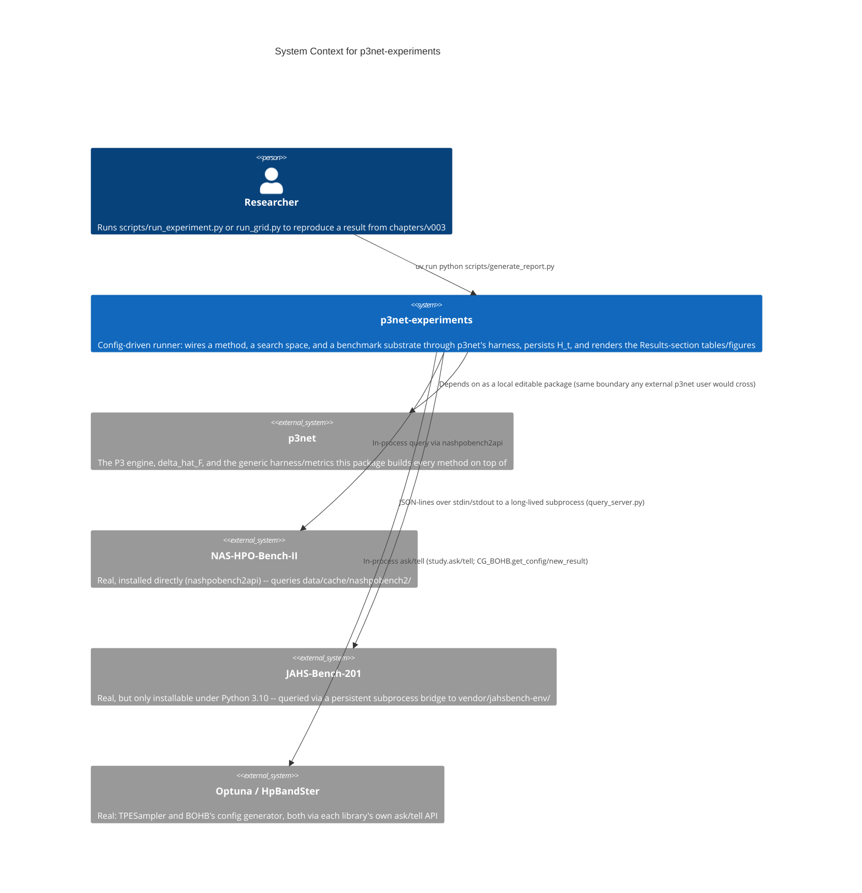

# C1 — System Context

This diagram shows `p3net-experiments` in relation to the people and
systems around it. Like `p3net` itself, it performs no persistent network
service of its own — the JAHS-Bench-201/optuna/hpbandster relationships
are outbound query dependencies at run time, not an exposed API.

## Actors

**Researcher** — Runs the config-driven scripts to reproduce one point
(`run_experiment.py`) or the full ablation grid (`run_grid.py`) of
`chapters/v003`'s experiment, then `generate_report.py` to render the
accumulated `results/raw/*.json` into the paper's Results-section tables
and figures.

## External Systems

**p3net** — The generic library `experiments/` consumes as an ordinary
dependency (`[tool.uv.sources]` local-editable path), never via a
relative import into its source tree. See
[`../../../lib/docs/architecture/README.md`](../../../lib/docs/architecture/README.md)
for its own C1–C4 documentation.

**NAS-HPO-Bench-II** — Queried in-process via the real, pip-installed
`nashpobench2api` against a downloaded dataset
(`data/cache/nashpobench2/`, gitignored).

**JAHS-Bench-201** — Queried via a persistent subprocess bridge
(`vendor/jahsbench-env/query_server.py`) to an isolated Python 3.10
environment, since the package cannot install under this project's main
Python 3.13 environment.

**Optuna / HpBandSter** — Real, pip-installed packages backing the TPE
and MO-BOHB baselines respectively, both driven through each library's
own ask/tell API rather than their `optimize()`/callback style, since
every arm is driven through `p3net.harness.Runner` instead.

## Notes

- No secrets, no user data, no authentication anywhere in this system —
  confirmed via a full git-history scan during the open-source-readiness
  audit (2026-08-14), zero findings beyond the author's own intentionally
  public contact email.
- The GECCO 2027 paper (`chapters/v003`) is the *specification* this
  package reproduces, not a runtime dependency — no diagram node for it,
  same convention as `p3net`'s own C1 doc.
