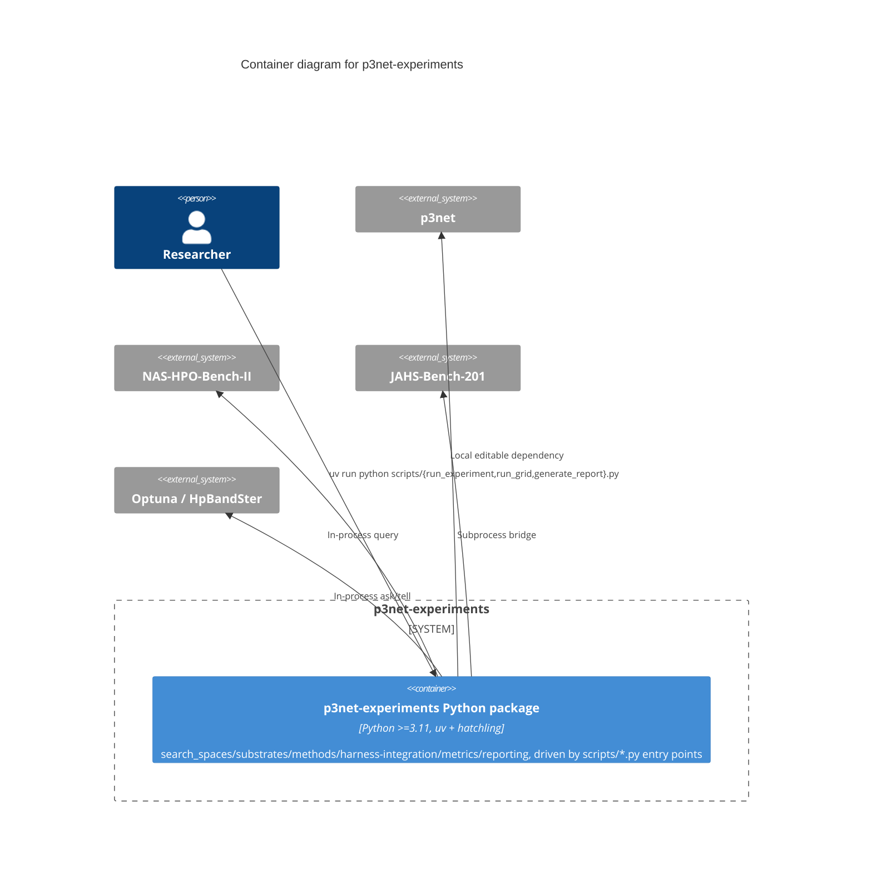

# C2 — Containers

`p3net-experiments` decomposes into exactly **one container**: a single
importable Python package plus a handful of CLI entry-point scripts that
import it, matching `p3net` itself. No server process, no database, no
message queue — every real system it talks to (JAHS-Bench-201,
NAS-HPO-Bench-II, Optuna, HpBandSter) is an outbound dependency it calls
into, not a container this system exposes. The interesting internal
structure lives one level down, at
[C3 — Components](../README.md#c3-components).

## The one container

| Container | Technology | Purpose |
|---|---|---|
| **p3net-experiments Python package** | Python ≥3.11, packaged with `uv` + `hatchling`, tested with `pytest`, linted/formatted with `ruff` | Everything specific to reproducing `chapters/v003`'s experiment: the NAS genotype(s), benchmark substrate adapters, all ten methods (P3Net's own arm plus nine baselines/ablations), the statistical plan, and reporting. Not distributed as a standalone package for others to depend on — this is the paper's own reproduction code, not a second general-purpose library. |

## Why not split further at this level

Same reasoning as `p3net`'s own C2 doc: no API server, no persistent
service, nothing that would need independent deployment or scaling. The
CLI scripts (`run_experiment.py`, `run_grid.py`, `generate_report.py`)
are entry points into the same package, not separate deployable units —
running the full ablation grid is `run_grid.py` calling `run_experiment.
run_single` in a loop, in-process, not a distributed job queue.

If this ever needed to run as a distributed grid (e.g. one process per
grid point, scheduled across machines), that's the point this diagram
would gain a second container. Not before — the current grid (nine
baselines/ablations x 2 benchmarks x 3 budget tiers x 10 seeds = 600
runs) is designed to run sequentially, skipping already-persisted points
(`run_grid.py`'s `skip_cached`).
