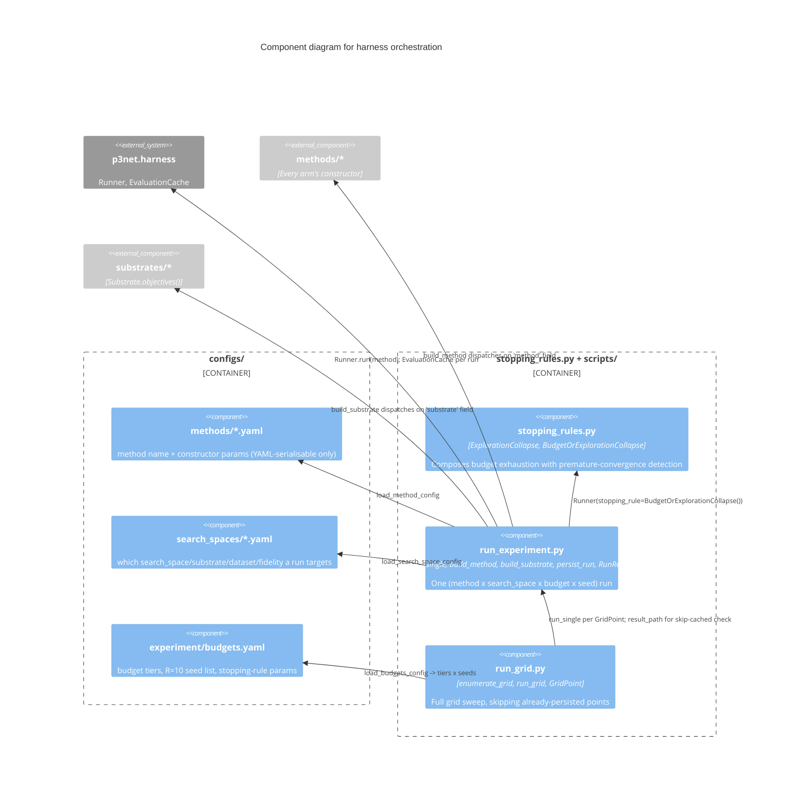

# C3 — Harness Orchestration Components

The config-driven glue turning a YAML file into a real, budget-driven
search run: the stopping rule, the method/search-space/substrate builders,
and the CLI entry points a researcher actually invokes. This is the layer
that makes every method in
[C3: Methods](methods.md) and every substrate in
[C3: Search Spaces & Substrates](search-spaces-and-substrates.md)
runnable from the command line with a fixed, reproducible configuration.

## Components

| Component | Responsibility | Source |
|---|---|---|
| **configs/methods/*.yaml** | One file per arm: `method` name + `params` (constructor kwargs, YAML-serialisable only — `model_factory` is a Python callable supplied by `run_experiment.py`, never from config). `p3net.yaml` uses `growth_factor`, not `population_size` — the latter no longer exists on `P3Net`'s constructor | `configs/methods/` |
| **configs/search_spaces/*.yaml** | Which `search_space`/`substrate`/dataset/fidelity one run targets | `configs/search_spaces/` |
| **configs/experiment/budgets.yaml** | `budget_tiers: [50, 100, 200]`, `seeds` (R=10, fixed published list), the `ExplorationCollapse` window/threshold | `configs/experiment/budgets.yaml` |
| **stopping_rules.py** | `ExplorationCollapse`: fires if the last `window` proposals fall below `min_unique_fraction` distinct genotypes. `BudgetOrExplorationCollapse`: composes it with the library's default budget-exhaustion rule — either firing stops the run | `stopping_rules.py` |
| **run_experiment.py** | `build_method`/`build_substrate`: config-to-object dispatch. `run_single`: one full run, returns `RunResult` (state + cache + method). `persist_run`: writes `results/raw/*.json` including per-run diagnostics | `scripts/run_experiment.py` |
| **run_grid.py** | `enumerate_grid`: the full cross product of configs x budget tiers x seeds. `run_grid`: dispatches each `GridPoint` to `run_single`, skipping points already on disk (`skip_cached`, default `True`) | `scripts/run_grid.py` |

See [C4: Run pipeline](../c4/run-experiment-pipeline.md) for the
`RunResult`/`persist_run` code-level detail.

## Why the stopping rule composes rather than replaces

`p3net.harness.runner.budget_exhausted` (the library default) and
`ExplorationCollapse` (this package's own addition, for search spaces
small enough to converge prematurely — analogous to Bartnik's addition
for NAS-Bench-201-scale spaces) are genuinely independent conditions,
either of which should end a run. `BudgetOrExplorationCollapse` composes
both rather than this package reimplementing budget tracking, keeping
`p3net.harness.Runner`'s pluggable `StoppingRule` protocol as the single
extension point.
