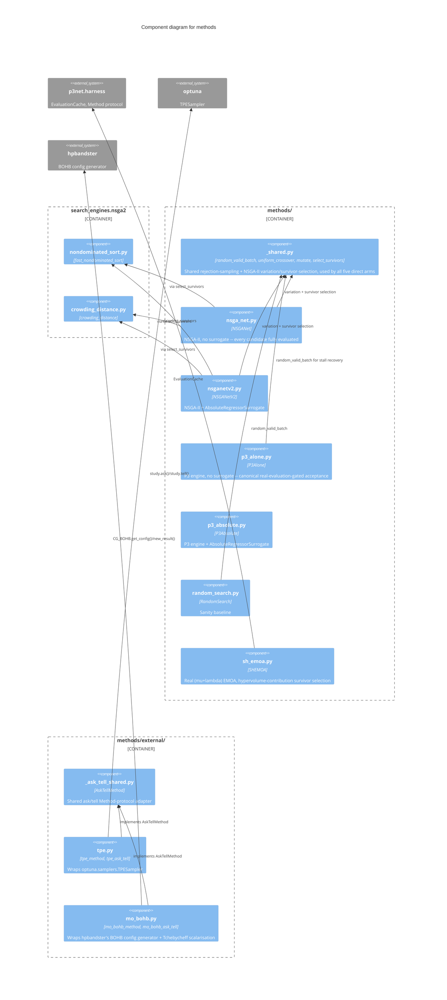

# C3 — Methods Components

The nine comparison arms (P3Net's own arm lives in `p3net.methods.p3net`,
library code — see
[`../../../lib/docs/architecture/c3/methods.md`](../../../lib/docs/architecture/c3/methods.md)).
Every arm implements `p3net.harness.runner`'s `Method` protocol
(`propose`/`update`) so `Runner` can drive all ten identically. Five are
implemented directly here (`methods/`); two real external algorithms are
wrapped through a shared ask/tell adapter (`methods/external/`); NSGA-II
itself (`search_engines/nsga2/`) is shared by the two NSGA-II-based arms.

## Components

| Component | Responsibility | Source |
|---|---|---|
| **_shared.py** | `random_valid_batch` (rejection-sampling, used by all five direct arms for initial population/stall recovery/sanity sampling), `uniform_crossover`/`mutate`/`select_survivors` (NSGA-II variation + mu+lambda elitist selection) | `methods/_shared.py` |
| **NSGANet** | NSGA-II, no surrogate — every candidate fully evaluated | `methods/nsga_net.py` |
| **NSGANetV2** | NSGA-II + `AbsoluteRegressorSurrogate` — the primary baseline | `methods/nsganetv2.py` |
| **P3Alone** | P3 engine's optimal-mixing sweep with the canonical acceptance rule: every proposal gated by a REAL `f1` evaluation, no surrogate. Tracks `sweeps_completed` for the paper's own budget-starvation diagnostic | `methods/p3_alone.py` |
| **P3Absolute** | P3 engine + `AbsoluteRegressorSurrogate` — isolates the surrogate's contribution from P3Net's relative δ̂_F | `methods/p3_absolute.py` |
| **RandomSearch** | Sanity baseline: one uniform-random valid genotype per `propose()`, no state | `methods/random_search.py` |
| **SHEMOA** | Real (mu+lambda) EMOA: uniform mutation/crossover, tournament selection, hypervolume-contribution survivor selection | `methods/sh_emoa.py` |
| **AskTellMethod** | Shared adapter shape both external wrappers implement: translate genotypes to/from each library's own config representation, route every ask through `EvaluationCache`, always eventually `tell()` something real | `methods/external/_ask_tell_shared.py` |
| **tpe_method** | Wraps real `optuna.samplers.TPESampler` via its native ask/tell API; supports multi-objective natively | `methods/external/tpe.py` |
| **mo_bohb_method** | Wraps the real, pip-installed `hpbandster` BOHB config generator with random-weight Tchebycheff scalarisation of `(f1, f2)` | `methods/external/mo_bohb.py` |

See [C4: MO-BOHB adaptation](../c4/mo-bohb-adaptation.md) and
[C4: SH-EMOA](../c4/sh-emoa.md) for code-level detail on the two most
algorithmically involved arms.

## Why a shared ask/tell adapter for exactly two arms

TPE and MO-BOHB are the only two arms wrapping a real *external*
optimisation library rather than implementing search logic directly —
both need the same translation shape (genotype <-> library config,
dedup-cache integration, always-tell discipline). `_ask_tell_shared.py`
factors that shape out once rather than duplicating it across two files
that would otherwise drift independently on dedup or cache-key handling.
