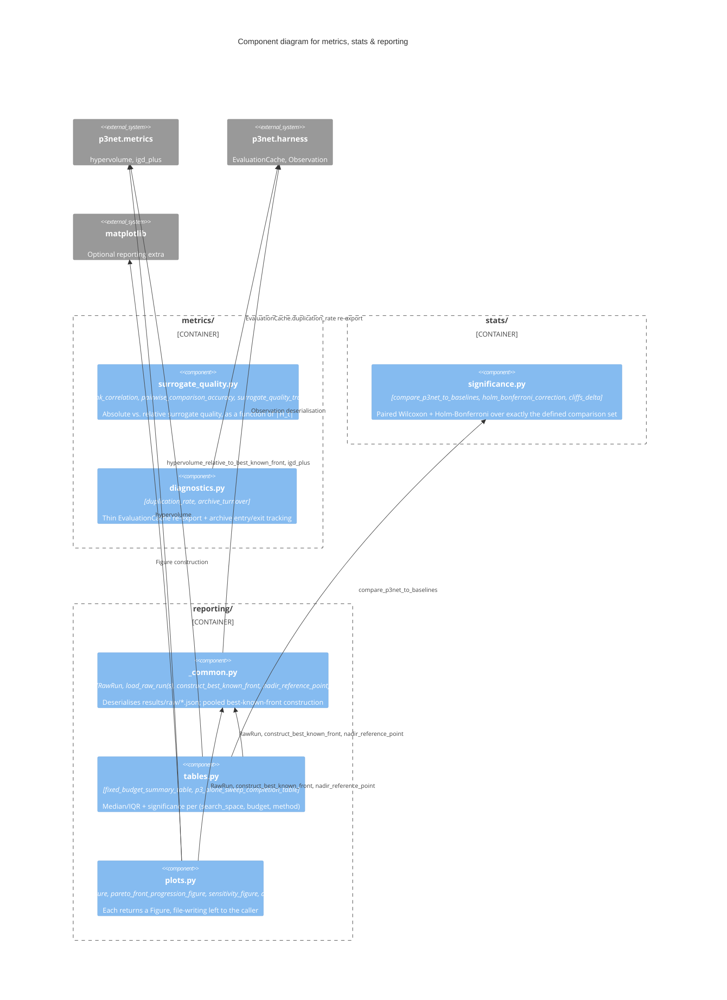

# C3 — Metrics, Statistics & Reporting Components

Everything downstream of a completed run: this paper's own diagnostic
metrics (surrogate quality, duplication rate), the statistical comparison
plan, and the reporting layer that turns accumulated `results/raw/*.json`
into the paper's Results-section tables and figures.

## Components

| Component | Responsibility | Source |
|---|---|---|
| **surrogate_quality.py** | `rank_correlation` (absolute-style surrogates), `pairwise_comparison_accuracy` (relational surrogates like δ̂_F, which have no absolute prediction to rank-correlate), `surrogate_quality_trace` (refits on growing `H_t` prefixes) | `metrics/surrogate_quality.py` |
| **diagnostics.py** | `duplication_rate` (thin `EvaluationCache` re-export — single source of truth, not a second counting mechanism), `archive_turnover` (entries/exits between consecutive population snapshots) | `metrics/diagnostics.py` |
| **significance.py** | `compare_p3net_to_baselines`: paired Wilcoxon signed-rank + Holm-Bonferroni correction, applied once over exactly the defined comparison set (P3Net vs. every other arm, per benchmark and budget tier) — never every pairwise combination | `stats/significance.py` |
| **_common.py** | `RawRun`/`load_raw_run(s)`: deserialises persisted JSON back into `Observation`-based records, additive `diagnostics` field defaults to `{}` for older files. `construct_best_known_front`/`nadir_reference_point`: the pooled-front construction `p3net.metrics` deliberately leaves to callers | `reporting/_common.py` |
| **tables.py** | `fixed_budget_summary_table`: median/IQR + Holm-corrected significance vs. P3Net, per (search_space, budget, method). `p3_alone_sweep_completion_table`: the paper's own sweep-completion side table | `reporting/tables.py` |
| **plots.py** | `convergence_curve_figure`, `pareto_front_progression_figure`, `sensitivity_figure`, `duplication_rate_figure` — each returns a `matplotlib.figure.Figure`; `matplotlib` is an optional extra | `reporting/plots.py` |

See [C4: Reporting pipeline](../c4/reporting-pipeline.md) for the
best-known-front and summary-table construction in code-level detail.

## Why `reporting/` depends on `_common.py` rather than `metrics/`/`stats/` directly duplicating it

`RawRun`/`construct_best_known_front`/`nadir_reference_point` are needed
by both `tables.py` and `plots.py` — `_common.py` is the single
implementation both import, rather than each reimplementing (and
potentially drifting on) the same best-known-front pooling logic. Neither
`metrics/` nor `stats/` needs this machinery at all: they operate on a
single run's `Observation` history or a paired-scores list respectively,
never on the cross-run pooling `reporting/` alone requires.
