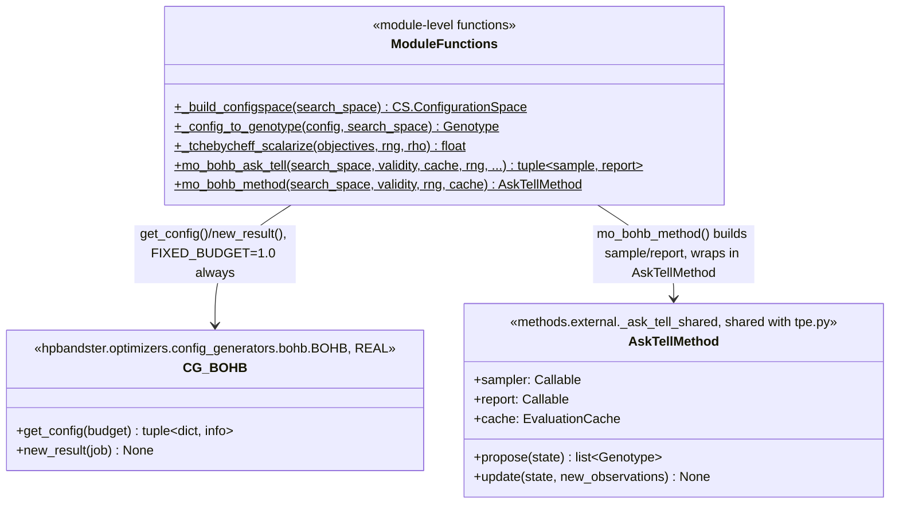

# C4 — MO-BOHB Adaptation Code

`methods/external/mo_bohb.py` wraps the real, pip-installed
`hpbandster.optimizers.config_generators.bohb.BOHB` — fundamentally
single-objective — with random-weight Tchebycheff scalarisation to make
it usable for this paper's `(f1, f2)` setting. This is a documented
adaptation, not the paper's own (unpublished) multi-objective fork: their
reference code (`automl/multi-obj-baselines`) depends on a custom-modified
hpbandster fork with its own bespoke multi-objective config generator,
not something `pip install hpbandster` provides.

## Function Responsibilities

| Function | Role |
|---|---|
| **_build_configspace** | Translates `SearchSpace.domains` into a `ConfigSpace.ConfigurationSpace` of `CategoricalHyperparameter`s, `x0..xN` |
| **_config_to_genotype** | ConfigSpace hands back numpy scalar types (`np.str_`, `np.float64`), not the original Python objects — matches each returned value back to its exact source object in the domain, so the resulting `Genotype` is type-identical to every other arm's and stays JSON-serialisable for `persist_run` |
| **_tchebycheff_scalarize** | Draws a fresh random non-negative weight vector (summing to 1) each call, computes `max(w_i * f_i) + rho * sum(w_i * f_i)` — the same technique visible in the reference implementation's own `MOBOHBWorker.tchebycheff_norm`, applied to the real `CG_BOHB` here |
| **mo_bohb_ask_tell** | Builds the real `(sample, report)` pair: `sample()` calls `CG_BOHB.get_config`, decodes it, and either tells BOHB a scalarised loss immediately (invalid or already-cached genotype) or returns it as a fresh proposal; `report()` scalarises the real evaluation and tells BOHB |
| **mo_bohb_method** | Wraps the above in `AskTellMethod` — the same generic ask/tell `Method` implementation `tpe.py` uses |

## Why every `sample()` call always tells BOHB something

`CG_BOHB.get_config` is a real, stateful sampler — if a config it hands
back turns out invalid or duplicate, `sample()` doesn't just skip it and
ask again silently: it calls `_tell_loss(config, float("inf"))` (invalid)
or the real cached objective's scalarisation (duplicate) before looping.
Never telling BOHB about a config it generated would leave its internal
KDE model's bookkeeping permanently out of sync with what it actually
proposed — the same "always eventually told something real" discipline
`tpe.py` follows for the same reason.

## The fixed-budget limitation

`FIXED_BUDGET = 1.0` is passed to every `get_config`/`new_result` call.
`CG_BOHB` itself is genuinely budget-aware (real Hyperband mechanics) —
this is a harness limitation (`p3net.harness.Runner`/`substrates.
Substrate` only support single-fidelity `r_K` queries), not a limitation
of the real algorithm being wrapped.
