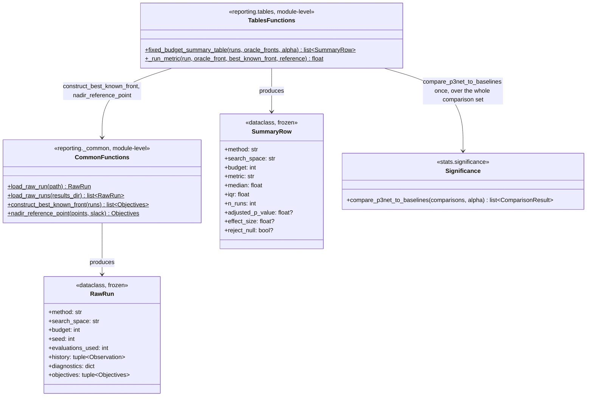

# C4 — Reporting Pipeline Code

`reporting/_common.py` and `reporting/tables.py` turn accumulated
`results/raw/*.json` into the paper's fixed-budget summary table:
deserialise, pool into a best-known front, compute a per-run metric
against it, then run the defined P3Net-vs-baselines significance
comparison exactly once over the whole set. The best-known front
implements the paper's own suggested candidate definition (`chapters/
v003/results/main.tex`, "Metrics" paragraph): the Pareto front of the
union of every point evaluated by any compared method across all runs.

## Class / Function Responsibilities

| Class / Function | Role |
|---|---|
| **RawRun** | One deserialised `results/raw/*.json` file. `.objectives` is a convenience property flattening `history` into a plain tuple of `Objectives` |
| **load_raw_run(s)** | JSON -> `RawRun`, reconstructing `Genotype`/`Observation` without needing a `SearchSpace` (a `Genotype` is just a value tuple) |
| **construct_best_known_front** | Pareto front of the union of every point across the given runs |
| **nadir_reference_point** | Coordinate-wise max + slack over *raw* points, not the filtered front's own nadir |
| **fixed_budget_summary_table** | Per (search_space, budget, method): groups runs, picks IGD+ or best-known-front-relative hypervolume as the metric, computes median/IQR, then runs one Holm-corrected significance pass over every P3Net-vs-baseline pair with >=2 shared seeds |

## Why the reference point comes from raw points, not the pooled front

`hypervolume()` requires its reference point to be weakly worse than
every point it scores. `construct_best_known_front` filters to only
*non-dominated* points — a dominated point can still have a worse
single-objective coordinate than anything on the front (e.g. it's
dominated on objective 1 but has an even worse objective 2 than the
front's own worst point). Computing `nadir_reference_point` from the
front's own nadir would risk that dominated point later violating the
reference requirement when a run containing it gets scored. Deriving the
reference from the full raw-point pool instead guarantees it dominates
everything that will ever be scored against it, since the front is a
strict subset of that same pool.

## Why the best-known front pools across every budget tier

`fixed_budget_summary_table` calls `construct_best_known_front` with
every run for a given `search_space`, across **all** budget tiers, not
just the tier being scored. If each tier used its own front, a 50-budget
run's relative-hypervolume score and a 200-budget run's would not be
comparable — the 200-budget tier would always look artificially better
purely because it's being compared against a smaller, easier-to-cover
front of its own points. Pooling once per benchmark keeps the denominator
fixed across tiers, so cross-tier comparisons (e.g. convergence curves)
are meaningful.

## Why significance is computed once, not per group

Holm-Bonferroni's correction strength depends on the total number of
comparisons `m`. `fixed_budget_summary_table` collects every
P3Net-vs-baseline `Comparison` across every `(search_space, budget)`
group *first*, then calls `compare_p3net_to_baselines` exactly once over
the full list — correcting across the whole defined comparison set (the
paper's own statistical plan), not separately per group, which would
under-correct.
