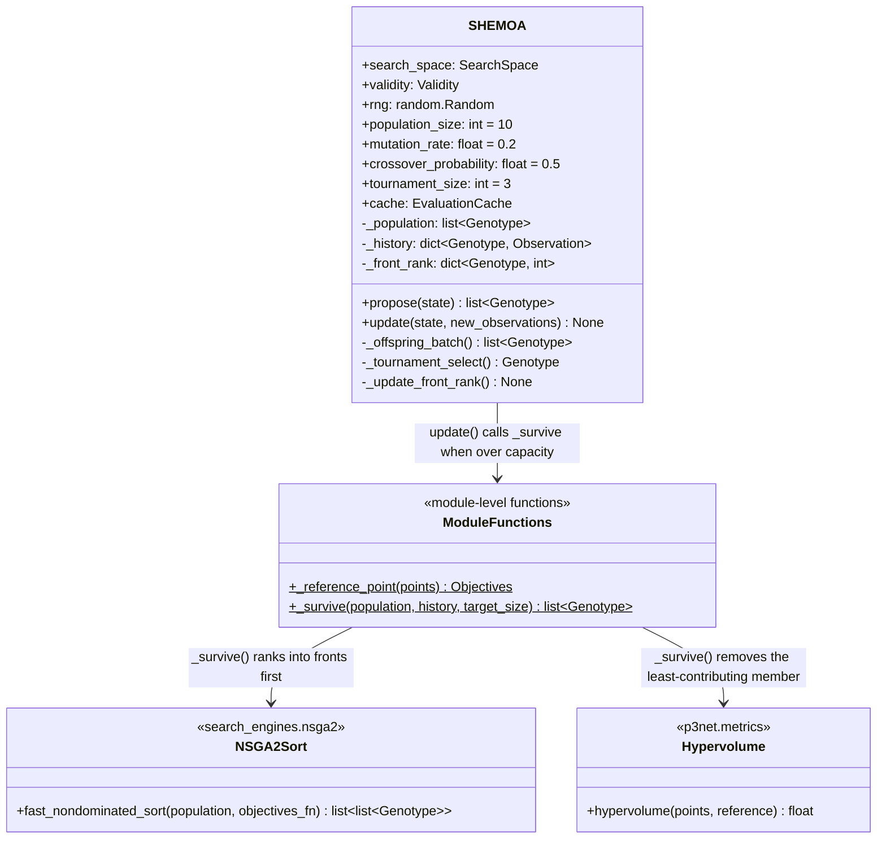

# C4 — SH-EMOA Code

`methods/sh_emoa.py`'s `SHEMOA` is a real, from-scratch (mu+lambda)
evolutionary multi-objective algorithm — not a wrapper around any
existing library. No published SH-EMOA package exists to wrap, and the
paper's own reference implementation is itself self-contained (reading
`automl/multi-obj-baselines` directly confirmed it doesn't use pymoo or
SMS-EMOA's code — "built on SMS-EMOA" refers to sharing its
hypervolume-contribution survivor-selection *principle*, not shared
code).

## Class Responsibilities

| Class / Function | Role |
|---|---|
| **SHEMOA** | Owns the population and `H_t`. `propose()` bootstraps randomly until `population_size`, then produces one offspring per call via tournament selection + mutation/crossover. `update()` folds new evaluations in and calls `_survive()` once over capacity |
| **_reference_point** | Nadir + 1% margin over the given points — a fresh reference computed for each `_survive()` call, not fixed once |
| **_survive** | SMS-EMOA's own survivor-selection rule: non-dominated sort, keep whole fronts while they fit, then repeatedly remove whichever member of the overflowing front contributes the *least* hypervolume until the population is back at `population_size` |

## Survivor selection is the whole point

`_survive`'s hypervolume-contribution removal is exactly what "SH-EMOA...
built on SMS-EMOA" (the paper's own phrase) refers to — not shared code
with SMS-EMOA, shared *principle*. It is also the single most expensive
part of this class: for an overflowing front of size `k` that needs
trimming to `keep_count`, it recomputes the whole front's hypervolume and
every member's marginal contribution on each of the `k - keep_count`
removal steps — `p3net.metrics.hypervolume`'s exact inclusion-exclusion
algorithm is O(2^front_size) per call, so this is only practical because
`population_size` (default 10) keeps fronts small in this codebase's
usage.

## The documented gap: no successive-halving

The module docstring is explicit that only the (mu+lambda) EMOA half is
implemented — the "SH" (successive-halving / multi-fidelity budget
escalation) half needs `p3net.harness.Runner`/`substrates.Substrate` to
support querying below full fidelity `r_K`, which they don't — the same
limitation `methods/external/mo_bohb.py` documents for the same
underlying reason.
