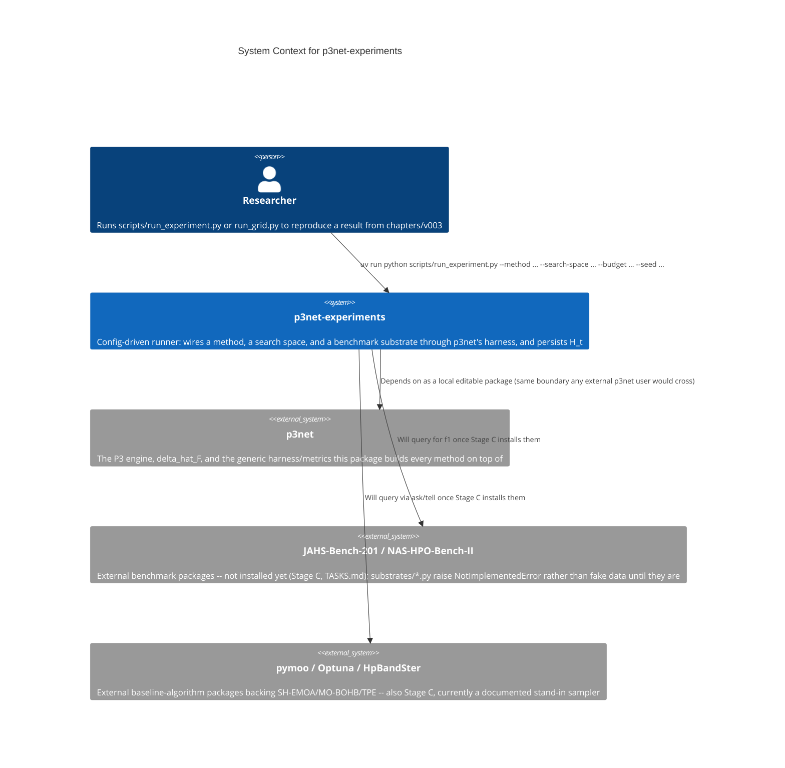

# Architecture Documentation

## Project Overview

`p3net-experiments` reproduces the GECCO 2027 paper's (`chapters/v003`)
experiment: the nine-arm ablation grid plus five additional baselines, on
JAHS-Bench-201 and NAS-HPO-Bench-II. It consumes the
[`p3net`](../../../lib/README.md) library as an ordinary dependency and
adds only what's specific to this one paper.

## How to Read This Documentation

A single page, not a full C4 set — this package is a thin, mostly-linear
pipeline (config → search space + substrate → method → harness → results),
not a system with enough internal complexity to need C2/C4-level
deep-dives yet. See [`../../lib/docs/architecture/`](../../../lib/docs/architecture/README.md)
for the library's full C1–C4 documentation, which this package builds on.

## C1 — System Context

## Module map (C3-equivalent)

The one container (`p3net-experiments`) has eight subpackages plus two
top-level modules. Dependency direction is top-to-bottom; nothing here
depends on `scripts/`.

| Module | Depends on | Responsibility |
|---|---|---|
| `search_spaces/` | `p3net.problem` | The concrete NAS genotype (6 edges + discretised Θ) every arm shares |
| `substrates/` | `search_spaces/` | JAHS-Bench-201 / NAS-HPO-Bench-II adapters — structural only, `NotImplementedError` until Stage C |
| `search_engines/nsga2/` | `p3net.problem` | Fast nondominated sort + crowding distance, for the NSGA-II-based arms |
| `methods/` | `p3net.*`, `search_engines/nsga2/`, `methods/_shared.py` | The nine non-P3Net arms (`p3net.methods.p3net` itself is library code) |
| `methods/external/` | `p3net.harness` | Ask/tell scaffolding for SH-EMOA/MO-BOHB/TPE — real backends are Stage C |
| `stopping_rules.py` | `p3net.harness.runner` | `ExplorationCollapse` + composition with the library's default budget rule |
| `metrics/` | `p3net.harness`, `p3net.problem` | Surrogate-quality (rank correlation / pairwise-comparison-accuracy) and duplication-rate/archive-turnover diagnostics |
| `stats/` | (pure) | Paired Wilcoxon + Holm–Bonferroni + Cliff's delta over the defined P3Net-vs-nine-arms comparison set |
| `reporting/` | `metrics/`, `stats/`, `p3net.metrics` | **Not implemented yet** (Phase 7) — tables/plots for the paper's Results section |
| `scripts/` | everything above | CLI entry points: `run_experiment.py` (single run), `run_grid.py` (full sweep); `run_kappa_sensitivity.py`/`generate_report.py` not implemented yet |
| `configs/` | (data only) | YAML: which method/search-space/budget a run targets — no Python logic |

## Notes

- No secrets, no user data, no authentication anywhere in this system —
  confirmed via a full git-history scan during the open-source-readiness
  audit (2026-08-14), zero findings beyond the author's own intentionally
  public contact email.
- `substrates/*.py` and `methods/external/*.py` deliberately fail loudly
  (`NotImplementedError`) rather than return placeholder data — the
  correct C1 relationships to the two external system boxes above exist
  in code today, but no live call across them has been made yet.
- See [`../../TASKS.md`](../../TASKS.md) for the phase-by-phase
  implementation record, including every documented gap.
