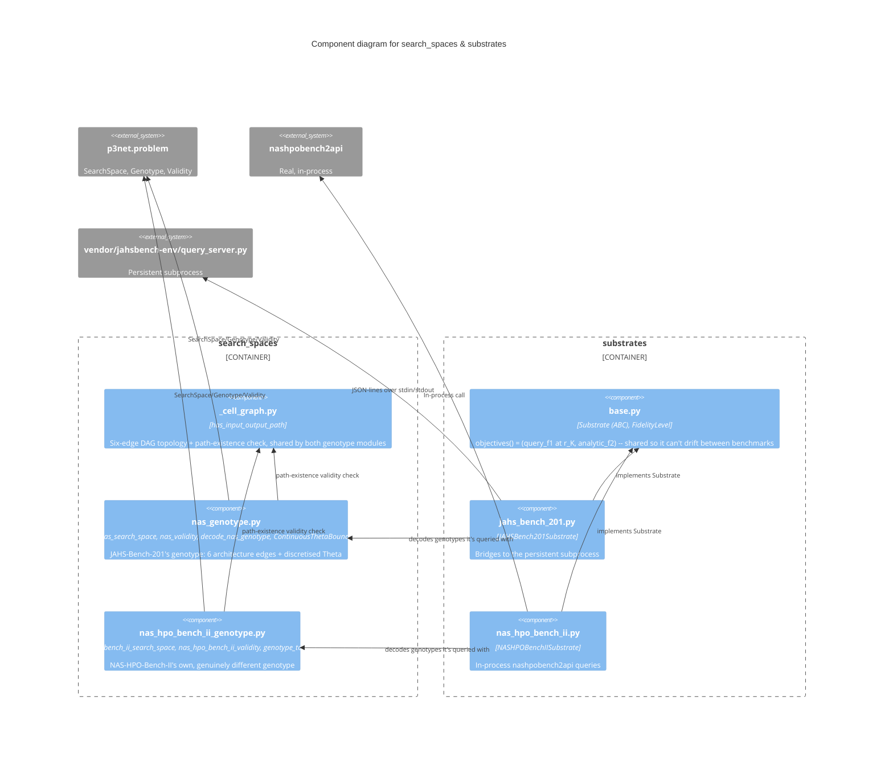

# C3 — Search Spaces & Substrates Components

Defines *what* is being searched (the genotype, per benchmark) and *how*
a candidate gets a real objective value (the substrate adapter querying
each benchmark's real data). The two benchmarks deliberately do **not**
share a genotype — see below — even though both build on
`p3net.problem.genotype.SearchSpace`.

## Components

| Component | Responsibility | Source |
|---|---|---|
| **_cell_graph.py** | `has_input_output_path`: the six-edge DAG topology and path-existence validity check genuinely shared by both genotype modules | `search_spaces/_cell_graph.py` |
| **nas_genotype.py** | `nas_search_space()`: 6 categorical architecture edges + discretised Θ (learning rate, weight decay, activation, augmentation). `ContinuousThetaBounds`: the separate real-valued Θ representation for the `nsganetv2_continuous` control | `search_spaces/nas_genotype.py` |
| **nas_hpo_bench_ii_genotype.py** | `nas_hpo_bench_ii_search_space()`: NAS-HPO-Bench-II's real, narrower genotype (4 cell ops, learning rate x batch size only) — verified against live data, not assumed | `search_spaces/nas_hpo_bench_ii_genotype.py` |
| **base.py** | `Substrate` (ABC): `fidelity_ladder`/`query_f1`/`analytic_f2` as the abstract contract; `objectives()` (shared, non-overridable) always queries `f1` at `r_K` and `f2` at the fixed highest-fidelity setting | `substrates/base.py` |
| **jahs_bench_201.py** | `JAHSBench201Substrate`: real queries via a persistent subprocess bridge | `substrates/jahs_bench_201.py` |
| **nas_hpo_bench_ii.py** | `NASHPOBenchIISubstrate`: real, in-process queries via `nashpobench2api` | `substrates/nas_hpo_bench_ii.py` |

## Why the two benchmarks don't share a genotype

An earlier version assumed one shared genotype module could serve both
benchmarks (they're both NAS-Bench-201-style cell graphs). Wiring real
NAS-HPO-Bench-II queries surfaced that its actual search space is
narrower (learning rate x batch size only, not JAHS-Bench-201's four
hyperparameter axes) — a real difference, not a configuration variant,
caught only by querying the live dataset rather than trusting the
structural assumption.
