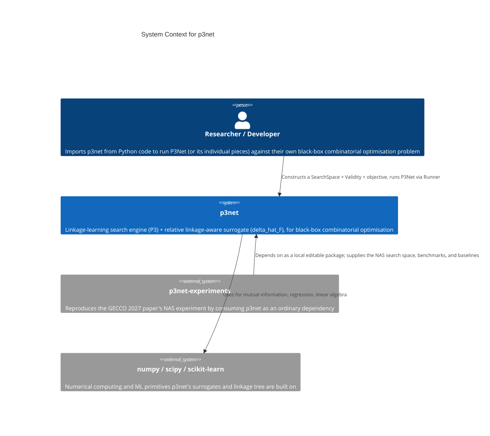

# C1 — System Context

This diagram shows `p3net` in relation to the people and systems around
it. `p3net` performs no network I/O and holds no persistent state of its
own — everything here is a Python-level (import/call) relationship, not a
network call.

## Actors

**Researcher / Developer** — Anyone using `p3net` on their own black-box
combinatorial optimisation problem: defines a `SearchSpace`, a `Validity`
check, and an objective function, then drives `P3Net` (or a smaller piece
of it — the linkage tree, a surrogate, the generic metrics) via
`harness.Runner`. This includes the paper's own authors when reproducing
`chapters/v003`'s results through `p3net-experiments`.

## External Systems

**p3net-experiments** — The GECCO 2027 paper reproduction. Consumes
`p3net` exactly the way any other researcher would (a declared,
local-editable dependency — see its own `pyproject.toml`), never via
relative imports into this package's source tree. Supplies everything
specific to that one paper: the NAS genotype, the JAHS-Bench-201 /
NAS-HPO-Bench-II adapters, the eight comparison baselines, the paper's
exact statistical plan.

**numpy / scipy / scikit-learn** — The only runtime dependencies. `scipy`
and `scikit-learn` back the UPGMA linkage tree (`normalized_mutual_info_score`)
and the two regression-based surrogates; `numpy` is a transitive
dependency of both. No other external system — no database, no API, no
file storage beyond what a caller chooses to do with the returned data.

## Notes

- `p3net` is a pure computation library: given a `SearchSpace`, a
  `Validity` callable, an objective callable, and a budget, it returns an
  observation history. It does not know or care what the caller does with
  the result.
- The GECCO 2027 paper (`chapters/v003`) is the *specification* this
  library implements, not a runtime dependency — there is no diagram node
  for it because C1 documents runtime relationships, not provenance.
- No secrets, no user data, no authentication anywhere in this system —
  confirmed during the maintainability/open-source-readiness audit (full
  git history scan, zero findings beyond the author's own intentionally
  public contact email).
