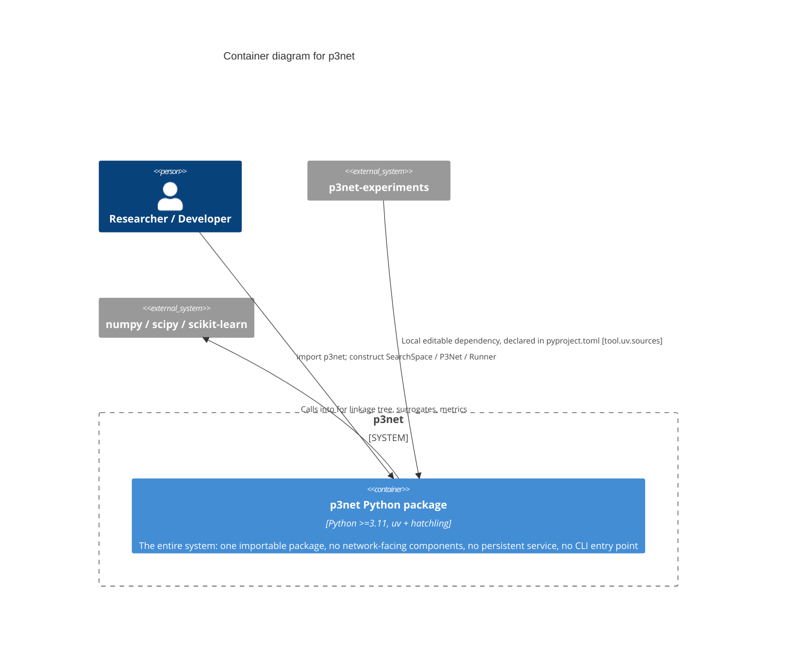

# C2 — Containers

`p3net` decomposes into exactly **one container**: a single importable
Python package. This is stated explicitly, not glossed over — C2 exists in
the C4 model to show how a system splits across independently deployable
units, and for a library with no server process, no database, and no
message queue, the honest answer is that it doesn't split. Forcing an
artificial multi-container diagram here would misrepresent the system.
The interesting internal structure lives one level down, at
[C3 — Components](../c3/components.md).

## The one container

| Container | Technology | Purpose |
|---|---|---|
| **p3net Python package** | Python ≥3.11, packaged with `uv` + `hatchling`, tested with `pytest`, linted/formatted with `ruff` | The library in its entirety: `SearchSpace`/`Genotype` machinery, the P3 engine, both surrogates, the `P3Net` method, the harness (dedup cache, generic `Runner`), and generic multi-objective metrics. Distributed as a normal Python package (`pip install` / `uv add`, or a local editable path for `p3net-experiments`). |

## Why not split further at this level

A library with a single distribution artifact and no runtime process
boundaries doesn't have "containers" in the C4 sense beyond the package
itself — there's no API server to separate from a worker, no database to
separate from application code. Confirmed by inspection during the C1/C2
documentation pass: zero network calls, zero persistent storage, zero
entry points (`grep -rln "if __name__" src/p3net` returns nothing — this
package exposes no CLI or script, only an importable API).

If `p3net` ever grows a second deployable unit — e.g. a CLI wrapper, or a
service exposing search-as-a-service — that's the point this diagram
would gain a second `Container(...)` node. Not before.
