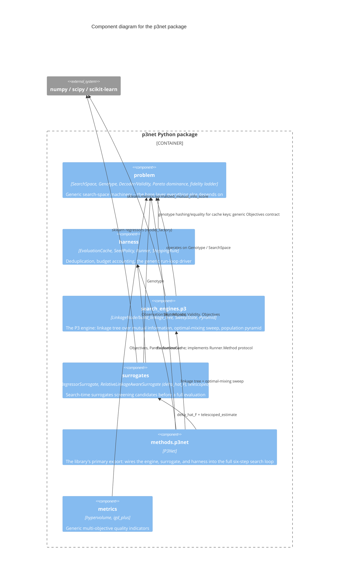

# C3 — Components

The one container (`p3net Python package`) decomposes into six
subpackages. The dependency graph below is not aspirational — it was
verified directly against the actual import statements
(`grep -rn "^from p3net\|^import p3net" src/p3net`) during the
maintainability audit: it is a strictly layered, acyclic graph, with
`problem` as the only zero-dependency base and `methods.p3net` as the sole
integration point.

## Components

| Component | Responsibility | Source | Depends on |
|---|---|---|---|
| **problem** | Domain-agnostic search-space machinery: `SearchSpace`/`Genotype` (Cartesian product of categorical domains + pluggable discretisation), `Decoder`/`Validity` as plain callables, `dominates`/`pareto_front`, `FidelityLadder`, `evaluate_with_noise` | `src/p3net/problem/` | *(nothing — base layer)* |
| **harness** | `EvaluationCache` keyed on (genotype, experiment type, protocol version) with proposal-time duplication tracking; `SeedPolicy` (R vs s); generic `Runner` driving any `Method` against any objective under a pluggable `StoppingRule` | `src/p3net/harness/` | `problem` |
| **search_engines.p3** | UPGMA linkage tree over normalised mutual information (`linkage_tree.py`); acceptance-agnostic optimal-mixing sweep (`optimal_mixing.py`, `SweepState`); population pyramid (`pyramid.py`, implemented but not yet wired into `methods.p3net` — see [C4: P3Net search loop](../c4/p3net-method.md)) | `src/p3net/search_engines/p3/` | `problem` |
| **surrogates** | Absolute regressor (one-hot encoding); relative linkage-aware δ̂_F (directional one-hot over both endpoints — see [C4: relative surrogate](../c4/relative-surrogate.md) for why); telescoping chain reconstruction; shared internal encoding helper (`_encoding.py`, extracted after the maintainability audit found it duplicated) | `src/p3net/surrogates/` | `problem`, `harness` |
| **methods.p3net** | `P3Net`: the full search loop (Proposed Optimizer steps 1–6), implementing `harness.Runner`'s `Method` protocol. The one place all five other components meet. | `src/p3net/methods/p3net.py` | `problem`, `harness`, `search_engines.p3`, `surrogates` |
| **metrics** | Generic hypervolume (exact, via inclusion-exclusion; supports an externally-supplied reference front) and IGD+ against a known oracle front | `src/p3net/metrics/` | `problem` |

## Why this shape

- **`problem` has zero internal dependencies by design.** Every other
  component needs a genotype/search-space vocabulary; nothing in
  `problem` needs to know about caching, surrogates, or the P3 engine.
  This is what keeps the library's public surface domain-agnostic — a
  different search engine or surrogate could be built against `problem`
  without touching it.
- **`methods.p3net` is the only component allowed to know about
  everything else.** It is, by construction, the most complex file in the
  package (confirmed in the maintainability audit — the only file with
  documented simplifications). That complexity is contained to one
  integration point rather than spread across the package.
- **`surrogates` depends on `harness` only for the `Observation` type**,
  not for caching or run-loop behaviour — a narrow, single-purpose
  coupling, not a layering violation.
