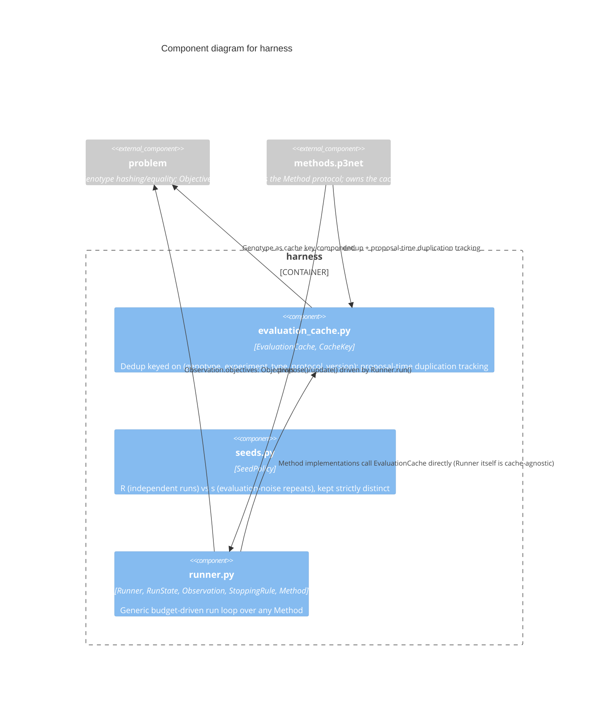

# C3 — Harness Components

`harness` is the shared run infrastructure every `Method` (P3Net, or any
caller-supplied search algorithm) is driven through: deduplication,
budget accounting, and the seed policy separating independent search runs
from evaluation-noise repeats. It depends only on `problem`, for genotype
hashing/equality and the generic `Objectives` contract.

## Components

| Component | Responsibility | Source | ADR References |
|---|---|---|---|
| **evaluation_cache.py** | `EvaluationCache`: dedup cache keyed on `(genotype, experiment_type, protocol_version)` — a protocol-version bump invalidates stale entries automatically, without deleting anything. `record_proposal` tracks genotype duplication rate at PROPOSAL time (whether or not a given proposal turns out to be a cache hit), independent of `has`/`get`/`put`'s cache-lookup role | `src/p3net/harness/evaluation_cache.py` | — |
| **seeds.py** | `SeedPolicy`: `run_seeds` (R independent search runs) and `s` (evaluation-noise repeats) as two explicitly separate concepts on one dataclass, never collapsed into a single "seed" parameter | `src/p3net/harness/seeds.py` | — |
| **runner.py** | `Runner`: generic budget-driven run loop, calling any `Method`'s `propose`/`update` until a `StoppingRule` fires (default: `budget_exhausted`). `RunState`/`Observation` are the shared record types every component that consumes run history reads | `src/p3net/harness/runner.py` | — |

## The run loop

`Runner.run(method)` repeats, until the `StoppingRule` fires:

1. `method.propose(state)` — the method returns a batch of `Genotype`s it wants fully evaluated.
2. `Runner` evaluates each via the caller-supplied `objective` callable — the only budget-consuming step.
3. `method.update(state, new_observations)` — the method absorbs the real results.

`Runner` itself has no P3Net-specific knowledge and no opinion on
deduplication — a `Method` implementation (e.g. `P3Net`) is responsible
for calling into its own `EvaluationCache` before returning a proposal, if
it wants dedup at all. This keeps `Runner` reusable for a `Method` that
doesn't need caching.
