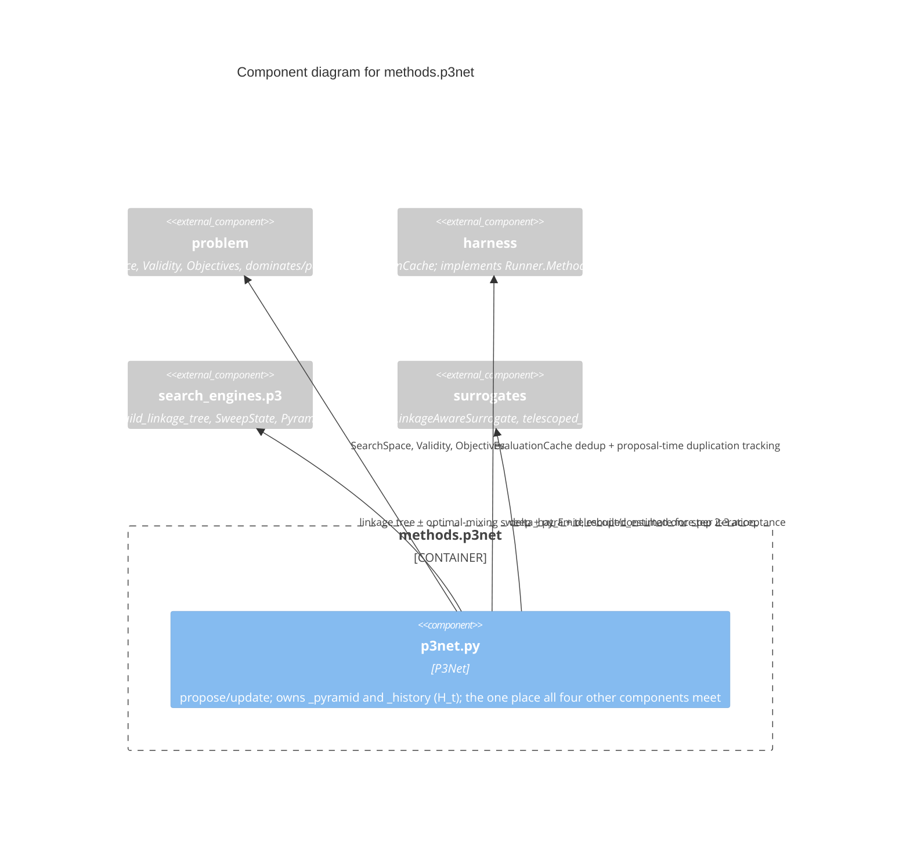

# C3 — Methods Component

`methods.p3net` is the library's primary export and its sole integration
point: the only component allowed to know about every other one. It wires
`search_engines.p3` (linkage tree, optimal-mixing sweep, pyramid) and
`surrogates` (the relative linkage-aware surrogate) into the full
six-step search loop, implementing `harness.Runner`'s `Method` protocol
so it can be driven generically. See
[C4: P3Net search loop](../c4/p3net-method.md) for the step-by-step
detail this file deliberately stays above.

## Components

| Component | Responsibility | Source |
|---|---|---|
| **p3net.py** | `P3Net`: the full six-step search loop (Proposed Optimizer). By construction the most complex file in the package — the only file carrying documented simplifications | `src/p3net/methods/p3net.py` |

## Why this is the only cross-cutting component

Every other component (`problem`, `harness`, `search_engines.p3`,
`surrogates`, `metrics`) is usable independently — a caller could drive
the linkage tree or a surrogate on its own without `P3Net` existing at
all. `P3Net` is deliberately the single place that assembles all of them
into one runnable algorithm, so that complexity concentrates in one
file with three documented simplifications (two resolved as of
2026-08-15) rather than spreading implicit cross-component coupling
throughout the package.
