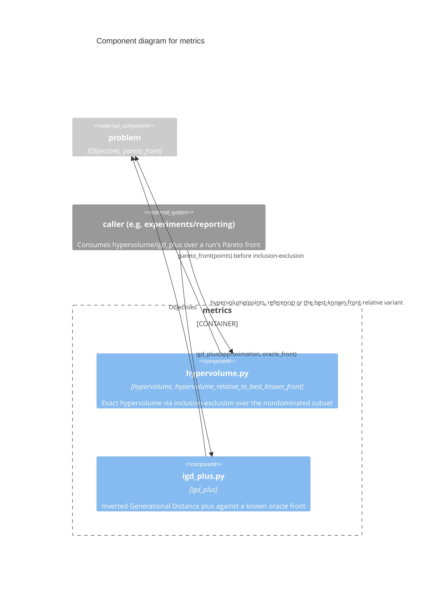

# C3 — Metrics Components

`metrics` is generic multi-objective quality indicators, consumed by
callers (e.g. `experiments/reporting/`) to score a search run's result
against either a known oracle front or a best-known-front approximation.
Depends only on `problem` for `Objectives`/Pareto dominance — no
knowledge of `H_t`, `Runner`, or any specific method.

## Components

| Component | Responsibility | Source | ADR References |
|---|---|---|---|
| **hypervolume.py** | `hypervolume(points, reference)`: exact, via inclusion-exclusion over the nondominated subset of `points` — O(2^k) in the number of nondominated points, fine at this library's scale. `hypervolume_relative_to_best_known_front`: the ratio fallback for benchmarks with no enumerable oracle front; constructing the best-known front itself is the caller's job (`experiments/reporting/_common.py::construct_best_known_front`) | `src/p3net/metrics/hypervolume.py` | — |
| **igd_plus.py** | `igd_plus(approximation, oracle_front)`: for each oracle point, the closest approximation point under the IGD+ modified distance (only counts how much worse an approximation point is, not how much better), averaged over the oracle front. Only applicable where an exact oracle front exists — callers are responsible for that guard | `src/p3net/metrics/igd_plus.py` | — |

## Why this component has no opinion on best-known-front construction

`hypervolume_relative_to_best_known_front` takes the best-known front as
a parameter rather than constructing it, because doing so requires
pooling points across every compared method's runs — information this
generic, single-run-scoped library has no reason to hold. That pooling is
exactly what `experiments/reporting/_common.py::construct_best_known_front`
does, kept out of `p3net` deliberately to preserve the split between the
generic library and the paper-specific reproduction (see
[`../../README.md`](../../README.md)'s "Relationship to the experiments
repository" section).
