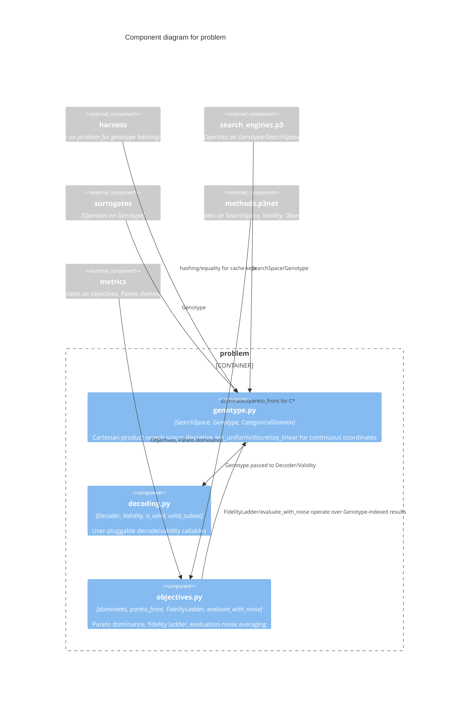

# C3 — Problem Components

`problem` is the base layer every other component depends on: a generic,
domain-agnostic vocabulary for describing a search space, a genotype
within it, decoding/validity callables, Pareto dominance, and the
fidelity/noise machinery a concrete substrate may optionally use. It has
zero internal dependencies by design — nothing here needs caching, a
surrogate, or the P3 engine.

## Components

| Component | Responsibility | Source | ADR References |
|---|---|---|---|
| **genotype.py** | `SearchSpace` (Cartesian product of `CategoricalDomain`s), `Genotype` (frozen, hashable value tuple), `discretize_log_uniform`/`discretize_linear` for turning a continuous coordinate into a fixed grid before it enters a `CategoricalDomain` | `src/p3net/problem/genotype.py` | — |
| **decoding.py** | `Decoder`/`Validity` as plain callables (`Genotype -> T` / `Genotype -> float`), `is_valid`/`valid_subset` implementing `g(x) <= 0` | `src/p3net/problem/decoding.py` | — |
| **objectives.py** | `dominates`/`pareto_front` (generic Pareto machinery over any objective count), `FidelityLadder` (ordered resource levels), `evaluate_with_noise` (s-repeat averaging for stochastic substrates) | `src/p3net/problem/objectives.py` | — |

## Why zero dependencies

Every other component needs a genotype/search-space vocabulary; nothing
in `problem` needs to know about caching, surrogates, or the P3 engine.
This is what keeps the library's public surface domain-agnostic — a
different search engine or surrogate could be built against `problem`
without touching it. Confirmed by the maintainability audit's direct
import-statement scan (`grep -rn "^from p3net\|^import p3net" src/p3net`):
`problem/` imports nothing else under `p3net.*`.
