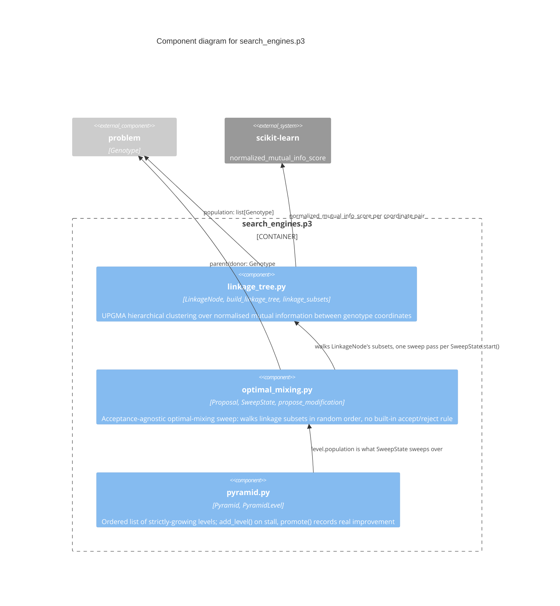

# C3 — P3 Search Engine Components

`search_engines.p3` is the P3 engine proper: a UPGMA linkage tree built
over normalised mutual information, an acceptance-agnostic optimal-mixing
sweep, and the population pyramid controlling parameter-less growth. It
depends only on `problem` (`Genotype`/`SearchSpace`) and, for the linkage
tree specifically, `scikit-learn`'s mutual-information estimator.

## Components

| Component | Responsibility | Source |
|---|---|---|
| **linkage_tree.py** | `build_linkage_tree(population)`: UPGMA hierarchical clustering over pairwise normalised mutual information between genotype coordinates, rebuilt once per iteration (not incrementally). `linkage_subsets(root)` flattens the tree into the nested subset family the sweep walks | `src/p3net/search_engines/p3/linkage_tree.py` |
| **optimal_mixing.py** | `SweepState`: walks a parent's linkage subsets in random order, proposing one modified candidate per subset via `propose_modification` (donor-sourced replacement of the subset's coordinates). Deliberately has no accept/reject logic of its own — `accept()`/`reject()` are called externally by whatever acceptance rule the caller supplies (surrogate-scored for `P3Net`, real-evaluation-gated for `P3Alone`). Donor provenance (must a donor come from `H_t`, or may it be transient?) is left caller-controlled, matching the paper's own open TODO on the question | `src/p3net/search_engines/p3/optimal_mixing.py` |
| **pyramid.py** | `Pyramid`/`PyramidLevel`: an ordered list of strictly-growing levels. `add_level()` only once `all_stalled`; `promote(level_index, genotype, objectives)` records whether a level's latest accepted step is a real Pareto improvement over its running best, driving the stall signal `add_level()` reads | `src/p3net/search_engines/p3/pyramid.py` |

## Why `optimal_mixing.py` has no acceptance rule

The paper's optimal-mixing sweep is defined generically: propose a
subset-restricted modification, then accept or reject it by *some* rule
that differs per algorithm variant (surrogate-scored for P3Net, real
evaluation for canonical P3/`P3Alone`). Baking one rule into `SweepState`
would force every caller through it. Instead `SweepState.propose()`
returns a `Proposal` and waits for an external `accept()`/`reject()` call
— `methods.p3net.P3Net` and `experiments.methods.p3_alone.P3Alone` share
this exact class with two entirely different acceptance rules, proving
the decoupling is real, not just theoretical.
