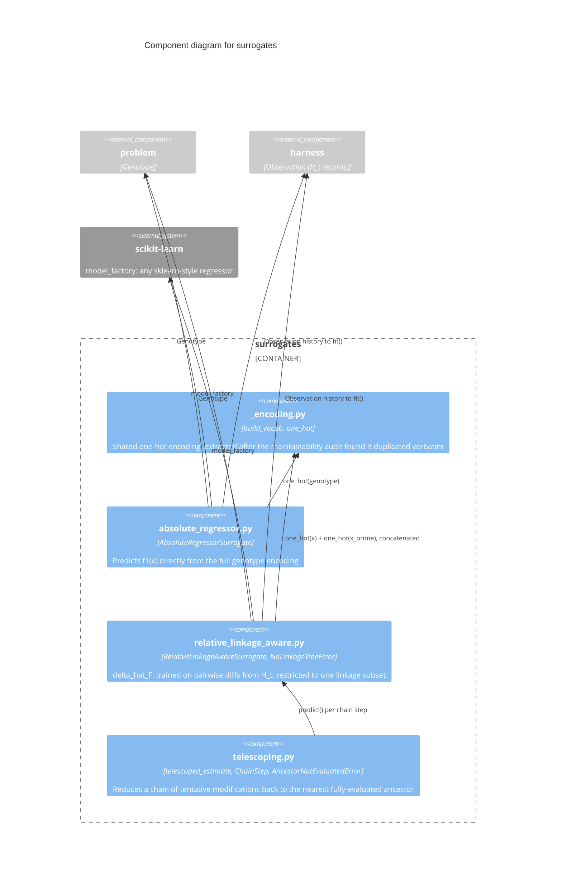

# C3 — Surrogates Components

`surrogates` holds two search-time cost models screening candidates
before a full evaluation: an absolute regressor predicting `f1(x)`
directly, and P3Net's own contribution, the relative linkage-aware
`delta_hat_F`, predicting `f1(x) - f1(x')` for a pair differing only
within one linkage subset. Both share a one-hot encoding helper; only
`RelativeLinkageAwareSurrogate` needs a linkage tree.

## Components

| Component | Responsibility | Source |
|---|---|---|
| **_encoding.py** | `build_vocab`/`one_hot`: shared one-hot vocabulary construction, extracted after the identical logic was found duplicated verbatim in both surrogate files | `src/p3net/surrogates/_encoding.py` |
| **absolute_regressor.py** | `AbsoluteRegressorSurrogate`: predicts `f1(x)` directly from the full one-hot genotype encoding. Used by `experiments/methods/nsganetv2.py` and `experiments/methods/p3_absolute.py` — both must use the same model family so the P3-vs-NSGA-II ablation isolates the search engine, not the surrogate | `src/p3net/surrogates/absolute_regressor.py` |
| **relative_linkage_aware.py** | `RelativeLinkageAwareSurrogate` (`delta_hat_F`): trained on pairwise fitness differences from `H_t`, restricted to pairs differing only within one given linkage subset. Caches each distinct genotype's encoding once per `fit()` call rather than once per pair | `src/p3net/surrogates/relative_linkage_aware.py` |
| **telescoping.py** | `telescoped_estimate`: reduces a chain of tentatively-accepted modifications to `f_hat_1(x_m) = f1(x_0) - sum delta_hat_{F_i}`, enforcing the hard `x_0 in H_t` invariant (`AncestorNotEvaluatedError` if violated) | `src/p3net/surrogates/telescoping.py` |

## Why two surrogates share an encoding module but not a base class

`AbsoluteRegressorSurrogate` and `RelativeLinkageAwareSurrogate` predict
fundamentally different things (`f1(x)` vs. `f1(x) - f1(x')`) with
different `fit`/`predict` signatures — a shared base class would force an
artificial common interface neither naturally has. What they genuinely
share is only the one-hot encoding mechanics, which is exactly what
`_encoding.py` factors out: real duplication removed, without inventing
false polymorphism over two conceptually different regressors.
