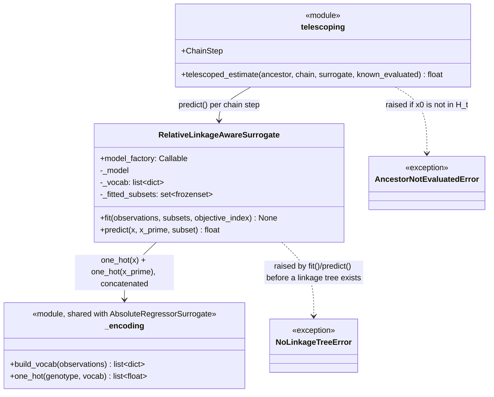

# C4 — Relative Linkage-Aware Surrogate (δ̂_F)

`RelativeLinkageAwareSurrogate` predicts `f1(x) - f1(x')` for a pair that
differs only within a linkage subset `F`, trained on pairwise differences
drawn from `H_t`. It is P3Net's own contribution, distinct from the
`AbsoluteRegressorSurrogate` used by the NSGANetV2-style baselines.



## Training data construction

`fit(observations, subsets)` builds training pairs `(a, b)` from every
*ordered* pair of observations whose differing coordinates are a subset of
one of the given linkage subsets (`_matching_subset`) — i.e. pairs that
differ *only* within one `F`, as the paper requires ("restricted to the
one linkage subset that was modified"). The target is
`a.objectives[i] - b.objectives[i]`.

## A real bug found and fixed here during implementation

The first version encoded each training pair as a **diff mask**: `1.0`
where a coordinate differs between `x` and `x'`, `0.0` otherwise. This
seemed reasonable but is wrong: the mask for `x → x'` and `x' → x` is
*identical* (the same coordinates differ either way), while their targets
are opposite in sign (`+Δ` vs `-Δ`). A linear model fit on a constant
feature with an alternating-sign target collapses to predicting the mean —
which is exactly what `tests/test_relative_surrogate.py::test_trains_on_pairwise_diffs_restricted_to_subset`
caught (`predicted_delta == 0.0` instead of the expected `-10.0`).

**Fix**: encode both endpoints' actual values (one-hot each, concatenate),
not just which coordinates changed:

```python
def _pair_features(x, x_prime, vocab):
    return one_hot(x, vocab) + one_hot(x_prime, vocab)
```

This is now shared, alongside `AbsoluteRegressorSurrogate`'s identical
one-hot-vocabulary logic, in `surrogates/_encoding.py` — extracted after
the maintainability audit found the same `build_vocab`/`one_hot` code
duplicated verbatim in both surrogate files.

## Telescoping reconstruction

`telescoped_estimate` reduces a chain of tentatively-accepted modifications
back to the nearest fully-evaluated ancestor:

```
f_hat_1(x_m) = f1(x_0) - sum_i delta_hat_{F_i}(x_{i-1}, x_i)
```

`ancestor` (`x_0`) is checked against `known_evaluated` (the current
`H_t`) and rejected with `AncestorNotEvaluatedError` if it isn't a real,
fully-evaluated genotype — the hard invariant the paper requires ("the
telescoping construction therefore never bottoms out on a surrogate
estimate"). In `methods.p3net.P3Net`, this exception is caught narrowly
(not via a blanket `except Exception`) and logged at `WARNING` level if it
ever fires, since — given the invariant is enforced by construction
elsewhere in `P3Net` — its firing would itself indicate a real bug, not an
expected condition.
